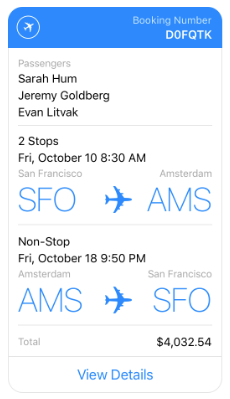

# Why?

As messaging platforms continue to grow and bots become an increasingly relevant means of reaching users, developers need a way to describe their "messages" such that they can be interpreted on a variety of platforms. 

Thus far, this need has given rise to very rigid "templates" that cater to very specific scenarios. For example, Facebook Bot developers must choose from an [Airline Itinerary Template](https://developers.facebook.com/docs/messenger-platform/send-api-reference/airline-itinerary-template), an [Airline Checkin Template](https://developers.facebook.com/docs/messenger-platform/send-api-reference/airline-checkin-template), an [Airline Boarding Pass Template](https://developers.facebook.com/docs/messenger-platform/send-api-reference/airline-boardingpass-template), a [Receipt Template](https://developers.facebook.com/docs/messenger-platform/send-api-reference/receipt-template), and a [Generic Template](https://developers.facebook.com/docs/messenger-platform/send-api-reference/generic-template) that only allows for 2 lines of text and an optional image.



(Example of an Airline Checkin Template)

As developers continue pushing bots into more advanced scenarios it becomes clear that having a specific template for every use case just won't scale. Not only do new "templates" need to be defined every time, but they then need native renderers for every platform and UI stack (Androd, iOS, HTML, Windows).

# Introducing Adaptive Cards

Adaptive Cards are meant to address the long-tail of developer needs. In other words, they fill the gaps when a strongly-typed template doesn't fit the bill.

They are comprised of `text`, `images`, `input`, and `buttons`, that may be `grouped` together as necessary. 

# What's in the Toolkit

* The official Adaptive Card JSON schema *(coming soon)*
* Documentation of the schema (see /docs)
* An Interactive Visualizer to preview Card payloads *(coming soon)*
* Sample Cards (see /samples) *(coming soon)*
* Card Renderer libraries for multiple platforms (iOS, Android, .NET) *(more info on this effort coming soon)*
* Card Builders for .NET *(coming soon)*

# Adaptive Card Schema


The following is the **initial proposal and not final**.

```
{
    "content": [
        {
            "text": "Thanks!",
            "hint-style": "title"
        },
        {
            "text": "Should I go ahead and charge this to your Visa ending in 3435?",
            "hint-wrap": true
        }
    ],
    "inputs": [
        {
            "id": "creditCard",
            "defaultInput": "card1",
            "type": "selection",
            "selections": [
                {
                    "id": "card1",
                    "title": "Visa X3435"
                },
                {
                    "id": "card2",
                    "title": "Mastercard X9813"
                }
            ]
        }
    ],
    "buttons": [
        {
            "title": "Book it!",
            "type": "imBack",
            "value": "pay"
        },
        {
            "title": "Cancel",
            "type": "imBack",
            "value": "cancel"
        }
    ]
}
```

## How it works

* All content flows top-down in the order specified. 
* `Text` takes up a single line (by default) and will be truncated as necessary. 
* `Images` have a `placement` that allow them to be inline with content, or the background of their container.
* `Buttons` align horizontally if they fit; otherwise stack vertically.
* `Input` includes text, multi-line, selections, dates, etc.
* `Groups` allow developers to create rows and columns to partition elements

## Render Hints

Render Hints allow developers to tweak the default rendering and better achieve their desired scenario. 

We call them Hints because Adaptive Cards are designed to support down-level rendering if a client doesn't support a given feature. To accomodate this requirement we partitioned the properties of each element to must-have, and nice-to-have. A "nice-to-have" property will be prefixed with `hint-*`

What this means is that each client will make a best-effort approach to render the Card as the developer specified, but may have some loss of fidelity under some circumstances.

### Hints Example

Take the following payload which describes a line of text

```
{
    "text": "Great. What time would you like to see it?",
    "hint-style": "title",
    "hint-wrap": true
}
```

The `hint-style` and `hint-wrap` properties may not be rendered on an older Skype client, but the `text` itself will be preserved.

## Text

* Each `text` element takes up 1 line by default, and will be truncated if necessary.

Property|Type|Description
--------|----|-----------
hint-style | enum { **body**, caption, subtitle, title, subheader, header} | The style of the text
hint-wrap | bool | Whether or not this line of text should wrap. Default is `false`
hint-maxLines | integer | Limited the number of lines that will be displayed. 
hint-minLines | integer | Forces the text to take up at least the specified number of lines.
hint-align | enum { **left**, center, right } | Controls the text alignment

**TODO:** Compare/Constrast Markdown alternative 

### Example
```
{
    "text": "Great. What time would you like to see it?",
    "hint-style": "title",
    "hint-wrap": true
}
```

## Facts

Facts allow you to easily create lists of data with a key and value.

```
"facts": [
    {
        "name": "This is a fact name",
        "value": "This is a fact value"
    },
    {
        "name": "This is a fact name",
        "value": "This is a fact value"
    },
    {
        "name": "This is a fact name",
        "value": "This is a fact value"
    }
]
```

## Images

Images can be inline with content or the background of their container. Inline images expand to the width of their container while still preserving aspect ratio.

Property|Type|Description
--------|----|-----------
src | Uri | The source of the image
alt | string | Description of the image
placement | enum { **inline**, background } | Whether the image should be inline with content, or the background of its container
hint-align | enum { **stretch**, left, center, right } | How an inline image should align inside its container
hint-crop | enum { **default**, circle } | Requests that an image be cropped into a circle, commonly used for profile images

## Groups/Subgroups

Groups allow the semantic grouping of elements. 

## Buttons

Buttons can be specified in a "command bar" at the bottom of the Card, or they can be declared directly within the content itself.

*NOTE*: I'll elaborate more on the "inline" scenario soon

## Input

Text box, drop-down lists, dates

# Speech customizations

While we commonly focus on a Card being visual, it's important to consider how your bot might behave on a headless device that is purely speech enabled. By adorning your Card with speech-hints, you can influence how your Card is read aloud on headless devices that don't have a screen.

# Versioning and fallback

Versioning and Fallback are important topics and have a dedicated page/discussion. 

See the following page for more details on [Versioning and Graceful fallback](docs/GracefulFallback.md)

# Beyond Bots

Windows Live Tiles and Notifications, Outlook Connector, Microsoft Teams, or anything else you can come up with

# Future Explorations

* Allow developers who **require** full UI customization to take on the burden of drawing their own UI: XAML, HTML, 3D 
* Inline update of Cards
* Contextual tailoring based on client-properties (e.g., if user is driving)

# Rendering Cards in your App or Web Site

If you have the need to render Adaptive Cards inside your app or web site, the Toolkit provides a couple Renderers to help achieve this.

We plan to cover this in greater detail on the [Rendering Cards page](docs/RenderingCards.md)