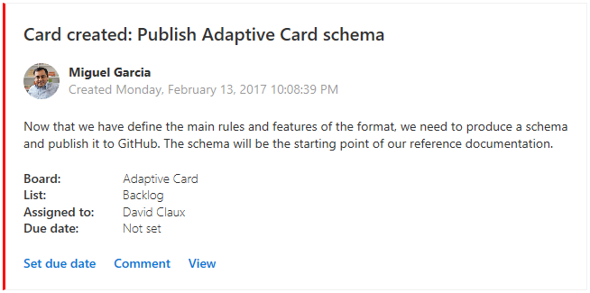

# Introducing Adaptive Cards

Adaptive Cards is an open source universal card format which allows developers to deliver great looking static and interactive cards to any device or client.

 
 
 
 

## Developer Features
* Simple but rich JSON layout gives developers ability to easily create rich great looking cards across any device or client!
* Support for Rich Input controls (text, date, time, etc.) allows you to send forms 
* Speech enabled from day one!
* Nuget and NPM libraries to make it easy to build cards in code

## Client application Features
* Client controled cards style, so cards from multiple sources look great together and like they were designed for the application.
* Client doesn't have to keep updating itself to support new cards
* Open source libraries to target multiple platforms and frameworks 
* Browser: HtmlDom, React, etc.
* Client: iOS, Android, WPF, UWP, XamarinForms
* Server: Image, Html Markup

## Install and build

Since we build for multiple platforms they each have slightly different build mechanisms.

See the `source` dir for a `README` in each platform for instructions.

# How it works

Developers describe the experience they want using a generic yet powerful JSON payload. With a properly described payload we take on the burden of presenting the best experience to a user wherever they are.

The payload is designed to be expressive enough that it addresses the long-tail of scenarios, without imposing the burden of fine-grained design, development, and testing across every platform and application. 

Adaptive Cards are comprised of `TextBlock`, `Images`, `Input`, and `Actions`, that may be `combined` together as necessary. 

* All content flows top-down in the order specified. 
* `TextBlocks` takes up a single line (by default) and will be truncated as necessary. 
* `Images` expand to the width of their container, while maintaining aspect ratio.
* `Columns` allow developers to create rows and columns to partition elements
* `Actions` align horizontally if they fit; otherwise stack vertically.
* `Input` includes text, multi-line, selections, dates, etc.

# What's in the Toolkit

* Documentation of the schema (see [docs/Schema.md](docs/Schema.md))
* The official Adaptive Card JSON schema (see [schemas/adaptive-card.json](schemas/adaptive-card.json))
* The official Adaptive Card XML schema (see [schemas/adaptive-card.xsd](schemas/adaptive-card.xsd))
* A Visual Code Live Preview Extension so you can see edits as you type (see [source/vscode](source/vscode))
* An online live previerer  [Interactive Visualizer](https://microsoft.github.io/AdaptiveCards) to preview and design Card payloads
* Sample Cards (see [samples](samples/Scenarios))
* Nuget and NPM libraries

# Rendering Cards in your App or Web Site

If you have the need to render Adaptive Cards inside your app or web site, the Toolkit provides a couple Renderers to help achieve this.


## Shared Libraries
* **AdaptiveCards** -> Defines Adaptive card object model for creating and serializing/deserializing adaptive cards
* **AdaptiveCards.Html** -> Defines HTML markup generator (suitable for server side html generation)
* **AdaptiveCards.WPF** -> defines stock XAML/WPF renderer
* **AdaptiveCards.WPF.Extended** -> Defines Enhanced XAML/WPF renderer which uses WPF Extended Control set
* **Android** -> Coming soon
* **iOS** -> Coming soon
* **UWP** -> Coming soon
* **AdaptiveCards.HtmlDom** -> TypeScript in browser renderer for html canvases

All of the .NET libraries are available on nuget 
> NOTE: Currently internal microsoft package feed only.
> https://fuselabs.visualstudio.com/Intercom/_packaging?feedName=packages&protocolType=NuGet&packageName=adaptivecards&packageVersion=1.0.0.4&_a=view

Typescript package is available via NPM
> NOTE: Currently internal microsoft npm feed only
> https://fuselabs.visualstudio.com/Intercom/_packaging?feedName=FuseNPM&protocolType=Npm&packageName=%40angular%2Fcli&packageVersion=1.0.0&_a=view

We plan to cover this in greater detail on the [Rendering Cards page](docs/RenderingCards.md)

## Tools

Visual Studio Code preview extension allows you to see in real-time the card you are building

To install:
1. Download AdaptiveCards.vsix
2. from command line run: `code --install-extension adaptivecards.vsix`
3. In editor create and save a new Json file (helloworld.json)  with following in it:

```javascript
{
    "$schema": "https://microsoft.github.io/AdaptiveCards/schemas/adaptive-card.json",
    "type": "AdaptiveCard",
    "version": "1.0",
    "body": [
        {
            "type":"TextBlock",
            "text":"Hello World",
            "size":"extraLarge"
        }
    ]
}
```
4. Hit **Ctrl+Shift+V** A to see previewer

