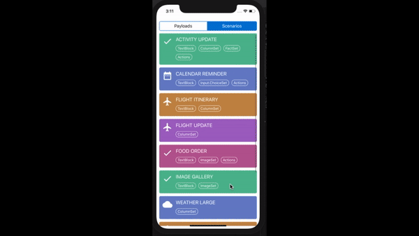

## Usage
- Add package
``` javascript
npm install adaptivecards-reactnative  
```
- Import the root component
``` javascript
import AdaptiveCard from 'adaptivecards-reactnative'
```
- Render the component with required props

``` html
<AdaptiveCard payload={} 
               hostConfig={}
               themeConfig={}
               onExecuteAction={} 
               onParseError={} 
               ref="referenceVariable"/>
```

Prop | Type | Description | Required
------------ | ------------- | ------------ | ------------ |
**payload** | `{object}` | JSON payload adhering to the [schema](https://docs.microsoft.com/en-us/adaptive-cards/authoring-cards/card-schema) | YES
**hostConfig** | `{object}` | JSON Host config to override based on [schema](https://docs.microsoft.com/en-us/adaptive-cards/rendering-cards/host-config) | NO
**themeConfig** | `{object}` | JSON Theme Config to customize styles | NO
**onExecuteAction** | `{Event Handler}` | Method to be executed on card actions | NO
**onParseError** | `{Event Handler}` | Method to be executed on JSON parse errors | NO
**ref** | `React.createRef()` |  Reference variable used to invoke the methods exposed by AdaptiveCards.(Example: In order to fetch the image & media URLs across the payload, one can use like this `this.refs.referenceVariable.getResourceInformation()`  | NO

## Extensibility
In order to override the rendering of built-in components OR to add/remove  an element type, one can simply make use of the functions exposed by Element Registry.

**Examples**   
* To override built-in `TextBlock` element,   
```
Registry.getManager().registerComponent('TextBlock',CustomTextBlock);
```
* To add support for new element type say `Rating`, add the component in the registry as below :

```
Registry.getManager().registerComponent('Rating',RatingComponent);
```
* To remove the support of an element type (i.e To ignore the rendering of specific element type), 
```
Registry.getManager().removeComponent('Input.Date');
```

## DataBinding
The [adaptivecards-templating](https://www.npmjs.com/package/adaptivecards-templating) library is available on npm.  Please refer the link for full documentation.

**Usage**
```jsx
import AdaptiveCard from '../adaptive-card';
import * as ACData from 'adaptivecards-templating';

// Sample template payload
var templatePayload = {
    "$schema": "http://adaptivecards.io/schemas/adaptive-card.json",
    "version": "2.0",
    "type": "AdaptiveCard",
    "body": [
        {
            "type": "TextBlock",
            "text": "Hi {employee.name}! Here's a bit about your organisation"
        },
        {
            "type": "TextBlock",
            "text": "Your manager is: {employee.manager.name}"
        },
        {
            "type": "TextBlock",
            "text": "2 of your peers are: {employee.peers[0].name}, {employee.peers[1].name}"
        }
    ]
};
        
// Create a Template instance from the template payload
var template = new ACData.Template(templatePayload);

// Create a data binding context, and set its $root property to the
// data object to bind the template to
var context = new ACData.EvaluationContext();
context.$root = {
    "employee": {
        "name": "David Claux",
        "manager": {
            "name": "Matt Hidinger"
        },
        "peers": [
            {
                "name": "Andrew Leader"
            },
            {
                "name": "Shalini Joshi"
            }
        ]
    }
}

// "Expand" the template - this generates the final payload for the Adaptive Card,
templatePayload = template.expand(context);

//Render the adaptive card with templatePayload
<AdaptiveCard payload={templatePayload}/>
```

## Theme Config
* For customising UI styles of elements, Host App can pass styles (plain JSON object) as an optional prop to root element `<AdaptiveCard/>`.

* Host app can provide `platform specific styles` as seen in the below example. For same styles across platforms, pass the styles without platform.

**Examples**   
In this example, styles passed for element `input` are applied to both iOS and Android whereas for `button`, platform specific styles are applied.

```css
    customThemeConfig = {
        input: {
            borderColor: "#000000",
            backgroundColor: "#F5F5F5",
        },
        button: {
            "ios": {
                textTransform: 'none',
            },
            "android": {
                textTransform: 'uppercase'
            }
        }
    }
```
Refer this [wiki page](https://github.com/Imaginea/AdaptiveCards/wiki/Extensibility---Theme-Config) to view the complete list of customizable theme config properties.

##  Examples / Visualizer
There are lot of sample JSON payloads covering all element types with few real case scenarios are available within this project.   

To see the visualizer,
* Clone the repo https://github.com/microsoft/AdaptiveCards
* Navigate to `source/community/reactnative/` **>** Run **`npm install`**
* iOS **> `react-native run-ios`**
* Android **> `react-native run-android`**
* Windows **> `react-native start`**  and  **`Launch Simulator from Visual Studio`**

**Notes:** Follow https://github.com/Microsoft/react-native-windows/blob/master/RNWCS/docs/GettingStarted.md for react-native-windows setup


##  About Adaptive Card
* Collection of `elements` and `actions`
* Element is the basic `building block` of card
* Element can be a `standalone` component OR can be a `container` that in turn holds collection of other element types
* Main responsibilities of an element are,
  * **P**arsing
  * **R**endering
* `HostConfig` takes care of applying `default styles`. Custom styles (if any) can also be passed via HostConfig instance
* `Actions` area contains one or more action buttons

## Project Structure
This project is for React-Native implementation of Adaptive cards based on https://github.com/Microsoft/AdaptiveCards.
A Quick overview of the folder structure.
* Components 
* Utils
* Styles

Folder | Description
------------ | -------------
**`src/components`** | This directory contains all the components along with its registry functionalities. This includes standalone components, container types and actions.
**`src/components/actions`** | This directory holds the collection of action elements.
**`src/components/containers`** | This directory holds the container elements that holds collection of elements and its layout.
**`src/components/elements`** | This directory holds all the static individual elements
**`src/components/inputs/`** | This directory holds all the interactable input elements
**`src/utils`** | This directory takes care of keeping the Configuration out of the Code. This will hold anything that is used in multiple places throughout our app in one place.
**`src/styles`** | This directory holds the global styles that will be used and applied across the components and app.The purpose is that we will reuse a lot of the same styling(like Container, Themes,etc....).

 


