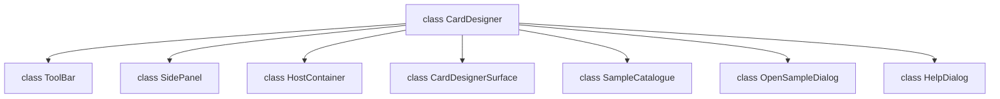
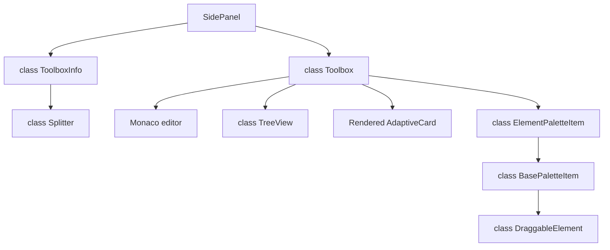
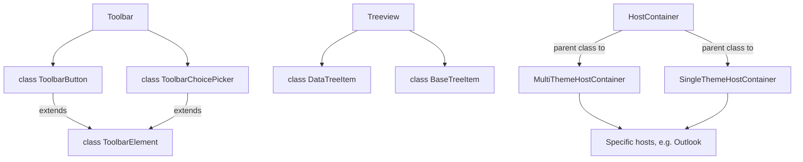
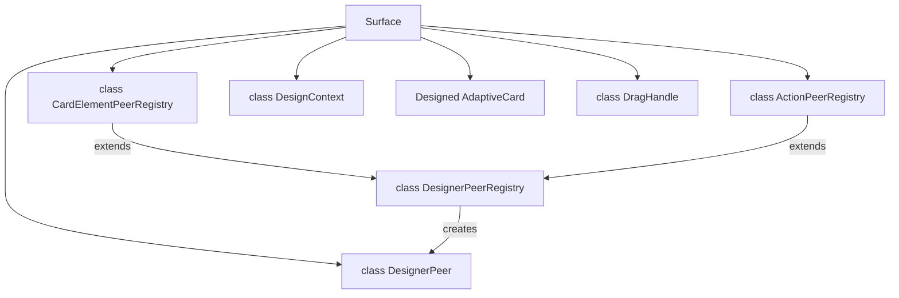
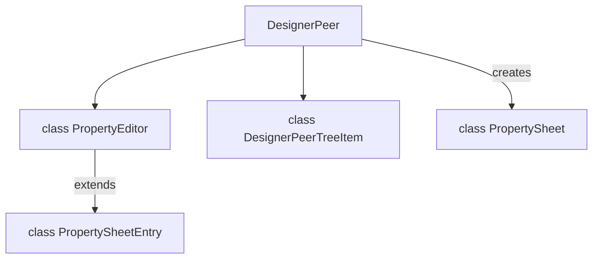

# Contributing to the Designer
This document covers information to help those wanting to contribute to the Adaptive Cards Designer.

## How to use the designer
The designer can be used in a few different ways.
1. Hosted on adaptivecards.io
2. Shipped as a standalone package. This allows developers to use the designer within their own sites and customize it.
3. Standalone app

## Renderer
Its important to note that the designer utilizes the javascript renderer **only**. The version that the designer uses can be configured by the container and by the user.

## Styling
Default styling for the designer is found at `src/adaptivecards-designer.css`. Note that containers also have styling for the rendered cards.

## `card-designer.ts`
The bulk of the designer is found within `src/card-designer.ts`. Most handling for the following features is included here:
1. Toolbar functionality
5. Card elements pane
6. Card surface
7. Card payload editor
8. Sample data editor
9. Card structure pane
10. Element properties pane
11. Error pane

Since the designer is meant to be extensible to external developers and resilient to new feautres, most of these features are implemented with shared classes. Notably:
- `Toolbar`
- `ToolbarButton`
- `ToolbarChoicePicker`
- `BasePaletteItem`
- `ElementPaletteItem`
- `DataPaletteItem`
- `SidePanel`
- `DataTreeItem`
- `TreeView`

The idea here is that you can simply create a new `ToolbarButton` when you want to add a new button to the main toolbar.

## Card Designer Surface
The area of the designer that displays the card is called the `CardDesignerSurface` (See `src/card-designer-surface.ts`).
It is easiest to think about the surface in two modes.

### Preview mode
When the designer is in preview mode, we will display the card as it is rendered. That is, you cannot modify the card without editing the JSON manually. This version is the most straighforward as there are no features beyond the renderer.

### Design mode
In design mode, the card designer surface is more complicated, because all card elements have an paired element called a `DesignerPeer` (See `src/designer-peers.ts`). That is, when we render the card in design mode, there will be a DesignerPeer overlaid on top of each element.


The peers allow us to enable a drag and drop interface for the designer. For some element peers, we also have additional buttons attached that add functionality (Example: `ColumnSetPeer` include an "Add a column" button). Note that new peers need to be registered within `CardElementPeerRegistry` (See `card-designer-surface.ts`).

The goal of design mode is to allow developers to design the card **without** manually modifyin the JSON editor. When an element has been moved, deleted, or modified from the card surface, the JSON editor will reflect the changes.

## Containers
The designer has a concept of a "container" that allows us to mock a specific host app. The default containers can be found within `adaptivecards-designer/src/containers`. Containers can specify their own styling and custom rendering. When a designer container is initialized, we will render the container and attach it to the designer host (See `src/card-designer.ts`).

For instance, we have a container for the Widgets Board which allows for different themes and container sizes.


Containers can also specify their own Host Config, and these are stored at `samples/HostConfig/`.

## Templating
Users are able to provide templating data via the Sample Data Editor.


When the card is rendered from the card designer surface, the template payload from the editor will be provided to the renderer.

Template data can also be utilized from the Element Properties pane:


More information on the element properties pane is below, but the specifics for the Data Binding button can be found in the `StringPropertyEditor` class.

## Card elements pane
The card elements pane showcases all available elements, and it is only displays elements available for that specific version.


Each element can be dragged to the designer surface or double clicked to add it to the current card. Most of the implemenentation is handled within `card-designer.ts`. See `_draggedPaletteItem` and `_toolPaletteToolbox`.

## Element properties pane
The element properties pane allows users to modify the various element properties without updating the JSON directly.

Populating this pane is handled by DesignerPeers. Each peer adds their properties to a `propertySheet` where the values are a `PropertyEditor` type. For instance, the Carousel has an additional property of type `BooleanPropertyEditor` that corresponds to the `loop` property.


## `adaptivecards-controls` usage
Many of the controls utilized in the designer come from the `adaptivecards-controls` library. Occasionally, a fix for the designer will require you to modify that package.

## Reference Pull Requests
- [Add new element to the designer](https://github.com/microsoft/AdaptiveCards/pull/7654)
- [Add controls to the toolbar](https://github.com/microsoft/AdaptiveCards/pull/7741)
- [Add a new container](https://github.com/microsoft/AdaptiveCards/pull/6612)
- [Add a new property to the element properties pane](https://github.com/microsoft/AdaptiveCards/pull/8271)
- [Update adaptivecards-controls](https://github.com/microsoft/AdaptiveCards/pull/7937)
- [Update designer peer ordering logic](https://github.com/microsoft/AdaptiveCards/pull/7514)

## Architecture

### High-level CardDesigner class interaction


### High-level SidePanel class interaction
Note: The Toolbox control can contain any HTML content


### High-level Toolbar class interaction


### High-level CardDesignerSurface class interaction


### High-level DesingerPeer class interaction


## Repo structure

Designer specific code is within `source/nodejs/adaptivecards-designer/src` folder. Here's the breakdown of relevant contents:
```yaml
├── assets # images used within the package
├── containers
│   ├── ** # Each supported container will have their own directory. Each includes their container implementation and css
│   ├── host-container.ts # Base host container implementation
│   ├── multi-theme-host-container.ts # Implementation for host containers that support multiple themes
│   └── single-theme-host-container.ts # Implementation for host containers with one theme
├── hostConfigs
│   └── Host Configs for the containers are pulled from ~/samples/HostConfig. This directory should not be modified
├── adaptive-card-schema.ts # Copy of the adaptive card schema
├── adaptivecards-designer.css # Styling for the designer
├── adaptivecards-designer.ts # Exports our default containers and device emulations
├── base-tree-item.ts # Base class for building all tree views
├── card-designer-surface.ts # Responsible for the rendering of the currently designed card and moving the designer peers across the surface
├── card-desginer.ts # Main entry point for the designer. Handles the state of all components
├── data-tree-item.ts # Utilized to build data tree views when users are selecting new data for templated properties
├── data.ts # Helpers for templating data handling
├── designer-peer-treeitem.ts # Utilized to build the tree view in the card structure pane
├── designer-peers.ts # Implementation of designer peers and their property sheets
├── draggable-element.ts # Implementation for elements that can be dragged on the designer surface (DesignerPeer extends this class)
├── *-dialog.ts # Various popup dialogs utilized in the designer
├── peer-command.ts # Supports actions on designer peers (e.g. "Add a column")
├── shared.ts # GlobalSettings that can enable/disable features
├── side-panel.ts # Utilized to dock content to side of the designer. Typically contains toolboxes/splitter
├── splitter.ts # Support multiple toolboxes within one side panel
├── string.ts
├── tool-box.ts # Standard way to host docked content. Content can be any HTML
├── tool-palette.ts # Contains palette item classes used to create the card elements toolbox
├── toolbar.ts # Implementation for the toolbar and its elements
└── tree-view.ts # Base class. Utilized to build the card structure
```
