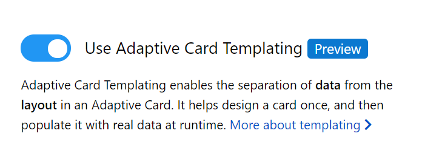

The goal of Adaptive Card Templating is to **save you time** when building cards. 

Most adaptive cards present data of some kind, but today that data is mixed with the layout properties in the same JSON payload. It isn't easy or straight-forward to create a **single card template** that can reused over and over, populated with **real data** at runtime. 

[Adaptive Card Templating](https://docs.microsoft.com/en-us/adaptive-cards/templating/) sets out to address that. We want to make it super simple to create a reusable card in the [rich card designer](https://adaptivecards.io/designer), preview it with your own data at design-time, and then populate that same exact template with real data in your app's code.

It's comprised of 3 major components:

1. The [Template Language](https://docs.microsoft.com/en-us/adaptive-cards/templating/language) is the syntax used for authoring a template. 
2. The [Templating SDK's](https://docs.microsoft.com/en-us/adaptive-cards/templating/sdk) will exist on all supported Adaptive Card platforms. These SDKs allow you to populate a template with real data, on the back-end or directly on the client.
3. The [Template Service](https://docs.microsoft.com/en-us/adaptive-cards/templating/service) is a proof-of-concept service that allows anyone to find, contribute to, and share a set of well-known templates.

## Real-world template samples

Today we're making it easier to get started by providing a handful of real-world templates on the [Adaptive Cards Samples](https://adaptivecards.io/samples) page.

When the "Use Adaptive Card Templating" toggle switch is on, instead of seeing a single `JSON` textbox, you'll see two:

- `Data JSON` represents the card's data
- `Template JSON` represents the card template

[](https://adaptivecards.io/samples)

A "template" is an Adaptive Card that you're used to, but all of the dynamically populated content has been replaced with "data-binding expressions". For example, below is a card with a large, wrapping TextBlock, but the `text` property has those funny curly braces in it. That means this property will be provided dynamically from my app code.

**Card Template**
```json
{
	"type": "AdaptiveCard",
	"version": "1.0",
	"body": [
		{ 
			"type": "TextBlock",
			"text": "{name}",
			"size": "large",
			"wrap": true
		}
	]
}
```

## Using a template in your app

How exactly is that `text` property dynamically populated? By using the [Templating SDKs](https://docs.microsoft.com/en-us/adaptive-cards/templating/sdk). With the Templating SDKs, you can generate a fully-populated Adaptive Card, ready to send to any current host app!

This means you **don't have to wait for hosts to update to the latest version** -- you can get started today building cards for Teams, Outlook, and your own apps!**

*Note:* during the preview, we only have .NET and JavaScript templating SDKs available.

Here's some code using the [`adaptivecards-templating`](https://www.npmjs.com/package/adaptivecards-templating) JavaScript SDK to populate the template with data. In the real world, this data could be retrieved from a database, or service, or anywhere else you app code has access to.

```js
var template = new ACData.Template({ 
    // The Template above goes here
});


var dataContext = new ACData.EvaluationContext();
// Put your data here
dataContext.$root = {
	"name": "Matt Hidinger"
};

var card = template.expand(dataContext);
// Now you have an AdaptiveCard ready to render!
```

## Get started today

Adaptive Card templating can save a ton of time when building cards, and we hope these [Samples](https://adaptivecards.io/samples) make it easier to get started!

Give it a shot and let us know your thoughts on [GitHub](https://github.com/Microsoft/AdaptiveCards/issues)!

For more on this topic, check out [Why templating for Adaptive Cards is a Game Changer](https://medium.com/@tim.cadenbach/why-templating-for-adaptive-cards-is-a-game-changer-1606de3226ed) by [Tim Cadenbach](https://twitter.com/TimCadenbach).