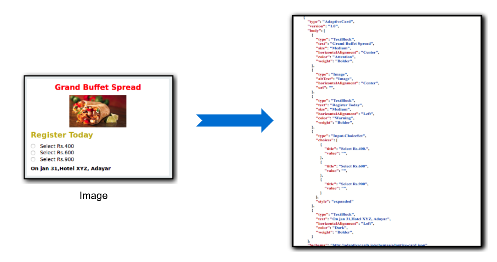
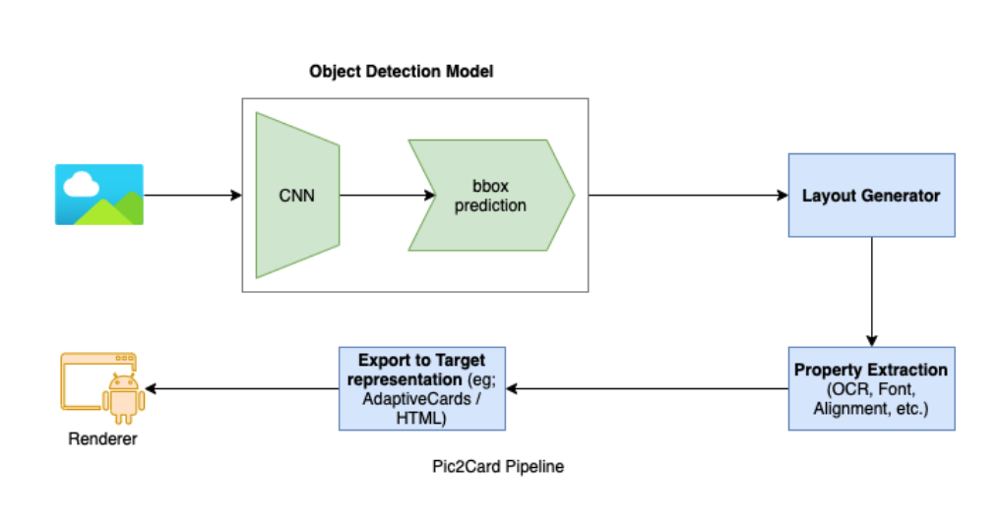

We are excited to share this; finally, the **pic2card** service is available on https://adaptivecards.io/designer.

Pic2Card helps the new AdpativeCard users to try out the Adaptive card generation by merely uploading a card image. This further reduces the learning curve needed to develop adaptive cards using the designer. AdaptiveCard Designer's whole idea was to help the card designers to create new cards with ease. Designer provides a WYSIWYG IDE environment to card developers to create their cards if the template designs don’t fit their requirements. Here is what team Imaginea wants to pitch in and make this process much easier for the new AdaptiveCards users by simply upload a **card image** that you got from the internet or your designer, upload, and right away grasp your Adaptivecards representation of it.

Go ahead and play with it, and let's know your feedbacks via Github issues.

## How to use this Feature

## What's Pic2Card

Pic2Card converts the image to Adaptivecards card schema. The card generated will reproduce the image text, color, and font details from the image so that the final card looks almost similar to the image uploaded to the pic2card service.

## Pipeline

We haven’t discussed anything much about its internals till now, here it's. We have the state of art ML and other heuristic processing involved to recreate the card from the image. The entire pipeline is shown below. The two main parts are,

- The Machine Learning model identifies each element’s bounding boxes that we need to be extracted for the card.
- The pipeline, which does all the layout setting, property extraction, etc., is based on the ML model output.

This entire pipeline is part of our backend [pic2card](https://github.com/microsoft/AdaptiveCards/tree/main/source/pic2card) service, which is hosted as azure functions. The frontend part of the pic2card integrates with the [AdaptiveCards Designer](https://github.com/microsoft/AdaptiveCards/tree/main/source/nodejs/adaptivecards-designer).

## Contribute

Try the service, and Let's know your feedback on [github issues](https://github.com/microsoft/AdaptiveCards/issues).

@Team [Imaginea](https://www.imaginea.com/)
