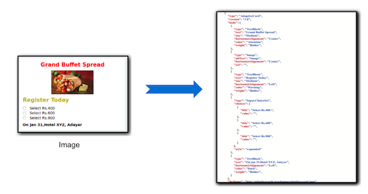
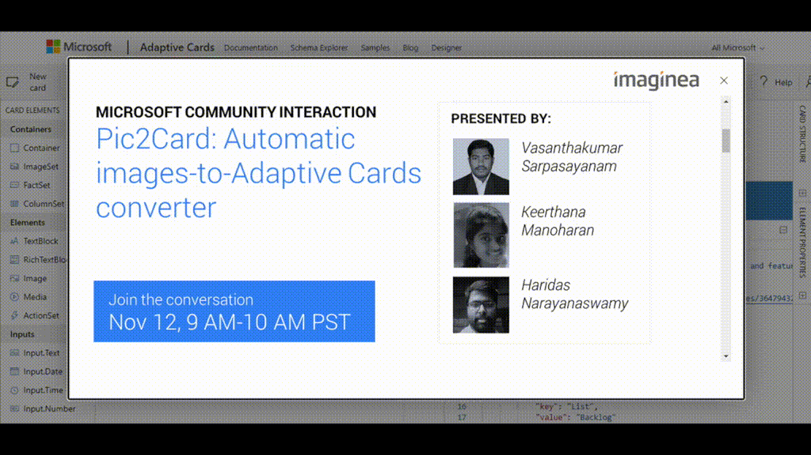

## Introducing Pic2Card 

We are excited to share a new addition to the [Adaptive Card Designer](https://adaptivecards.io/designer), **enabling you to instantly create a card from a bitmap image**. 

Pic2Card automatically converts a card-like image into an Adaptive Card payload. The generated Adaptive Card will reproduce any internal images, text, color, fonts, and even detect input fields -- so that the output card matches the source image as closely as possible.

This service helps users get started quickly with the Adaptive Card Designer, especially those who are more comfortable with traditional image editing tools. 

### How it works

Pic2card uses Machine Learning and other heuristic processing to recreate the Adaptive Card from the image. The entire pipeline is shown below. The two main parts are:

- The **Machine Learning model** identifies each elements' bounding box to identify what type of element is resembles
- The **pipeline** then does all the layout settings, property extraction, etc. 
  

Curious to see how it was built?

- This entire pipeline is part of the [pic2card backend](https://github.com/microsoft/AdaptiveCards/tree/main/source/pic2card)
service, which is hosted as an Azure Function. 
- The frontend part of the pic2card integrates with the [Adaptive Card Designer](https://github.com/microsoft/AdaptiveCards/tree/main/source/nodejs/adaptivecards-designer)

### Try it out today

Try it now at **https://adaptivecards.io/designer** by clicking **New Card** and then **Create from Image**

We'll be improving the model over time, so please let us know if you encounter any issues [via GitHub](https://github.com/microsoft/AdaptiveCards/issues/new?template=pi2card.md).

### Special thanks to Imaginea

This entire feature was built by our wonderful community member [Imaginea](https://www.imaginea.com/). Many thanks to your whole team for bringing this feature to Adaptive Card users, including:

* [Vasanthakumar Sarpasayanam](https://www.linkedin.com/in/vasanthakumar-sarpasayanam/)
* [Haridas Narayanaswamy](https://github.com/haridas)
* [Keerthana Manoharan](https://github.com/Keerthana786)

### Watch the Community Call for full details

<iframe width="560" title="Community Call Video" height="315" src="https://www.youtube.com/embed/b7FVAsaWo3g" frameborder="0" allow="accelerometer; autoplay; clipboard-write; encrypted-media; gyroscope; picture-in-picture" allowfullscreen></iframe>
