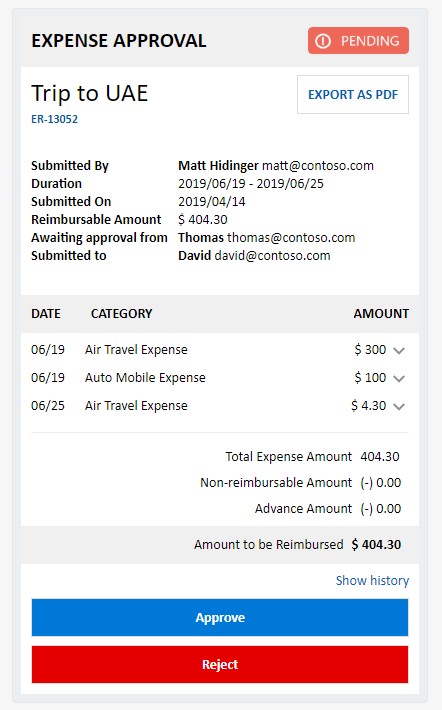
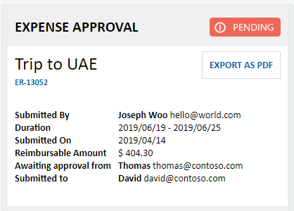
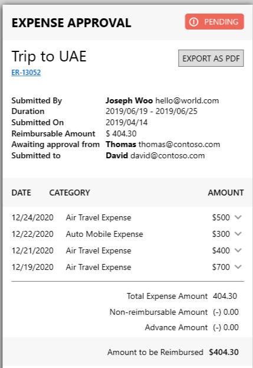
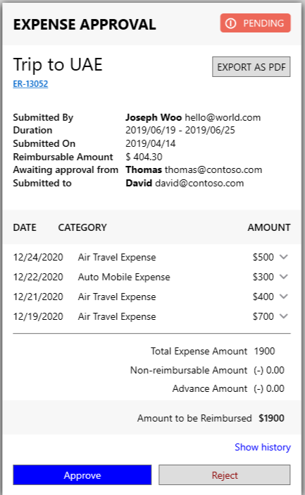

The goal of Adaptive Card Templating is to **save you time** when building cards.

This post will walk through the basic templating features as well as some advanced ones. Along the way, we will walk through you the updated template syntax, and introduce the *Adaptive Expression Language (AEL)*. 

We will be working on an Expense report card. This expense report card is available in [our github repository](https://github.com/microsoft/AdaptiveCards/blob/master/samples/v1.2/Scenarios/ExpenseReport.json). We will turn this Adaptive Card into a template, so we can dynamically populate and generate an Adaptive Card based on dynamic data!



## Breaking change in May 2020

**Note**: If you've been using the templating preview, we made a breaking change in the binding syntax. It went from `{...}` to `${...}`.
 
 For example: `"text": "{name}"` becomes `"text": "${name}"`

## Basic Data Binding

The expense report's JSON is over 800 lines. To update the contents of the card, we could manually port that code into an Adaptive Element object model using the various platform SDKs we make available (e.g., .NET or C++), but that would be quite the burden on a developer. Let's take a look at how much easier it is using templating.
 
As an example, if we want to change the name of Submitter, **Matt Hidinger** to **Jopseh Woo**. 
Given the json below, we will update it with a template and a "data binding expression".

```json
{
    "type": "FactSet",
    "spacing": "Large",
    "facts": [
        {
            "title": "Submitted By",
            "value": "**Matt Hidinger**  matt@contoso.com"
        },
        ...
```

```json
{
    "type": "FactSet",
    "spacing": "Large",
    "facts": [
        {
            "title": "Submitted By",
            "value": "**${submitter.name}**  ${submitter.e-mail}"
        },
        ...
```

You'll notice the card payload above is missing the data now. To make use of a template, we have to provide data that goes along with it. Data can be any valid JSON.

Here's the data we will use for this example:

```json
{
    "submitter": { 
        "name" : "Joseph Woo",
        "e-mail" : "hello@world.com"
    }
}
```

And the updated card with the data:



As long as the data's format doesn't change, this Adaptive Card template can be re-used. The final Adaptive Card payload will be "populated" according to the data the card is bound to. 

## `$data` contexts

The Expense Report Card has following layout, notice how each expense line item row has the same layout.


Without a template, we have to manually build up the layout for each expense items. Since there are three expense items, we would have to create three `ColumnSets` each defining the same layout.

```json
{
    "type": "ColumnSet",
    "columns": [
        {
            "type": "Column",
            "items": [
                {
                    "type": "TextBlock",
                    "text": "06/19",
                    "wrap": true
                }
            ],
            "width": "auto"
        },
        {
            "type": "Column",
            "spacing": "Medium",
            "items": [
                {
                    "type": "TextBlock",
                    "text": "Air Travel Expense",
                    "wrap": true
                }
            ],
            "width": "stretch"
        },
        {
            "type": "Column",
            "items": [
                {
                    "type": "TextBlock",
                    "text": "$ 300",
                    "wrap": true
                }
            ],
            "width": "auto"
        },
        {
            "type": "Column",
            "id": "chevronDown1",
            "spacing": "Small",
            "verticalContentAlignment": "Center",
            "items": [
                {
                    "type": "Image",
                    "selectAction": {
                        "type": "Action.ToggleVisibility",
                        "title": "collapse",
                        "targetElements": [
                            "cardContent1",
                            "chevronUp1",
                            "chevronDown1"
                        ]
                    },
                    "url": "https://adaptivecards.io/content/down.png",
                    "width": "20px",
                    "altText": "collapsed"
                }
            ],
            "width": "auto"
        },
        {
            "type": "Column",
            "id": "chevronUp1",
            "isVisible": false,
            "spacing": "Small",
            "verticalContentAlignment": "Center",
            "items": [
                {
                    "type": "Image",
                    "selectAction": {
                        "type": "Action.ToggleVisibility",
                        "title": "expand",
                        "targetElements": [
                            "cardContent1",
                            "chevronUp1",
                            "chevronDown1"
                        ]
                    },
                    "url": "https://adaptivecards.io/content/up.png",
                    "width": "20px",
                    "altText": "expanded"
                }
            ],
            "width": "auto"
        }
    ]
}
```

To use a template we will do following:

1. We define the template layout for a **single expense item**
2. We provide data that the template expects

```json
{
    "$data" : "${expense}",
    "type": "ColumnSet",
    "columns": [
        {
            "type": "Column",
            "items": [
                {
                    "type": "TextBlock",
                    "text": "${date}",
                    "wrap": true
                }
            ],
            "width": "auto"
        },
        {
            "type": "Column",
            "spacing": "Medium",
            "items": [
                {
                    "type": "TextBlock",
                    "text": "${description}",
                    "wrap": true
                }
            ],
            "width": "stretch"
        },
        {
            "type": "Column",
            "items": [
                {
                    "type": "TextBlock",
                    "text": "$${amount}",
                    "wrap": true
                }
            ],
            "width": "auto"
        },
        {
            "type": "Column",
            "id": "chevronDown1",
            "spacing": "Small",
            "verticalContentAlignment": "Center",
            "items": [
                {
                    "type": "Image",
                    "selectAction": {
                        "type": "Action.ToggleVisibility",
                        "title": "collapse",
                        "targetElements": [
                            "cardContent1",
                            "chevronUp1",
                            "chevronDown1"
                        ]
                    },
                    "url": "https://adaptivecards.io/content/down.png",
                    "width": "20px",
                    "altText": "collapsed"
                }
            ],
            "width": "auto"
        },
        {
            "type": "Column",
            "id": "chevronUp1",
            "isVisible": false,
            "spacing": "Small",
            "verticalContentAlignment": "Center",
            "items": [
                {
                    "type": "Image",
                    "selectAction": {
                        "type": "Action.ToggleVisibility",
                        "title": "expand",
                        "targetElements": [
                            "cardContent1",
                            "chevronUp1",
                            "chevronDown1"
                        ]
                    },
                    "url": "https://adaptivecards.io/content/up.png",
                    "width": "20px",
                    "altText": "expanded"
                }
            ],
            "width": "auto"
        }
    ]
}
```

Notice the new keyword: [`$data`](https://docs.microsoft.com/en-us/adaptive-cards/templating/language#assigning-a-data-context-to-elements). 

`$data` is used in this example to specify the "data context" for the `ColumnSet`, and in this example `expense` is a [a JSON object](https://www.w3schools.com/js/js_json_objects.asp). Data contexts are useful when you have a deep object hierarchy and want to simplify the data-binding expressions for children of the element. For example, if `$data` context is defined on a `Container`, and if `TextBlock` is an item of the Container, the `TextBlock` will get the same data context. 

Now let's add an `expense` property to our data. 

```json
{
    "submitter": { 
        "name" : "Joseph Woo",
        "e-mail" : "hello@world.com"
    },
    "expense": { 
        "date" : "12/24/2020",
        "amount" : 500,
        "description" : "Air Travel Expense" 
    }
}
```

## Repeating items in an array 

With the addition of `expense`, binding will occur *almost* correctly. Another powerful feature of templating is **repeating elements**. As shown in the example, what was lacking was the ability to popluate the card with the submitter's full set of line items.

This can be accomplished by a template's [repeating element feature](https://docs.microsoft.com/en-us/adaptive-cards/templating/language#repeating-items-in-an-array). This allows adaptive elements to be repeated by simply changing the data type to array. 

**If the data an element is bound to is an array, the Adaptive Card element will be repeated by the number of elements in the array.**

Let's change the data to include the array of expense line items.

```json
{
    "submitter": { 
        "name" : "Joseph Woo",
        "e-mail" : "hello@world.com"
    },
    "expenses": [ 
        { 
            "date" : "12/24/2020",
            "amount" : 500,
            "description" : "Air Travel Expense" 
        },
        { 
            "date" : "12/22/2020",
            "amount" : 300,
            "description" : "Auto Mobile Expense" 
        },
        { 
            "date" : "12/21/2020",
            "amount" : 400,
            "description" : "Air Travel Expense" 
        },
        { 
            "date" : "12/19/2020",
            "amount" : 700,
            "description" : "Air Travel Expense" 
        }
    ]
}
```

Since the property is an array now, we've changed the name from `expense` to `expenses`. All you need to do now is change the `ColumnSet`'s `$data` property to `expenses`.

Notice how the `ColumnSet` is repeating for 4 items now; once for each item in the array.

## Expressions and functions using Adaptive Expressions

 We're getting close, but there is one more problem. The type of `amount` is a number and not a string. This causes a problem in the binding by setting the `TextBlock`'s `text` property to a non-string value, which will evluate to `"text": 500`. 
 
Since this is no longer a valid Adaptive Card payload our renderer will drop the entire `TextBlock`. To convert a number to string, we can use the built-in `string` function. 

Adaptive Card templating offers a rich set of functions and operators powered by the [Adpative Expression Language (AEL)](https://aka.ms/adaptive-expressions). 

Changing ```"text": "$${amount}"``` to ```"text": "$${string(amount)}"``` resolves our final issue. Finally we don't need non-templated ColumnSets for the expenses in the Expese Report card, so we can remove them. 

If the template is run in the designer, it should look like this:



## Advanced repeating items with `$index`

The Expense Report card has a hidden element whose visibility can be toggled by interacting with a chevron arrow. To generate this element dynamically, we will create a `Container` that will include both the `ColumnSet` for the expense items and the `Action.ToggleVisibility` action. Then we can bind the data to the new Container which will get repeated for each item in the array.

```json
{
	"type" : "Container",
	"$data": "${expenses}",
	"items" : [       
		{ 	// expense item with cheveron mark
			"type": "ColumnSet",
			"columns": [
				// ... skipped contents ...  
			]
		},
		{ 	// hidden element with toggle visibility 
			"type": "Container",
			"id": "cardContent0",
			"isVisible": false,
			"items": [
				{
					...
				}
			]
		}
	]
}
```

`Action.ToggleVisibility` works by targeting an element's ID. Using the ID, we can ask the AdaptiveElement with targeted ID to toggle its visibility.

```json
"selectAction": {
	"type": "Action.ToggleVisibility",
	"title": "show history",
	"targetElements": [
		"cardContent0",
		"chevronUp0",
		"chevronDown0"
	]
}
```

```targetElements``` in the above example contains array of ids that the ```selectionAction``` is targetting.


If ```"id": "cardContent0",```  is static text, toggle Visibility won't work as designed. Since all of the repeated element's ID would have same ID. 

We can use the keyword ```$index``` for such cases. ```$index``` will evaluate to the index of the object within the array. For example, if ```"id": "cardContent${$index}",``` was part of 5th element in the array, `$index` will be evaluated to ```"id": "cardContent4",``` (since it's 0-based)

```json
{
    "type" : "Container",
    // expenses is json array, and will cause current Container including its sub elements to repeat for len(${expenses})
    "$data": "${expenses}",
    "items" : [       
		{ // expense item with cheveron mark
			"type": "ColumnSet",
			"columns": [
				// ...skipped content ...  
			]
		},
		{ // hidden element with toggle visibility 
			"type": "Container",
			"id": "cardContent{$index}",
			"isVisible": false,
			"items": [
				{
					...
				}
			]
		}
	]
}
```

## More built-in functions

Finally, the total amount of expense shown below is static, and should be fixed.

```json
"items": [
{
    "type": "TextBlock",
    "text": "404.30"
}
```

Using AEL's [sum](https://docs.microsoft.com/en-us/azure/bot-service/adaptive-expressions/adaptive-expressions-prebuilt-functions?view=azure-bot-service-4.0#sum), [select](https://docs.microsoft.com/en-us/azure/bot-service/adaptive-expressions/adaptive-expressions-prebuilt-functions?view=azure-bot-service-4.0#select) functions, we modify "403.30" to ```${sum(select(expenses, x, x.amount))}```. This change will allow the card to dynamically update the expanses based on the data

```json
"items": [
{
    "type": "TextBlock",
    "text": "${string(sum(select(expenses, x, x.amount)))}"
},
```

After this changes, total sum correctly updated.



Take a look at the [full payload](https://adaptivecards.io/samples/ExpenseReport.html) for this sample. 

We hope you found this tutorial and Adaptive Card templating useful, thanks for reading this far!