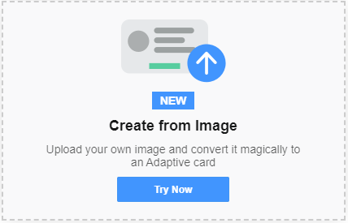

## Designer "Create from Image" feature

The [Adaptive Card Designer](https://adaptivecards.io/designer) includes a preview feature that allows uploading an image and having machine learning (ML) convert it into an Adaptive Card. Once this image is processed and the card payload is returned, all uploaded data is discarded. Your use of the feature operates as your consent to these practices. The Microsoft privacy statement is located here https://go.microsoft.com/fwlink/?LinkID=824704

## General website usage
The software may collect information about you and your use of the software, and send that to Microsoft. Microsoft may use this information to provide services and improve our products and services.You may opt-out of many of these scenarios, but not all, as described in the product documentation. There are also some features in the software that may enable you and Microsoft to collect data from users of your applications. If you use these features, you must comply with applicable law, including providing appropriate notices to users of your applications and you should provide a copy of Microsoft’s privacy statement to your users. The Microsoft privacy statement is located here https://go.microsoft.com/fwlink/?LinkID=824704. You can learn more about data collection and use in the help documentation and our privacy statement. Your use of the software operates as your consent to these practices.

