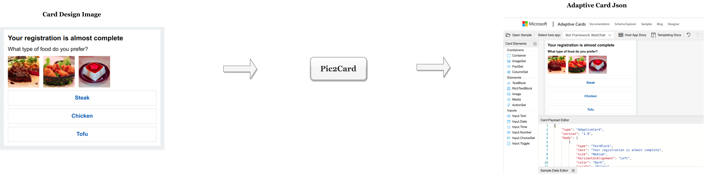
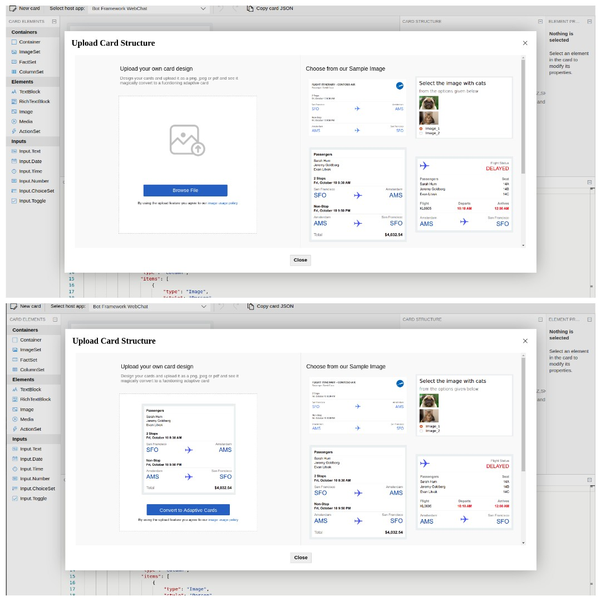

# Pic2Card

## Description
Pic2Card is a solution for converting adaptive cards GUI design image into adaptive card payload Json.





## Architecture


## Integrated with Adaptivecard designer


## Setup and Install pic2card 


### Setup Locally

**Install the requirements**

```shell
    # Setup dependency under a virtualenv
    $ virtualenv ~/env
    $ . ~/env/bin/activate
    (env)$ pip install -r requirements/requirements.txt
    (env)$ pip install -r requirements/requirements-frozen_graph.txt # tf specific only
```

**Run the pic2card Servie**

```shell
    # Start the service.
    (env)$ python -m app.main

    # Hit the API using curl
    $ (env) curl --header "Content-Type: application/json" \
            --request POST \
            --data '{"image":"base64 of the image"}' \
            http://localhost:5050/predict_json
```

**For Batch process**


```shell
   python -m commands.generate_card  --image_path="path/to/image"
```

### Run the pic2card service in docker container

You can build a docker image from the source code and play with it.

By default we only need single container, which embed the model model as well as
the pic2card application.

```bash

# Build the image with frozen model.
$ docker build -f docker/Dockerfile -t <username>/<container-name:tag> .

# Run the pic2card service with frozen graph model.
$ docker run -it --name pic2card -p 5050:5050 <image:name:tag>
```

### Use Tensorflow Serving to deploy pic2card

NOTE: This is an experimental feature only.

If you want to use the tensorflow serving to serve the model, then first build
the tensorflow serving with our model loaded with it in an another separate
docker. tf_serving provide RESTful APIs to interact with tensorflow models, in
standard way.

```bash
# You can export the model for inferencing from model checkpoint.
#
$ cp <tf saved_model>/* model/*
$ docker build . -t <image:tag> docker/Dockerfile-tf_serving
$ docker run -it -p 8501:8501 <image:tag>

# Build the pic2card pipeline without trained model. Now the inference is
# provided by the tensorflow serving.

$ docker build -t <image:tag> -f docker/Dockerfile .
```

## Training
After the [Tensorflow ,Tensorflow models intsallation](https://tensorflow-object-detection-api-tutorial.readthedocs.io/en/latest/install.html):

1. Lable the  train and test images using - [labelImg](https://github.com/tzutalin/labelImg).

1. create csv files for train and test dataset

  ```shell
  python commands/xml_to_csv.py
  ```

  ```python
  #Which will generate the label mapping like:
    filename  width  height    class  xmin  ymin  xmax  ymax
  0   64.xml    576     814  textbox    24    31   407    81
  1   64.xml    576     814  textbox    15   109   322   157
  2   64.xml    576     814  textbox   337   112   560   151
  3   64.xml    576     814  textbox   256   176   543   294
  4   64.xml    576     814  textbox    93   358   506   432
  ```

  ​

2. set configs for generating tf records

  ```python
  # TO-DO replace this with label map
  def class_text_to_int(row_label):
      if row_label == 'textbox':
          return 1
      if row_label == 'radiobutton':
          return 2
      if row_label == 'checkbox':
          return 3
      else:
          None
  ```

  ```shell
  #Generate tf records for training and testing dataset
  python commands/generate_tfrecord.py \
     --csv_input=/data/train_labels.csv \
     --image_dir=/data/train \
     --output_path=/tf_records/train.record

  python commands/generate_tfrecord.py \
     --csv_input=/data/test_labels.csv \
     --image_dir=/data/test \
     --output_path=/tf_records/test.record

  ```

  ​

3. Edit training/object-detection.pbxt file to match the label maps mentioned in generate_tfrecord.py

4. download any pre trained tensorflow model from [here](https://github.com/tensorflow/models/blob/master/research/object_detection/g3doc/detection_model_zoo.md)

5. set below paths appropriately in pipeline.config file

  ```
  num_classes:number of labels/classes
  fine_tune_checkpoint: path to pre-trained faster rcnn tensorflow model
  train_input_reader.input_path: path to train tf.record
  eval_input_reader.input_path: path tp test tf.record
  label_map_path: path to object-detection.pbtxt label mapping
  ```

  ​

6. train model using below command

  ```shell
  python commands/train.py \
     --logtostderr \
     --model_dir=training/ \
     --pipeline_config_path=../training/pipeline.config
  ```

  ​

7. export inference graph

  ```shell
  #After the model is trained, we can use it for prediction using inference graphs
  #change XXXX to represent the highest number of trained model

  python commands/export_inference_graph.py \
     --input_type image_tensor \
     --pipeline_config_path training/pipeline.config \
     --trained_checkpoint_prefix training/model.ckpt-XXXX \
     --output_directory ../inference_graph
  ```

8. Can view the rcnn trained model's beaviour using the Jupyter notebook available under notebooks

## Testing

Unit tests have been written with python unittest module. Can run the tests module
using the following commands

To run all tests

```
python -m unittest discover
```

## Measure the model Accuracy

We are using the standard mAP (Mean Average Precision) metric. Use the below
command to generate the intermediate results so that can be used to generate the
map metric.

```bash

# Test the default tf model
$ python -m commands.map_score --test-dir <test-labelmg-dir> \
    --ground-truth-dir ./out/ground-truth \
    --pred-truth-dir ./out/detection-results
    --model-fw tf

```

Currently `tf|pytorch` model implementations are added, in which tf is matured
one. And you can enable the custom image extraction pipeline by passing the
flag `--image-pipeline`.

Once we generated the `out` folder, then we can use the command from [mAP](https://github.com/Cartucho/mAP.git)
repository to see the score. You have to clone this repo and copy the out
folder generate here under the input folder of the mAP command. Please refer
the README to understand how to use the mAP command further.
