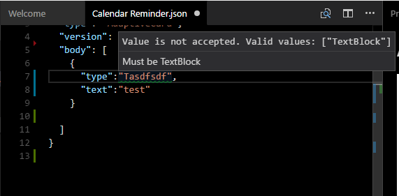

# Schema validation
Schema validation is a powerful way of making authoring easier and enabling tooling.

## JSON Schema file
We have provided a complete [JSON schema file](../../../schemas/adaptive-card.json) for editing and validating 
adaptive cards in json.

In Visual Studio and Visual Studio Code you can get automatic Intellisense by including a `$schema` reference.




Example:
```javascript
{
    "$schema": "http://adaptivecards.io/schemas/adaptive-card.json",
    "type": "AdaptiveCard",
    "version": "0.5",
    "body": []
}
```

## XSD Schema file
The Microsoft.AdaptiveCards .NET library has XML annotations so that you can serialize and deserialize XML 
as well as JSON, making it easy to use with XML-based toolsets. 

We have provided a complete [XSD schema file](../../../schemas/adaptive-card.xsd) for editing and validating 
adaptive cards in xml.

In Visual Studio and Visual Studio Code you can get automatic Intellisense by including a XSD reference like this:

```xml
<?xml version="1.0" encoding="utf-16"?>
<AdaptiveCard xmlns:xsi="http://www.w3.org/2001/XMLSchema-instance" 
    xmlns:xsd="http://www.w3.org/2001/XMLSchema"
    xsi:noNamespaceSchemaLocation="http://adaptivecards.io/schemas/adaptive-card.xsd">
  <TextBlock Text="Hello world" />
</AdaptiveCard>
```

# Tools and samples
There are some tools and samples in the source tree which are useful references as well as useful tools.

## Visual Studio Code Extension
We have created a Visual Studio code extension which allows you to visualize the card you are editing in real time
inside the editor itself. 


To install, open Extensions Marketplace and search for **Adaptive Card Viewer**.


## WPF Visualizer Sample
The [WPF visualizer sample project](../../../../../source/dotnet/Samples/WPFVisualizer/AdaptiveCards.Sample.WPFVisualizer.csproj) lets you visualize cards using WPF/Xaml on a Windows machine.  A `hostconfig`
editor is built in for editing and viewing host config settings. Save these settings as a JSON to use them in rendering
in your application.


## Render2Image Sample
The [Render2Image sample project](../../../../../source/dotnet/Samples/RenderImage/Render2Image.csproj) turns any card into a PNG from the command line.
