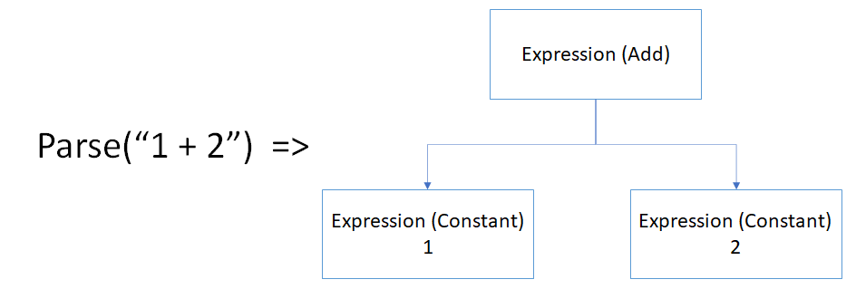
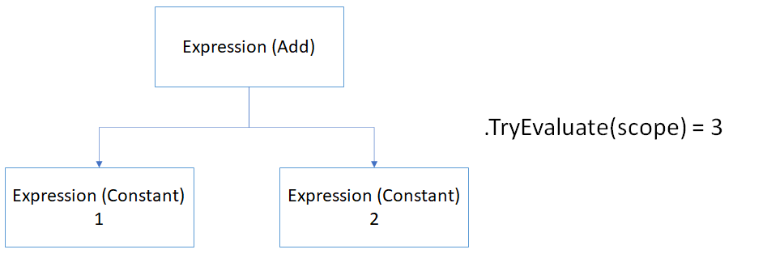
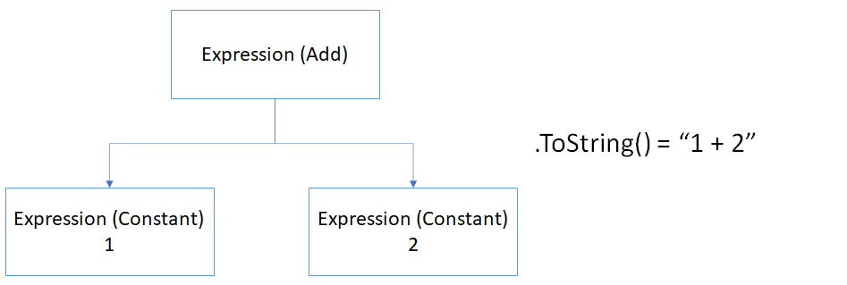

# AEL Port for C++

# What is Antlr? (ANother Tool for Language Recognition)

ANTLR is a parser generator tool. Antlr takes a piece of text and transforms it into an Abstract Syntax Tree (AST). Before being able to generate an AST we need to define a lexer and parser grammar. This elements are fed to ANTLR which generates lexer and parser code in the desired language (C#, Javascript, C++, etc). Finally, you provide the text to be transformed to the generated code.

# Basic API usage

From the Unit tests found in the C# AEL we can see that the most used APIs are the following:

`static Expression Parse(string expression);`

The `Parse` function is in charge of converting a string into the Abstract Syntax Tree (AST), this step is in charge of `visiting` all the nodes in the tree and validating the expected return types. The word `visiting` is emphasized as the library follows the visitor pattern so it can return values when entering/exiting each of the abstract tree; the other pattern supported in antlr is the listener pattern which doesn't allow value returns.

`Expression TryEvaluate(object scope);`

The `TryEvaluate` function is in charge of converting the parsed AST into a value (int, string, array, object, etc.). The expression tree is visited completely during this step evaluating every node. The scope object is a collection of (key, value) pairs where the key is a string and the value can be of any type.

`string Expression ToString()`

Finally, the `ToString` function converts an expression tree into it's equivalent expression string. 

`Expression`

The expression class contains 4 properties
| Property | Details |
| --- | --- |
| Children | A children list composed of other Expression elements |
| Evaluator | Function that defines the behaviour of this expression | 
| ReturnType | Expected result of evaluating expression (Number, Object, String, Boolean, Array) |
| Type | String that represents the type of the expression ("+", "add", etc) |

`AdaptiveCardTemplate Expand(EvaluationContext context)`

The `Expand` function is in charge of converting an AdaptiveCardTemplate object into a valid (if possible) adaptive card json that can be parsed and renderers by any platform.

# Built in functions

The built-in functions list is currently composed of 150 elements which are: 

| | | | | |
| --- | --- | --- | --- | -- |
| Accessor | Add | AddDays | AddHours | AddMinutes | 
| AddOrdinal | AddProperty | AddSeconds | AddToTime | And | 
| Average | Base64 | Base64ToBinary | Base64ToString | Binary | 
| Bool | Ceiling | Coalesce | Concat | Contains | 
| ConvertFromUtc | ConvertToUtc | Count | CountWord | CreateArray |
| DataUri | DataUriToBinary | DataUriToString | Date | DateReadBack | 
| DateTimeDiff | DayOfMonth | DayOfWeek | DayOfYear | Divide | 
| Element | Empty | EndsWith | EOL | Equal | 
| Exists | First | Flatten | Float | Floor | 
| Foreach | FormatDateTime | FormatEpoch | FormatNumber | FormatTicks |
| GetFutureTime | GetNextViableDate | GetNextViableTime | GetPastTime | GetPreviousViableDate | 
| GetPreviousViableTime | GetProperty | GetTimeOfDay | GreaterThan |  GreaterThanOrEqual | 
| If | Ignore | IndexOf | IndicesAndValues | Int | 
| Intersection | IsArray | IsBoolean | IsDate | IsDateRange |
| IsDateTime | IsDefinite | IsDuration | IsFloat | IsInteger | 
| IsMatch | IsObject | IsPresent | IsString | IsTime | 
| IsTimeRange | Join | JPath | Json | JsonStringify | 
| Last | LastIndexOf | Length | LessThan | LessThanOrEqual | 
| Max | Merge | Min | Mod | Month | 
| Multiply | NewGuid | Not | NotEqual | Optional | 
| Or | Power | Rand | Range | RemoveProperty | 
| Replace | ReplaceIgnoreCase | Round | Select | SentenceCase | 
| SetPathToValue | SetProperty | Skip | SortBy | SortByDescending | 
| Split | StartOfDay | StartOfHour | StartOfMonth | StartsWith | 
| String | SubArray | Substring | Subtract | SubtractFromTime | 
| Sum | Take | Ticks | TicksToDays | TicksToHours | 
| TicksToMinutes | TitleCase | ToLower | ToUpper | Trim | 
| Union | Unique | UriComponent | UriComponentToString | UriHost | 
| UriPath | UriPathAndQuery | UriPort | UriQuery | UriScheme | 
| UtcNow | Where | Xml | XPath | Year |

This list of functions is located in a Custom dictionary called `FunctionTable` that merges the built-in functions with custom functions. 

# Diferences in the context of a C++ port

As this is a port into the C++ language not all code can be translated in a 1:1 fashion. As of this time only a simple and fail prone prototype has been made and as such this is a list of some of the currently encountered issues. 

## Json lib vs Newtonsoft.Json

Some of the code found in the C# library relies on data types returned by the Newtonsoft.Json library as well as some converters which use has not been pin pointed.

## Multiple platform release

The C++ port of AEL is designed to be able to be executed in the mobile platforms (UWP, iOS and Android), as such we will have to devise a mechanism to allow Java or C# developers to add custom functions into the C++ code (if possible).

## C++ Language limitations

### Object

Prior to C++ 17, the language doesn't have an `object` type equivalent so there have been lots of third party solutions that have appeared such as `boost::any`, in the case of antlr they decided to introduce their own datatype `antlrcpp::Any`. With the introduction of C++17, new data types and other niceties were introduced including a new `std::any` data type which can enclose any other type and that allows us to replicate the object behaviour (except for having all elements have a ToString method). 

> Important: `std::any` and `antlrcpp::Any` are not interchangeable types, so outside of the `parsing` process `antlrcpp::Any` should not be used 

### ToString()

The C# implementation of AEL relies heavily on the use of the ToString method to convert the `Expression` objects into strings, in c++ the output stream operator `<<` can be overloaded which may be useful to overcome the lack of the ToString method in all C# objects.

### Lambdas

The C# implementation also uses heavily lambdas for short function or to avoid passing function as parameters, while C++ allows to wrap lambdas in `std::function` variables this approach may not work if relying on the function state as as soon as it goes out of scope variables are cleaned. 

## Feature Cost estimation

For the development of this feature the following conservative costs have been estimated for all platforms like this:

| Task # | Task | Cost (days) | Previous requirements | Includes |
| --- | --- | --- | --- | -- |
| 1 | Lexer and Parser generation | 0 | None |  |
| 2 | Completion of Expression Tree generation (Parse API) | 5 | Lexer and Parser generation | |
| 3 | Completion of TryEvaluate API | 5 | Parse API |
| 4 | Implementation of built-in functions | 57 | Parse API, TryEvaluate API | Unit test per function |
| 4.1 | Implementation of arithmetic and logical functions | 10 | TryEvaluateAPI | |
| 4.2 | Implementation of date and time functions | 15 | TryEvaluateAPI | |
| 4.3 | Implementation of string and array functions | 12 | TryEvaluateAPI | |
| 4.4 | Implementation of casting functions | 5 | TryEvaluateAPI | |
| 4.5 | Implementation of other functions | 15 | TryEvaluateAPI | |
| 5 | Bug Bash (AEL only) | 2 | Parse API, TryEvaluate API, Built-in functions  |
| 6 | Bug Fixing | 10 | Bug Bash | Bug fixing |
| 7 | Implementation of AdaptiveCards Templating library | 8 | Parse API, TryEvaluate API, Built-in functions | Unit tests | 
| 8 | Bug Bash (AC Templating) | 2 | AC Templating lib  |
| 9 | Bug Fixing | 5 | Bug Bash | Bug fixing |
| 10 | Definition of swig interface for Android | 5 | AC Templating lib | Unit tests | 
| 11 | Definition of C# interfaces for UWP | 5 | AC Templating lib | Unit tests |
| 12 | Final Bug Bash (mobile platforms) | 2 | AC Templating lib, Android and UWP interfaces  |
| 13 | Bug Fixing | 2 | Bug Bash | Bug fixing |
| 14 | Documentation | 5 | Mobile platforms implementations | | 
| | Total cost | 108 | | |

The Adaptive Expressions library for C++ must be merged in a different repository so extra release work may be needed.

## Requirements Priorities

| Priority | Task |
| --- | --- |
| P0 | Valid expressions can be converted to an Expression tree |
| P0 | Valid Expression trees can be evaluated |
| P0 | Error messages shall be returned if an expression tree failed evaluation |
| P0 | TryEvaluate API can consume a set of (key, value) pairs during evaluation |
| P0 | The AC Templating library will return a valid AdaptiveCard (if input is valid) |
| P0 | UWP platform can consume the AC Templating API | 
| P0 | Android platform can consume the AC Templating API |
| P0 | iOS platform can consume the AC Templating API |
| P2 | Support for multi-threading |
| P2 | Support for non utf-8 strings |
| P2 | Support for custom functions |
| P2 | Support for Locale and Culture variant conversions (i.e. decimal point as `,`) |

# Appendix

## Appendix A: Built-in functions divided by type 

### Arithmetic & Logical
* Add
* And
* Average
* Ceiling
* Divide
* Equal
* Floor
* GreaterThan
* GreaterThanOrEqual
* If
* LessThan 
* LessThanOrEqual 
* Max
* Min
* Mod
* Multiply 
* Not
* NotEqual
* Or
* Power
* Rand
* Range
* Round
* Subtract
* Sum
* Where

### Date & Time

* AddDays
* AddHours
* AddMinutes
* AddSeconds
* AddToTime
* ConvertFromUtc
* ConvertToUtc
* DateReadBack
* DateTimeDiff
* DayOfWeek
* DayOfYear
* DayOfMonth
* FormatDateTime
* GetFutureTime
* GetNextViableDate 
* GetNextViableTime 
* GetPastTime
* GetPreviousViableDate
* GetPreviousViableTime
* GetTimeOfDay
* Month
* StartOfDay
* StartOfHour 
* StartOfMonth
* SubtractFromTime
* Ticks
* TicksToDays
* TicksToHours
* TicksToMinutes
* UtcNow 
* Year

### String & Array
* Concat
* Contains
* CountWord
* CreateArray
* EndsWith
* Empty
* Exists
* First
* Foreach
* IndexOf 
* IndicesAndValues
* Intersection
* Join
* Last
* LastIndexOf
* Length
* Merge
* Replace
* ReplaceIgnoreCase 
* SentenceCase
* SortBy
* SortByDescending
* Split
* StartsWith
* SubArray
* Substring
* TitleCase
* ToLower
* ToUpper
* Trim
* Union
* Unique

### Casting

* Bool
* Date
* IsArray
* IsBoolean
* IsDate
* IsDateRange
* IsDateTime
* IsDefinite
* IsDuration
* IsFloat
* IsInteger
* IsMatch
* IsObject
* IsPresent
* IsString
* IsTime
* IsTimeRange
* Float
* Int
* String

### Other functions
* Accessor
* AddOrdinal
* AddProperty
* Base64
* Base64ToBinary
* Base64ToString
* Binary
* Coalesce
* DataUri
* DataUriToBinary
* DataUriToString
* Element
* EOL
* Flatten
* FormatEpoch
* FormatNumber
* FormatTicks
* GetProperty
* Ignore
* JPath
* Json
* JsonStringify
* NewGuid 
* Optional
* RemoveProperty
* Select
* SetPathToValue
* SetProperty
* Skip
* Take
* UriComponent
* UriComponentToString
* UriHost
* UriPath
* UriPathAndQuery
* UriPort
* UriQuery
* UriScheme
* Xml
* XPath