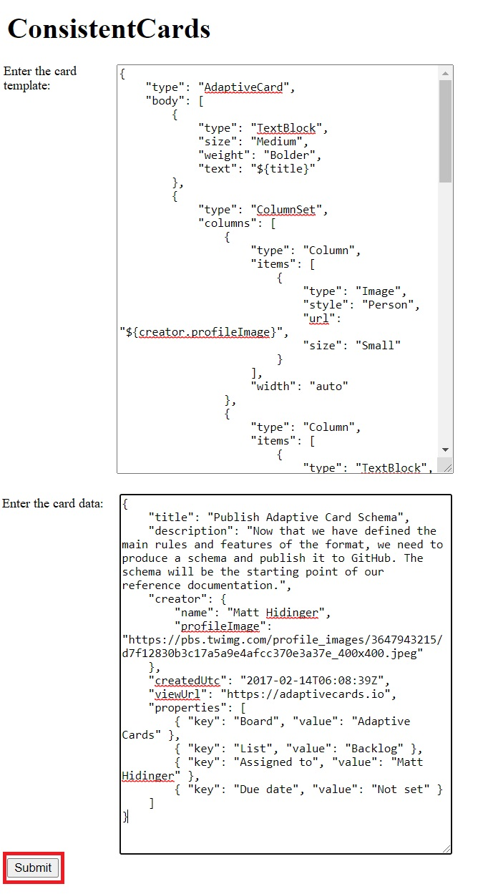
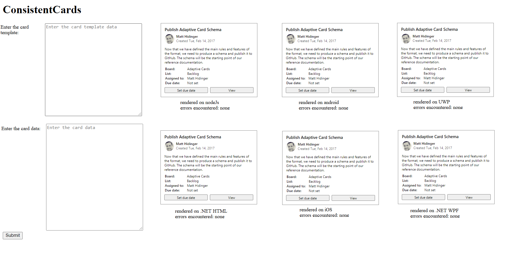
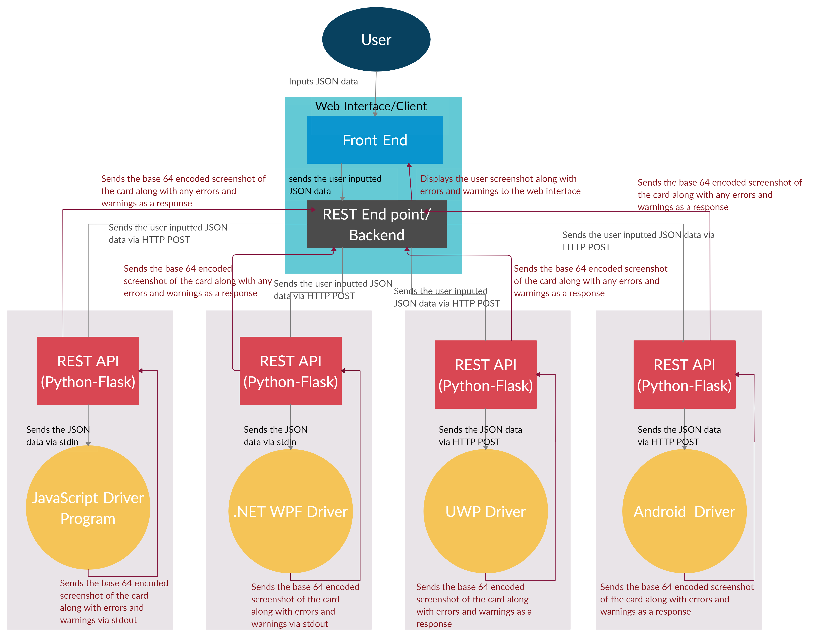
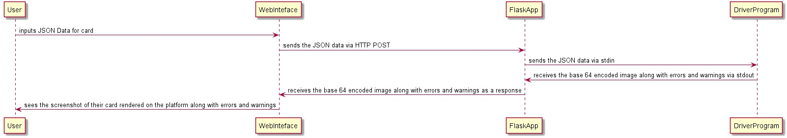
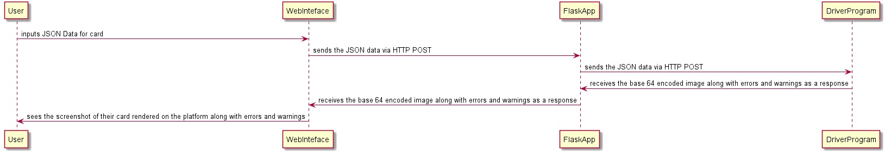

# Consistent Cards

## Table of Contents
- [Overview](#overview)
    - [Problem Statement](#Problem-Statement)
    - [Existing Solution](#Existing-Solution)
    - [Project Idea](#Project-Idea)
    - [Requirements](#Requirements)
- [Technology Decisions](#Technology-Decisions)
- [Architecture Details](#Architecture-Details)
    - [UserExperience(Interface Mockups):](#UserExperience(Interface-Mockups))
    - [Architecture Diagram](#Architecture-Diagram)
    - [Key Components](#Key-Components)
- [Workflow](#Workflow)
    - [Sequence Diagram](#Sequence-Diagram)
    - [Workflow Details](#Workflow-Details)
    - [Communication between the Flask App and the Driver Program(Javascript and .NET WPF)](#Communication-between-the-Flask-App-and-the-Driver-Program(Javascript-and-.NET-WPF))
    - [Android, IOS and UWP communication](#Android,-IOS-and-UWP-communication)
    - [Android-and-IOS-templating](#Android-and-IOS-templating)
    - [Child processes vs REST Server(Driver level)](#Child-processes-vs-REST-Server(Driver-level))
    - [REST API Specifications](#REST-API-Specifications)
        - [Endpoint](#Endpoint)
        - [Type-of-Request](#Type-of-Request)
        - [URL Parameters](#URL-Parameters)
        - [Request Body(form data)](#Request-Body(form-data))
    - [Error Handling](#Error-Handling)
- [Deployment Details](#Deployment-Details)
- [Q/A](#Q/A)
- [Appendix](#Appendix)
    - [Current Testing Tools](#Current-Testing-Tools)

        

## Overview
### Problem Statement
It is one of the goals of Adaptive Cards as a product to have its features be consistently implemented by default across all platforms currently supported by Adaptive Cards. For instance, if a card uses the templating SDK on one platform, our customers (card authors and host app developers alike) as well as the feature team, should be able to view the specific card rendered consistently across all the platforms or alternatively have similar failures across the platforms. 

Currently there is no easy way to test this consistency across all platforms as a card designer, host app developer and a developer on the Adaptive Cards Team.

### Existing Solution
One way a user can test their card is by using our per-platform visualizer tools. This would require the user to test the card with each individual visualizer. However, these tools are not shipped publicly for every platform. The current solutions to test your card on each individual platform are mentioned in the appendix at the end. For many platforms, if you are not a Microsoft internal customer, running these tools involves the user needing to clone our repo, and build each project and then use the visualizer tool to render the card.  

This method not only takes time and demands familiarity with the building some solutions but also requires the necessary hardware from the card designer. A Windows user would need a Mac to use iOS visualizer. This method would therefore not be suitable for every user and is inconvenient even for the Adaptive Cards feature team themselves. 

### Project Idea
ConsistentCards is a web based application that allows users to quickly see how their Adaptive Card renders across the multiple supported platforms without directly having to use the specific SDKs for each platform and without having the necessary hardware for each platform. The user is required to input the json data or upload the json files for their adaptive card. They then get a screenshot of their card rendered on each individual platform along with any warnings or errors. This allows the user to easily ensure consistency across the multiple platforms supported by Adaptive Cards. This project would target card authors, host app developers as well as members of the Adaptive Cards Team and would allow them to easily ensure consistency in their cards.

### Requirements
The following are some of the major requirements:
1.	P0: The customer-facing front-end of the app must be accessible on any platform, not just Windows.
2.	P0: The app should support one windows renderer experience (.NET or UWP or JS) and one cross platform renderer experience (android or iOS).
3.	P0: The app must make use of existing shipped/stable rendering SDKs for each platform at the backend to render the card.
4.	The app must support all the user to input the card contents in all supported formats (including templating and any other future format) 
5.	P0: The app must support templating and allow the user to input the card template and card data.
6.	P1: The app should support cards that do not use templating as well.
7.	P1: All platforms that currently support Adaptive Cards must be supported by the application.
8.	P2: The app should allow users to optionally supply the host config as well.

## Technology Decisions
1.	The customer-facing front-end is a website accessible by any browser on any device/platform, a key requirement of this project. 
2.	The app consists of a cloud hosted REST service for each platform. Python-Flask is chosen for this REST API. It allows us to easily call the rendering scripts.
3.	The rendering scripts (called by the REST service) are written natively to each platform. This allows us to make use of the rendering SDK for that platform.
4.	NodeJs is chosen for the front-end web application. It allows us to easily make asynchronous calls to all the cloud hosted REST services. 

## Architecture Details
### UserExperience(Interface Mockups) 
The following pictures show what the app aims to achieve. The final product might look different, but the functionality would be identical:

- The user goes to the URL and enters the card data and card template 

  

- The user is shown pictures of what their card looks like when it’s rendered across the different platforms along with any errors that may have been encountered:
  

### Architecture Diagram 
 

The above diagram gives the overall architecture of the project. It is supposed to give an idea of the overall architecture and does not mention all the platforms. However, the actual project must cover all the platforms that support adaptive cards. 

### Key Components
The following are the key components of the project along with their purpose:
1.	There is a front-end web-based client app. We will refer to this as the web interface.
    *	This is written in Node Js. 
    *	The user inputs the json data for the card template and data here. 
    *	The user also sees the rendered screenshots of the card across the platforms here.
    *	The web interface would be one page where the user would supply their JSON data. Then, their cards would be rendered underneath on the same page.
2.	There are a number of cloud hosted REST API. These REST API are all written in Python-Flask. We will refer to this as the FlaskApp.
    *	Each REST API contains a single REST endpoint. This is the route that accepts the HTTP POST request from the client app.
    *	Each REST API will accept the JSON data via an HTTP POST. It will call a renderer script and send it the JSON data
    *	Each REST API receives a JSON from the renderer that contains the screenshot as well as any errors in rendering.
    *	Because each REST API calls a renderer program, each REST API and corresponding renderer are hosted on a separate VM that supports the renderer. For instance the REST API for iOS and the iOS renderer are hosted on a Mac VM. Similarly, the UWP renderer and corresponding REST API are hosted on a Windows VM.
    *	The REST API is the same for each platform and it is abstracted away from the renderer.
    *	For the first version of this project, there will be one REST API per platform and therefore one REST end point per platform. These would be something like /nodejs, /dotnetWPF etc.
3.	There is a rendering app connected to each REST API. We will refer to this as the driver.
    *	It is specific to a platform(for instance there is a nodeJs renderer, UWP renderer)
    *	This app is called by the REST API and gets the JSON data from the FlaskApp via stdin. 
    *	It uses the templating SDK (for its specific platform) and the rendering SDK (for its specific platform) to render the adaptive card. 
    *	It takes a screenshot of the rendered card.
    *	It sends a JSON containing the screenshot of the card(base 64 encoded) along with any errors(list of strings) back to the Flask App (REST API) via stdout.
    *	It is also hosted on the VM along with its corresponding Flask App (REST API).

## Workflow
### Sequence Diagram
**JavaScript and .NET WPF**

The current workflow of a request and response on JavaScript and .NET WPF is shown below: 

**Android, UWP and iOS**

The current workflow of a request and response on UWP, Android and iOS is shown below: 

### Workflow Details
The current flow is as follows:

1.	The user inputs the card template and card data JSON files/strings on the client web App. 

    

2.	This JSON data is sent to the FlaskApp(REST API) via an HTTP POST request.
3.	The flask app parses the json data and creates a new JSON string with two fields: “card”, “template”. These fields correspond to the json data respective to each field. The following example shows how this string would look like for a particular user input:

    Suppose the user inputs: 

    *Template.json*
    
        {
            "type": "AdaptiveCard", 
            "version": "1.0", 
            "body": [ 
                { 
                    "type": "TextBlock", 
                    "text": "Hello ${name}!" 
                } 
            ] 
        }
    *Data.json* 
        
        {
            “name”: "Matt Hidinger" 
        }
    Then the flask app would create the following JSON string:

        {
            “template”: { 
                "type": "AdaptiveCard", 
                "version": "1.0", 
                "body": [ 
                    {  
                         "type": "TextBlock", 
                        "text": "Hello ${name}!" 
                      } 
                ] 
            }, 
            “data”: { 
                name: "Matt Hidinger" 
            } 
        } 

        
    *(One of the benefits of using the above format is its extensibility. We can 	     easily allow the user to supply a host config and add another field to accommodate it in our JSON string above.)* 

4.	The flask app then writes/prints this JSON string to the standard output/sends it as an HTTP POST(depending on the platform) and calls a specific driver program(for instance the nodejs driver) for a specific platform.

5.	The driver creates a new JSON string with fields for the image and errors as shown below: 
    
    *Result* 
        
        {
            "imageData": "",
            "errors": "",
            "warnings": ""
        }

6.	The driver program reads the JSON string from the standard input and uses the templating SDKs and the rendering SDKs to create an Adaptive Card.
7.	This card is rendered on the platform and a screenshot is taken.
8.	The driver then adds the base 64 encoded image data to the imageData field in the JSON string it created earlier. It also adds any errors to the errors field.

The resultant JSON string would look something like:

*Result* 
        
        {
            "imageData": <base64 encoded screenshot of card>,
            "errors": [array of strings],
            "warnings": [array of strings]
        }
      
9.	The driver then prints this JSON string to the standard output.
10.	The Flask app reads this string via standard input and sends back this string to the client as a response to the HTTP POST request it had received.
11.	The client then parses this string and displays the screenshot as well as any errors to the user

The above workflow mentions the client making a POST request to one REST service. In reality, the client makes an asynchronous call to all the REST services(one per platform) and sends each of them the data via HTTP POST. It then displays each screenshot as it receives it from each of the REST services.

### Communication between the Flask App and the Driver Program(Javascript and .NET WPF)
- The flask app receives a post request from the web interface/client app with the relevant data. 
- It spins up a child process(a node script for javascript and a console app for WPF) and sends the JSON string it created via stdin and listens on the process's stdout. 
- The child process reads the data from its stdin and renders the card. 
- It then takes a screenshot and sends the results back via stdout and exits. 
- The flask app receives these results since it was listening on the process's stdout. 
- The flask app sends these results back to the web interface.
- It must be noted that this approach works for .NET WPF due to the renderCardToImageAsync.
    - We create a simple .NET console application.
    - This app receives the data from the flask app via stdin. 
    - It creates the adaptive card and then simply calls the renderCardToImageAsync instead of rendering the card. 
    - It sends the results back to the flask app via stdin.

### Android, IOS and UWP communication
- It is quite difficult to start an android,iOS or a UWP app as a child process and communicate with it via stdin. 
- As an alternative, we can instead create a REST server within the app that is capable of accepting POST requests. 
- Then, we simply have our flask app send a post request to our platform app and get a response. 
- It must be noted that apart from the communication, the app would behave in a similar manner and parse a similar input format and send a similar output format. 
- One drawback in this approach is that we have a single app that must handle all requests and render the card on its own UI to get a screenshot. 

### Android and IOS templating
Since Android and IOS do not support templating right now, we can send the non-templated cards by just filling the template field in the form. The Flask Apps for these two platforms can simply send this data to the app and get the response back.

If a user enters a templated version of a card then they should get an error message saying that templating is not supported on these platforms. This should be the case until templating is supported.

### Child processes vs REST Server(Driver level)
It is entirely possible to alter the javascript and the .NET WPF Implementation and use the REST approach(as used in Android, iOS and UWP) instead of using child processes and pipes. There are several benefits in using pipes and child processes instead of creating an app that embeds a REST server.

- Child processes and pipes mean that each post request is independent from the other post requests. This means if multiple users submit post requests, each would be handled independtly on its own thread. 
- This is different from how android, iOS and UWP work. There is only a single application that embeds the server and this application is always running. The details are given below:

    - When a user sends a post request for UWP, iOS or Android, the flask app sends a post request to the app. 
    - This app takes the data and renders the card on its own UI. 
    - It then takes a screenshot of the card and creates the base64 encoded string along with the errors and warnings.
    - It removes the card from its layout.
    - It sends the result back as response. 
    - This approach basically means that the app is only able to process one request at a time.
- The benefit of using child proceses is that each request can spin its own child process and communicate with its standard input. There is no sharing of resources between requests and concurrency issues. 
- In an ideal case, we would use child processes for Android, UWP and iOS. However, due to the limitations of stdin on these platforms, we have to rely on the REST approach.

### REST API Specifications
The following gives an example of one REST API. It must be noted that for version 1, all the REST API are almost identical with respect to their request body, response and type of request.

#### Endpoint
 /nodeJs

#### Type of Request
POST

#### URL Parameters
None

#### Request Body(form data)
| name     | type   | description                                         |
|----------|--------|-----------------------------------------------------|
| template | *string* | A JSON string that corresponds to the card template |
| data     | *string* | A JSON string that corresponds to the card data     |

   
| Code | Body         |                                                                                                                                                           |
|------|--------------|-----------------------------------------------------------------------------------------------------------------------------------------------------------|
|      | Content-Type | Description                                                                                                                                               |
| 200  | JSON string  | A JSON string that contains three fields (imageData, warnings and errors) that contains the base 64-encoded screenshot of the card along  with any errors |
|      |              |                                                                                                                                                           |
    

### Error Handling
There are two major instances of errors that might occur. 
1. **Invalid input/malformed input:**
    1.	This type of error can occur if the user supplies some malformed input (invalid json string). The web interface and flask app would not check for a valid json. This error would be caught at the driver program level. This is done to ensure that the error handling per platform is also valid and consistent in case of malformed JSON.
    2.	It can also occur if the user’s json strings are not valid adaptive cards. These errors will be handled by the driver program by the specific SDK being used. The current error handling supported by the SDKs is mentioned at 
    https://docs.microsoft.com/en-us/adaptive-cards/rendering-cards/renderer-status
        1.	Any errors and warnings encountered during rendering the adaptive card can be added to the list of the strings in the resultant json and will be returned to the FlaskApp which will return it to the client. 
        2.	These errors will be displayed on the client app.
        3.	 It is useful that each FlaskApp returns its own sequence of errors(supplied by the driver program). This allows us to ensure if the errors are also consistent across platforms when it comes to rendering. 
        4.	The exceptions and warnings generated are also added to the list of errors and returned to the client.
2. **Outside of SDKs and parsing:**
    1.	This type of error can occur when we take a screenshot of the rendered card. 
    2.	It can be the case that our driver program does not terminate and this causes the FlaskApp to wait for the driver to return the resultant JSON. To avoid this situation and ensure that the driver terminates, we use a timeout and if it takes more than _____ to take a screenshot, we will return the resultant JSON string with the error that it was unable to take a screenshot and the user should try again.

## Deployment Details
We would want to use cloud hosting services to deploy our project. Some of the major requirements or specifications would be:
1.	The process of deployment should not have us manually roll out updates.
2.	It should not require us to manually set up the VMs.
3.	The process of deployment should be easily repeatable.

First Version:
-	For the first version of the project, we are planning to manually host each REST API and the driver app on a separate VM.
-	This would serve as an initial tool for the Adaptive Cards Team and also serve as a proof of concept.
-	We would not be exposing the REST endpoints publicly. These can only be accessed through the client app.

## Q/A
1.	Why is a blocking API used over non-blocking API?
Ans. Currently, the aim of this project is to allow users to provide a JSON input and see how their card would render across all platforms. The current blocking API design easily accomplishes this without having to store the user requests or information somewhere. The request takes a few seconds at most to complete. Therefore, the blocking API is chosen since it does not take long to process a user’s requests. 

2.	Why is Python-Flask chosen for the REST API vs other frameworks such as nodeJs?
Ans. Each REST API calls a driver program that can render the adaptive card. The REST API supplies the JSON data over std out and gets the result back via stdin. Python has the subprocess module that provides functions which can easily achieve this. The subprocess module allows us to make calls to different scripts from within python, supply them data via stdin and capture anything the scripts output to stdout. 

3.	Why is the client app written in nodeJS?
Ans. NodeJS allows us to make asynchronous calls to all the REST API quite easily. We can use node promises and render each result on the client app as soon as we get it.

## Appendix
### Current Testing Tools
Currently there is no testing toolkit that works across all the platforms to test the cards on all platforms. The following is the list of the platforms currently supported by Adaptive Cards and the present toolkit to test the cards.
1.	**JavaScript:** 
The JavaScript designer tool is used by the Adaptive Cards Team as well as card authors and host app developers to design adaptive cards. The cards are rendered on the website using the RC renderer package.
https://adaptivecards.io/designer

2.	**UWP:**
An older version of the visualizer tool is available on the app store. There is also a nightly build availability for Microsoft v-team members on https://appcenter.ms/. These link against the source code and not the current nuget packages being shipped publicly.

3.	**Android:**
Internal nightly builds are available on https://appcenter.ms/. These are again not shipped publicly and link against the source code and not the rendering SDKs shipped publicly.

4.	**iOS:**
This is similar to android. The internal nightly builds are available on https://appcenter.ms/. These again link against the source code and not the SDKs shipped publicly.
