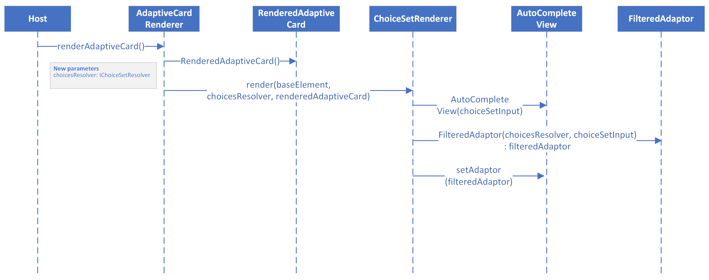
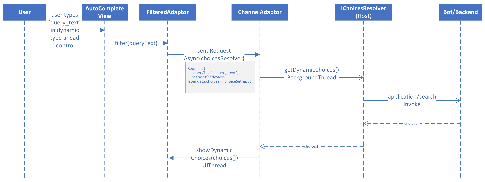

# [Draft] Dynamic Type Ahead Search

## Scope

This document covers changes to add Dynamic Type Ahead search support to Input.ChoiceSet in adaptive cards in android SDK.

### Render Dynamic Type Ahead

1.  Host calls the render method in the AdaptiveCardRenderer to render the adaptive card. Additional parameter choicesResolver is passed from the host to the SDK. This is an implementation of the IChoicesResolver exposed by the SDK, which is used by the SDK to fetch dynamic choices from host.
2.  AdaptiveCardRender creates a instance of RenderedAdaptiveCard.
3.  Views are created for all components in the adaptive card and added to RenderedAdaptiveCard. ChoiceSetRender is used to create view for input choice sets.
4.  Based on parameters of ChoiceSetInput, if dynamic type ahead needs to be rendered then AutoCompleteView is created.
5.  FilteredAdaptor is created and passed ChoiceSetInput instance which contains choices.data, choices[] etc. Also, choicesResolver is passed to the FilteredAdaptor.
6.  This instance of filteredAdaptor is then set onto the AutoCompleteView.

New Interfaces and classes  

1.  IChoicesResolver
    method - getDynamicChoices()
    params - queryText and choice set input which contains choices.data
    returns - list of dynamic choices
2.  ChannelAdaptor
    Sends an asynchronous request to the host on a background thread. Posts the result on to the caller on UIThread.

### Communication with Host to fetch Dynamic choices

1.  When user types in the type ahead control box, an event is triggered onto the auto complete view.
2.  AutoCompleteView calls in the filter method in the filtered adaptor.
3.  Filtered adaptor creates a request to fetch the dynamic choices from the host and calls the channel adaptor with this request and send choicesResolver as a parameter.
4.  Channel adaptor forwards the request to fetch the dynamic choices to the host on a background thread.
5.  The host either resolves the dynamic choices itself of through a backend/bot.
6.  Host gets a response from the backend/bot which contains list of dynamic choices.
7.  The host returns the list of dynamic choices to the channel adaptor.
8.  Channel adaptor inturn posts the filtered adaptor on the caller on a UIThread.

### Debounce Logic

[Recommendation - 250 ms](https://medium.com/android-news/implementing-search-on-type-in-android-with-coroutines-ab117c8f13a4)
