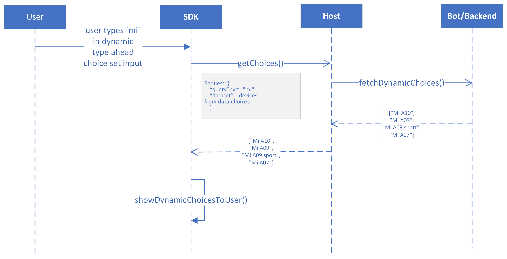
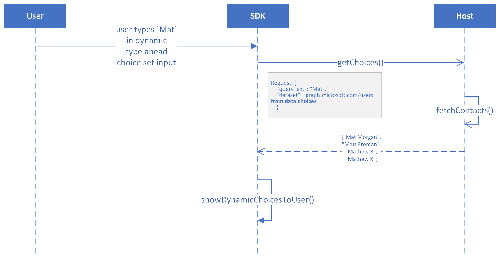
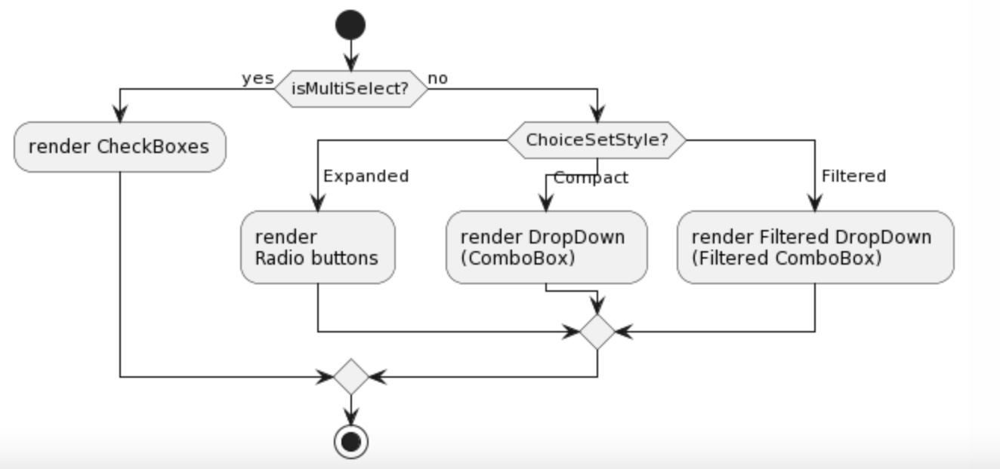
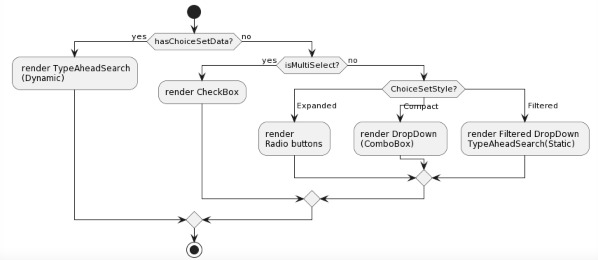
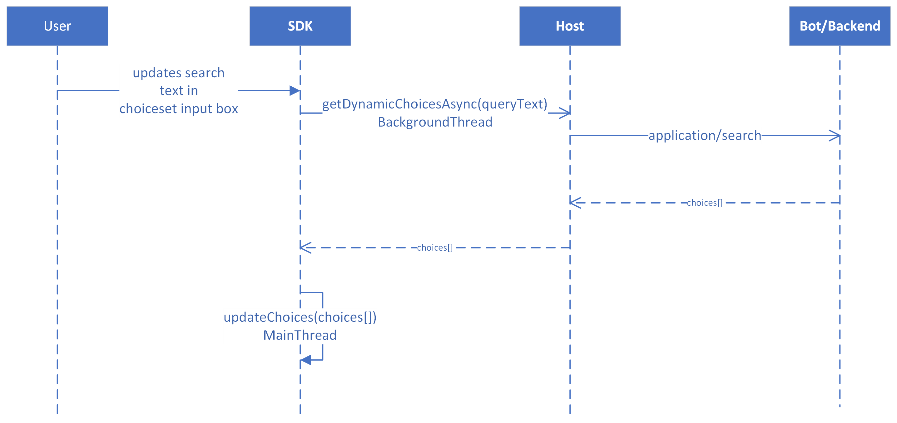
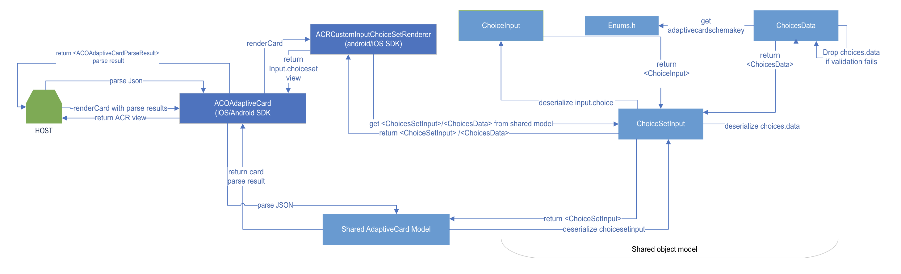
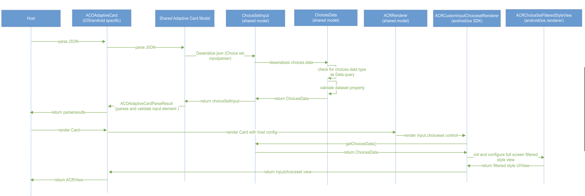

# Dynamic Type Ahead Search in Adaptive cards

## Summary

Input choice sets are a heavily used component in adaptive cards and lets developers create short form like experiences to take information from the end user and pass it on to the bot. Dynamic type ahead feature is useful when the user has to select from a large number of choices, a searchable select menu that dynamically loads data as the user searches will help in avoiding the poor experience that currently exists today (a static list of large number of choices). This feature will ultimately expand the horizon of the kind of use cases adaptive cards can be used by developers as large datasets (example addresses, product catalogs, contacts) can be used to take input from users.


## Scope

This document covers changes to add Dynamic Type Ahead search support to Input.ChoiceSet in adaptive cards.

## Goals

- The choice set input can dynamically fetch the list of choices from a remote backend as the user types.
- User should be able to view and select any option in the input choice set drop down.
- User should be able to clear the option selected in the input choice set.

## Architecture Overview

_Scenario 1: Search for a device model_ <br/>
`FixIt` is an app for raising requests for mobile repairs. `FixIt` sends an adaptive card to the user which the user has to fill in order to provide details of the device which needs repair. Here the device model field can be a dynamic type ahead (Input.ChoiceSet) which fetches the model names from the backend as the user types.



_Scenario 2: People Picker_ <br/>
Using the approvals app users can assign a request to people. This scenario can use an adaptive card with an Input.ChoiceSet which allows picking people dynamically. As the user types in the input box, dynamic choices of people are show to the user. From this dynamic choices of people, user can pick an option.


## Requirements

P0: Support the choices.data schema with SDK out of the box.

P0: The input can dynamically fetch the list of choices from the host as the user types.

P0: User experience when the dynamic choices are fetched from the host.

P0: Hosts can specify 1 or more pre-determined datasets that get the first-chance to fulfill the request. (E.g., Microsoft Teams could query the Active Directory list of users by hooking into the graph.microsoft.com/users dataset). If the host hasn't registered a matching dataset, the request will be sent to the backend.

P0: A static list of choices can be provided, and any dynamic ones will get appended to the end.

P1: The input will support "isMultiSelect": true. Multiselect won’t be supported as a part of v1.0 release. (Multi select will be a fast follow up).

P1: Add support pagination of dynamic choices. Pagination won’t be supported as a part of v1.0 release. We will display only top 15 as in Teams today.

## Schema

The below schema was discussed [here](https://github.com/microsoft/AdaptiveCards/issues/3924) and closed. The same schema is currently in use by MS Teams clients. With this change we will support the below defined schema with SDK out of the box.

Input.ChoiceSet
| Property | Type | Required | Description
| :---------- | :------- | :---------- | :------- |
| choices.data | Data.Query | No | Enables dynamic type ahead as the user types, by fetching a remote set of choices from a backend.

Data.Query Definition
| Property | Type | Required | Description
| :---------- | :------- | :---------- | :------- |
| type | Data.Query | Yes | Specifies that this is a Data.Query object.
| dataset| String | Yes | The type of data that should be fetched dynamically
| value | String | No | Populated for the invoke request to the bot with the input the user provided to the ChoiceSet
| count | number | No | Populated for the invoke request to the bot to specify how many elements should be returned (can be ignored by the bot, if they want to send a diff amount)  
 | skip | number | No | Populated for the invoke request to the bot to indicate that we want to paginate and skip ahead in the list

Recommendation: Introduce count and skip only when we add support for pagination. Pagination won’t be supported as a part of initial release. We will display only top 15 as in MS Teams today.

## High Level Changes

1.  Add choice.data schema to Input.ChoiceSet.
2.  Support dynamic type ahead search control rendering in ChoiceSetInputRenderer.
3.  Fetch the dynamic choices from the host on search query change in the type ahead search box.
4.  Loading experience - Show an indication to the user while the dynamic choices are being fetched from the host through a bot/backend.
5.  Debouncing logic - Implement a default debouncing logic in the SDK. Allowing host to override this debouncing delay time using host config.
6.  Error experience - Indication to the user in case an error occurred while fetching dynamic choices.
7.  No result experience - Indication to the user in case the dynamic choices are empty.
8.  Support multi select in dynamic type ahead. This will not be supported in initial release so out of scope for now.
9.  Support pagination of dynamic choices using skip and count. This will not be supported in initial release so out of scope for now.

### Current Input.ChoiceSet rendering



The below represents the current rendering of Input.ChoiceSet:

1.  If isMultiSelect is true then render check boxes
2.  Else check style
    - If style is ChoiceInputStyle.Expanded then render radio buttons
    - If style is ChoiceInputStyle.Compact then render drop down menu (combo box)
    - If style is ChoiceInputStyle.Filtered then render filtered drop down menu with static choices

### Proposed Input.ChoiceSet rendering

Option 1: Precedence of choices.data > style
In case the developer adds a valid choices.data in the adaptive card payload, we will directly render a dynamic type ahead control. It will not be mandatory for the developer to provide style as ChoiceInputStyle.Filtered.

Option 2: Precedence of style > choices.data
Other option is to give Precedence to style over choices.data. In this case even when developer adds a valid choices.data to the Adaptive card payload and forgets adding ChoiceSetStyle as Filtered, we will render a compact choice set input with static choices by default.

Recommendation: Option 1 - Since style is a cosmetic property where as choices.data is functional property (in case dynamic type ahead), we can consider style as ChoiceInputStyle.Filtered by default when choices.data has a valid value. Hence, it is suggested to go with Option 1 and give precedence to choices.data over style.



1.  If choices.data is present and valid then render drop down menu with dynamic choices
2.  Else check if isMultiSelect is true then render check boxes
    - Else check style
      - If style is ChoiceInputStyle.Expanded then render radio buttons
      - If style is ChoiceInputStyle.Compact then render drop down menu (combo box)
      - If style is ChoiceInputStyle.Filtered then render filtered drop down menu with static choices

### Fallback impact / Backward compatibility

Dynamic type ahead
Since we still support defining static values as choices, we can just provide those options and safely ignore the dynamic information. This will make the choice sets a little less functional, but won’t break the host.

### Communication with Host to fetch Dynamic choices



1.  On any text change in the type ahead control text box we will fetch the dynamic choices from the host.
2.  We will make an asynchronous call on a background thread to the host in order to fetch the dynamic choices.
3.  The host will resolve the request at its end or by making a call to a backend / bot and return a dynamic choices list as response.
4.  The SDK on receiving the dynamic choices will update the choices list (drop down list) of the given type ahead control on the UI thread.
5.  Store the ongoing request made from sdk to host to fetch dynamic options. Before initiating a new request, cancel the current pending request. Alternately, The latest query can be stored in the type ahead control view. When the host sends the response for a request to fetch dynamic choices, it sends the queryText along with dynamic choices []. This queryText is compared against the latest query which is stored in the choice set input view. In case the queryText is a mis-match we do not update the choices[] in the drop down.

### Debounce Logic

- We will have a default debounce time of `x` ms (e.g 250 ms or 500 ms). After the user has made text change, we add a delay of `x` ms before making a call to the host to fetch the dynamic choices. Host can specify the value in host config. <br/>
  Recommendation - 250 ms.

### User Experience

We will enable the host to provide it's own UI components and the functionality will be on the SDK side. Host will not need to handle any events which happen on the dynamic ChoiceSet control.

#### _Loading experience_

While the host resolves the request for dynamic choices requested by the sdk we continue to show the static choices and show an indication to the user that dynamic options are being fetched.

- Recommendation - We can add a loader to indicate that dynamic choices are being fetched.

#### _Failure experience_

In case the host is not able to resolve (bot error, network error etc.) the search query from the SDK. Host can respond back with an error message. In this case we will show an error message to indicate failure to fetch dynamic choices.
Also, we show an error message if the choices are not fetched in fixed time limit (upper limit). This limit can have a default value `x` seconds and also be added to host config.

### Shared Model Details

Shared changes for android/iOS/UWP SDK

 <details>
 <summary>Click Here To Open Details</summary>

[Schema](#schema) </br>
**Example card**
Input.ChoiceSet

```json
{
    "type": "Input.ChoiceSet",
    "id": "selectedUser",
    "choices": [
        { "title": "Static 1", "value": "Static 1" }
    ],
    "choices.data": {
        "type": "Data.Query",
        "dataset": "graph.microsoft.com/users"
    },
     “isMultiSelect”: true
}
```

Choices.data class in shared object model parses and serializes the choices.data property. Also, we will validate type as data.query and dataset should be non empty which is defined in choices.data. Choices.data property is a functional and optional property. If any of the required properties are missing, we can either skip the deserialization for choices.data and render the card or return json parsing error to the host and host can handle the error. This is the case where adaptive card rendering fails.
If the choices.data payload contains the invalid values, the parsed card will have warnings according to our decision made for closing parsing gap.

Parsing

- We will make changes to the parsing logic for choices.data and the changes will allow cards to render even if required properties are missing.
- We will raise parse warnings to host app for bad or incorrect values for given choices.data properties and continue parsing. It depends upon the host to render the card or not.
- We do assign default values to optional properties in the adaptive card. Same applies to choices.data property also. (For eg. skip and count are optional in choices.data) We will be setting default values in this scenario.

Rendering

- If dataset or type property in choices.data is not given, is null, is empty, or has invalid value we will raise parsing error as we can not render dynamic typeahead.
- We will not break the adaptive card rendering incase of invalid choices.data property. We will fallback to the existing choiceset experience. This will not break rendering experience for the user and support backward compatibility for input.choiceset.
- We will simply drop choices.data and parse other properties (as this is an optional property). Adaptive card will render card fine across clients.
  Source of truth:[Inconsistencies.md](https://github.com/microsoft/AdaptiveCards/blob/main/specs/DesignDiscussions/Inconsistencies.md#gap-in-the-design)



- Host calls the fromJson in the ACOAdaptiveCard to parse the adaptive card json. Only adaptive card payload is passed from the host to the SDK.
- ACOAdaptiveCard will then call shared adaptive card library to parse the payload. This will parse all the elements in the card payload.
- If choiceset input is present, will deserialize the input.choiceset and choices.data property with the help of shared lib. Sdk will return card parse results back to the host along with all the parse errors if any.
- Now it depends upon the host to render the card or not based on the parsing error. Render method of ACOAdaptiveCard will be called if host proceeds with rendering the card.
- SDk will then ACRCustomChoiceSetRenderer for rendering input.choiceset. This will create dynamic typeahead search view based on the input.choiceset params and return acr view back to the host.



 </details>

### Android

[Android design link](https://github.com/karthikbaskar/AdaptiveCards/blob/dipja/dynamic-type-ahead-doc/specs/DesignDiscussions/DynamicTypeAhead-Android.md)

### iOS

[iOS design link](https://github.com/karthikbaskar/AdaptiveCards/blob/usr/jykukrej/typeahead-search/specs/DesignDiscussions/DynamicTypeaheadSearch_iOSDesign.md)

### JS

## Open Questions

1.  Rendering flow for choice set - PM input. Fallback and backward compatibility.
    Refer to [Proposed Input.ChoiceSet rendering](#proposed-inputchoiceset-rendering).
    Does developer assign ChoiceSetStyle as `Filtered` when using TypeAheadSearch? If not, how do we manage fallback to show static choices using existing `Filtered` ChoiceSetStyle control?
    We will give preference to choices.data over style.
2.  Do we support multi select with type ahead?
    Current `Filtered` choice set style support single select for static choices. New UX and spec will be required for multi select for all platforms.
    We will support only single select in initial release.
3.  Loading UI when search invoke is in progress to fetch dynamic choices.
    No results UI in case of empty dynamic choices list.
    Error UI case - How to handle bot invoke error and show it on the AC UI?
4.  UX for pagination of results. (Automatic or user initiated) - Skip & count
    Pagination is out of scope for now.
5.  SDK will leave the search request processing to the host? Is there a need for the host to register any pre-determined databases?
    SDK will not be responsible for resolving any search query. Host might resolve the query locally or through backend (bot).
6.  Invoke name - application/search.

## Links

1.  Teams PM Spec - https://microsoft.sharepoint.com/:w:/t/skypespacesteamnew/EbRkss1WtHxNndt2pZXVc6sBTMpkCDVTA-5kwrtqIEJ6VA?e=gphSKw
2.  Teams Dev Spec - https://microsoft.sharepoint.com/:w:/t/ExtensibilityandFundamentals/EVDcREZ6hJdNi4o-dZoyG3gB160lXm7XWOnSMQVZg-sZkA?e=DjM9h7
3.  Github discussion link for dynamic type ahead - https://github.com/microsoft/AdaptiveCards/issues/3924
4.  Debounce - https://medium.com/android-news/implementing-search-on-type-in-android-with-coroutines-ab117c8f13a4
