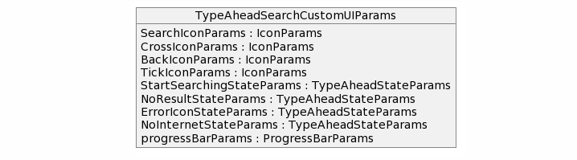
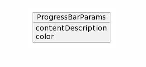
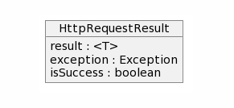
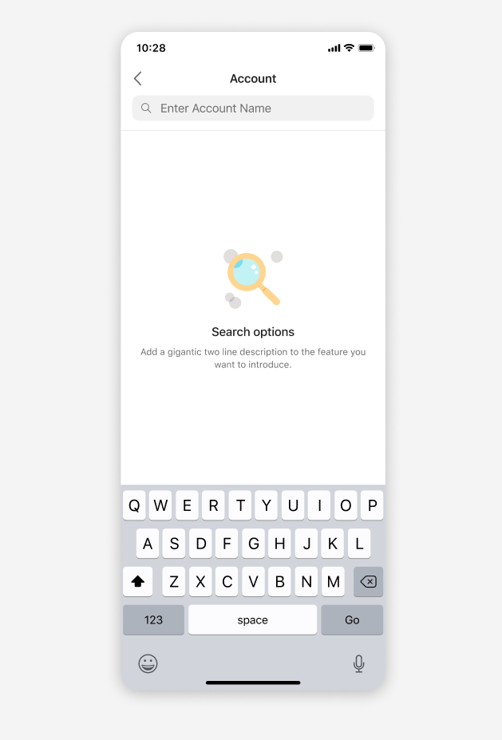
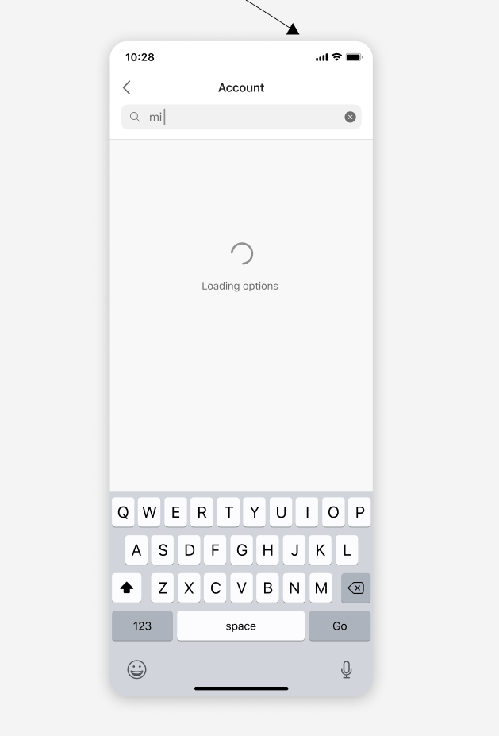
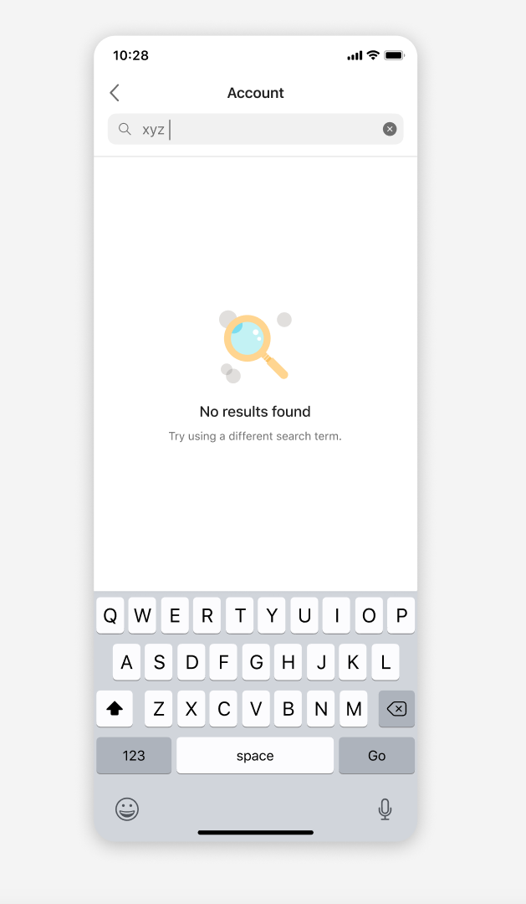
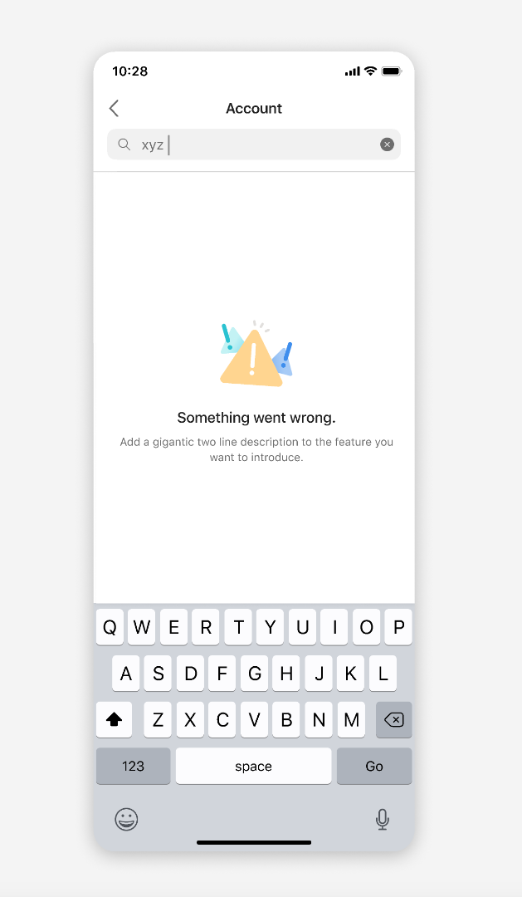

# Dynamic Type Ahead Search in Adaptive cards
This document covers changes to add Dynamic Type Ahead search support to Input.ChoiceSet in adaptive cards in android SDK.

### Prerequisite 
[Link to feature document](https://github.com/microsoft/AdaptiveCards/blob/dipja/dynamic-type-ahead-doc/specs/DesignDiscussions/DynamicTypeAhead.md)
### Rendering Dynamic Type Ahead

We have considered two options for rendering the ChoiceSet control to support dynamic type ahead: </br>
1. [Recommended] Opening a new screen to support dynamic type ahead choice selection when user clicks on type ahead search control in AC 
2. Extend inline ChoiceSet input control to render dynamic type ahead.

Here are a few pros and cons of rendering of ChoiceSet input control in a new screen to support dynamic type ahead search experience: </br>

Pros:
1. Better and richer experience for the host in terms of choice selection, scrollable list and error messages state. 
2. New screen experience is the preferred by hosts like Teams and Outlook.
3. Hosts like MS Teams will not need to override the ChoiceSet component because they need full screen experience for the dynamic type ahead search. Thus the hosts can use the default rendering from the SDK which saves time to onboard to new version of the SDK.

Cons:
1. We cannot extend the existing functionality of filtered style view (inline static type ahead experience).
2. Additional effort in order to support dynamic type ahead as we can not reuse existing UI components from filtered style view. 
3. We will not have consistent experience for both static (inline experience) and dynamic type ahead feature in the SDK. We will have to update the behavior for static filtered choiceSet to new screen separately.

#### Rendering of ChoiceSet input control in new screen to support dynamic type ahead search experience 


1. Host calls the render method in the AdaptiveCardRenderer to render the adaptive card. Additional parameters activityResultRegistry, choicesResolver and TypeAheadSearchCustomIcons are passed from the host to the SDK. 
choicesResolver is an implementation of the IChoicesResolver exposed by the SDK, which will be used by the SDK to fetch dynamic choices from host. TypeAheadSearchCustomIcons will hold the custom icons related information. 
2. AdaptiveCardRender creates a instance of RenderedAdaptiveCard.
3. Views are created for all components in the adaptive card and added to RenderedAdaptiveCard. ChoiceSetRender is used to create view for input choice sets.
4. Based on parameters of ChoiceSetInput, if dynamic type ahead needs to be rendered then TypeAheadSearchView is created.
5. Clicking on TypeAheadSearchView will open a new screen TypeAheadSearchActivity. IChoicesResolver instance is registered onto the DynamicChoicesService before opening the new screen. Information such as dataset in the ChoiceSet input schema and customizable icons is passed to the new activity as parameters.
6. The new activity has a SearchTextView where user can type and see dynamic options as a recycler view list. The UI state and current query is stored inside the TypeAheadSearchViewModel. 

New parameters to be send from host while rendering AC
1. ActivityResultRegistry - Used while opening new activity and handling the activity result on closing
2. IChoicesResolver - Used to fetch dynamic choices from the host
3. TypeAheadSearchCustomUIParams - Host provides custom icons (search, cross icons etc.) information though this data class

### SDK to Host communication 


1. The user types some text in the search text box in the new TypeAheadSearch screen. 
2. The text change event is emitted to the text change listener present in the TypeAheadSearchActivity.
3. To fetch the dynamic choices from the host, a call is made to the fetchDynamicChoices() method in the TypeAheadSearchViewModel.
4. TypeAheadSearchViewModel will use DynamicChoicesService which is responsible for fetching the dynamic choices asynchronously from the Host. 
5. DynamicChoicesService makes a call to the host using IChoicesResolver to fetch dynamic choices in a background thread.
6. Once the dynamic choices are returned by the Host, DynamicChoicesService sends the dynamic choices to the TypeAheadSearchViewModel which updated the choices on the UI thread.

### New Interfaces and classes 
1. IChoicesResolver method - getDynamicChoices() 
   params -  type: String, dataset: String, value: String, count: Int?, skip: Int?
   returns - HttpRequestResult<List<ChoiceInput>>

   

2. TypeAheadSearchCustomUIParams - Host provides customized icons object with default values
   
   
   
   IconParams - drawableResourceId, scaleType, contentDescription </br>

   

   TypeAheadStateParams - title, subtitle, drawableResourceId, scaleType

   

   ProgressBarParams - contentDescription, color
   

3. DynamicChoicesService - This class will make a call to host to fetch dynamic choices using IChoicesResolver on a background thread and update the resultant choices in the dropdown on an UI thread.

### Request object format to be sent to the host: 
As the user types, the renderer will create a JSON object that includes all the properties from the Data.Query, along with what the user has typed, plus any additional options such as the current skip/count and max results to be returned. 


Sample Request
```
{ 
“type”: “Data.Query”, 
“dataset”: “companies”, 
“value”: “Microsoft”, 
“count”: 25, 
“skip”: 0 
} 
```

### Response object format to be sent back to SDK: 
`HttpRequestResult<T>`

We will reuse the existing HttpRequestResponse object will contain the following - 
1. boolean isSuccess
2. Exception exception
3. T result
In this case result will be an instance of List of ChoiceInput.



Update to HttpRequestResponse class - 
1. Replacing boolean isSuccess with a ResponseType.
ResponseType will be a StringDef with 3 possible values - SUCCESS, ERROR, NO_INTERNET_CONNECTION


### Customizable icons and views
The host is enabled to specify its custom drawable resource id for the TypeAheadSearchActivity. The search icon, cross icon etc. will be customizable.
Also, the UI for the 3 states which are start searching, no result and error will be customizable.

1. IconParams - drawableResourceId, scaleType, contentDescription
   
   a. SearchIconParams: IconParams
   b. CrossIconParams: IconParams

2. TypeAheadStateParams - title, subtitle, drawableResourceId, scaleType

   a. StartSearchingStateParams: TypeAheadStateParams
   b. NoResultStateParams: TypeAheadStateParams
   c. ErrorIconStateParams: TypeAheadStateParams

3. ProgressBarParams - contentDescription, color

### User Experience
TypeAheadSearchViewModel - Will maintain the current state of the screen (loading, error etc) and will communicate with host to fetch dynamic choices.

Type ahead search UI states - 

1. StartSearching - Default state when new screen is opened and there are no static choices to be displayed
2. Loading - Once user types something in the search box, SDK makes a call to the host to fetch the dynamic choices. During this time we show that loading state.
3. NoResults - When SDK receives an empty list of dynamic choices from the host.
4. Error - When SDK receives an error from the host while fetching dynamic choices.
5. ShowingChoices - SDK receives a list of dynamic choices from the host and displays the same in the recycler view list.






### Debounce time
1. A DebouncingTextWatcher will be added which will implement the default TextWatcher. 
2. We will use coroutineScope to add a debounce time before calling the host to fetch dynamic choices. By using coroutineScope we will have lifecycle awareness while fetching the dynamic choices which means if the new screen is closed, we will cancel the ongoing fetch call to prevent any memory leaks.
3. Also we can cancel any stale fetch call (fetch dynamic choices) while initiating a new one.  
4. At a given time, we will only be waiting for one debounced fetch call to be completed. 
5. The default value for this debounce time will be 250ms. 


### Host Config
We allow a new property called 'autoCompleteChoiceSet' in the host config object that will hold all the required configurations for dynamic type ahead supported Input.ChoiceSet.

```
autoCompleteChoiceSet: 
{ 
	queryParams: 
	{ 
		count: 15 
		debounceTime: 250
	},
}
```
### Accessibility
1. Providing an error message when search results are not invalid.
2. Announce loading state message to the user while the search is in progress.
3. Announce displayed error message to the user in case of any error.
4. Focus should go to all actionable icons/views as well as choices.

### Test Coverage
Add unit tests in the SDK sample app (AC Visualizer for android) and UI tests as well.