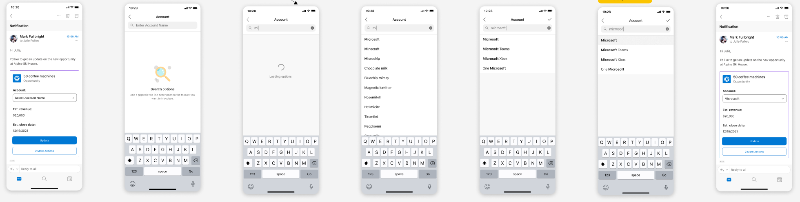
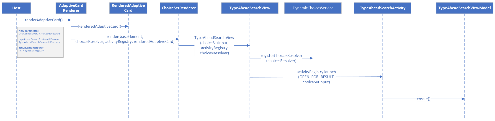
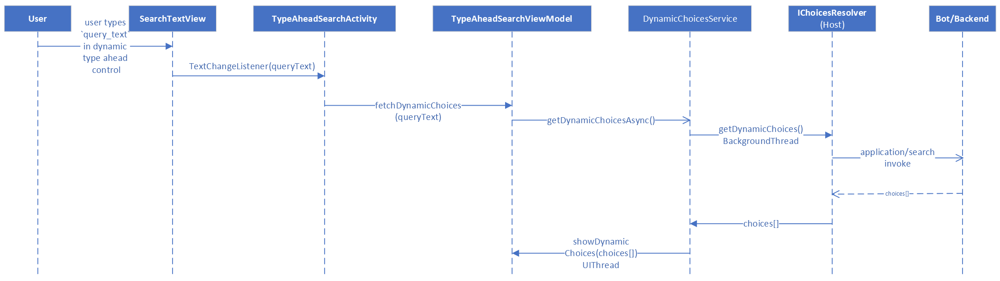
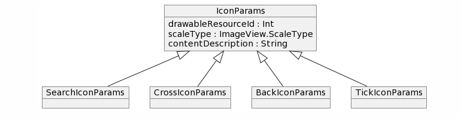
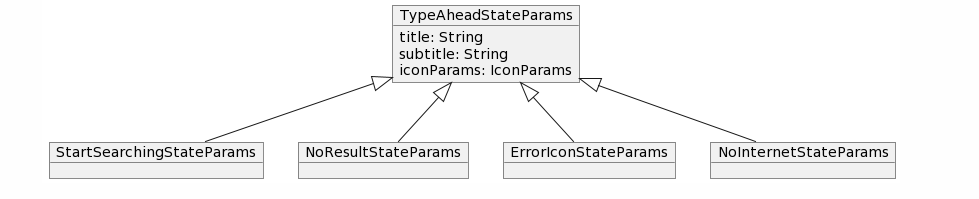
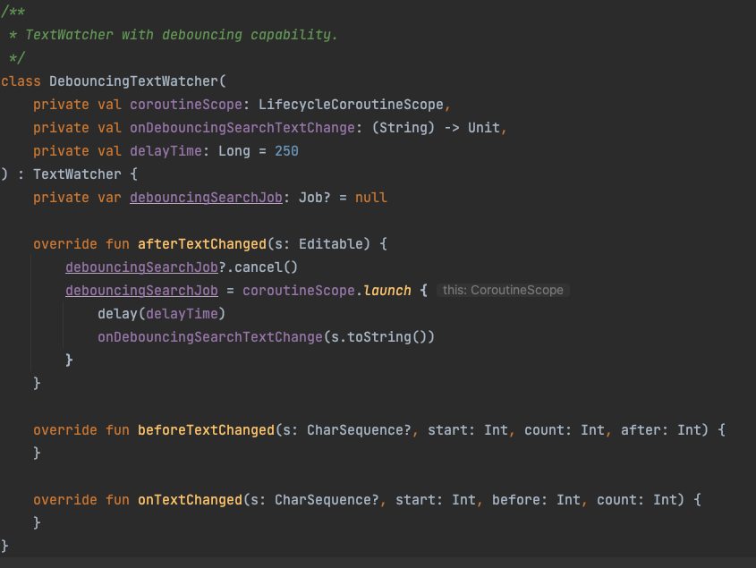

# Dynamic Type Ahead Search in Adaptive cards
This document covers changes to add Dynamic Type Ahead search support to Input.ChoiceSet in adaptive cards in android SDK.

### Overview
1. Rendering the new dynamic type ahead control
2. SDK to host communication to fetch dynamic choices
3. Customization icons and UI
4. Debounce Logic

### Rendering Dynamic Type Ahead

We have considered two options for rendering the ChoiceSet control to support dynamic type ahead:  
1. [Recommended] Opening a new screen to support dynamic type ahead choice selection when user clicks on type ahead search control in AC 
2. Extend inline ChoiceSet input control to render dynamic type ahead.

Here are a few pros and cons of rendering of ChoiceSet input control in a new screen to support dynamic type ahead search experience:  

Pros:
Better and richer experience for the host in terms of choice selection, scrollable list and error messages state. This is the preferred by hosts like Teams and Outlook.
Hosts like MS Teams will not have to override the ChoiceSet component because teams uses full screen experience for the dynamic type ahead search and those hosts can use the default rendering from the SDK.

Cons:
We can not extend the existing functionality of filtered style view (inline static type ahead experience).
Additional effort in order to support dynamic type ahead as we can not reuse existing UI components from filtered style view. We will not have consistent experience for both static (inline experience) and dynamic type ahead feature in the SDK.

#### Rendering of ChoiceSet input control in new screen to support dynamic type ahead search experience 

1. Host calls the render method in the AdaptiveCardRenderer to render the adaptive card. Additional parameters activityResultRegistry, choicesResolver and TypeAheadSearchCustomIcons are passed from the host to the SDK. 
choicesResolver is an implementation of the IChoicesResolver exposed by the SDK, which will be used by the SDK to fetch dynamic choices from host. TypeAheadSearchCustomIcons will hold the custom icons related information. 
2. AdaptiveCardRender creates a instance of RenderedAdaptiveCard.
3. Views are created for all components in the adaptive card and added to RenderedAdaptiveCard. ChoiceSetRender is used to create view for input choice sets.
4. Based on parameters of ChoiceSetInput, if dynamic type ahead needs to be rendered then TypeAheadSearchView is created.
5. Clicking on TypeAheadSearchView will open a new screen TypeAheadSearchActivity. IChoicesResolver instance is registered onto the DynamicChoicesService before opening the new screen. Information such as dataset in the ChoiceSet input schema and customizable icons is passed to the new activity as parameters.
6. The new activity has a SearchTextView where user can type and see dynamic options as a recycler view list. The UI state and current query is stored inside the TypeAheadSearchViewModel. 

New parameters to be send from host while rendering AC
1. ActivityResultRegistry - Used while opening new activity and handling the activity result on closing
2. IChoicesResolver - Used to fetch dynamic choices from the host
3. TypeAheadSearchCustomIcons - Host provides custom icons (search, cross icons etc.) information though this data class

### SDK to Host communication 

1. DynamicChoicesServiceAsync is responsible for fetching the dynamic choices asynchronously from the Host. This class makes a call to the host using IChoicesResolver to fetch dynamic choices in a background thread.
2. Once the dynamic choices are returned by the Host, DynamicChoicesServiceAsync updated the choices on the UI thread.

### Customizable icons 
The host is enabled to specify its custom drawable resource id for the TypeAheadSearchActivity. The search icon, cross icon will be customizable.
Also, the UI for the 3 states which are start searching, no result and error will be customizable.

### New Interfaces and classes 
1. IChoicesResolver method - getDynamicChoices() 
   params -  type: String, dataset: String, value: String, count: Int?, skip: Int?
   returns - HttpRequestResult<List<ChoiceInput>>

   

2. TypeAheadSearchCustomUIParams - Host provides customized icons object with default values
   Contains the following:-
   ITypeAheadIconParams - drawableResourceId, scaleType
   
   a. SearchIconParams: ITypeAheadIconParams
   b. CrossIconParams: ITypeAheadIconParams

   

   ITypeAheadStateParams - title, subtitle, drawableResourceId, scaleType

   c. StartSearchingStateParams: ITypeAheadStateParams
   d. NoResultStateParams: ITypeAheadStateParams
   e. ErrorIconStateParams: ITypeAheadStateParams

   

3. DynamicChoicesService - This class will make a call to host to fetch dynamic choices using IChoicesResolver on a background thread and update the resultant choices in the dropdown on an UI thread.

### Debounce time
A DebouncingTextWatcher will be added which will implement the default TextWatcher. We will use coroutineScope to add a debounce time before calling the host to fetch dynamic choices. The default value for this debounce time will be 250ms.  

### Request object format to be sent to the host: 
As the user types, the renderer will create a JSON object that includes all the properties from the Data.Query, along with what the user has typed, plus any additional options such as the current skip/count and max results to be returned. 

{ 
“type”: “Data.Query”, 
“dataset”: “graph.microsoft.com/users”, 
“value”: “surya”, 
“count”: 25, 
“skip”: 0 
} 

### Host Config

### User Experience 