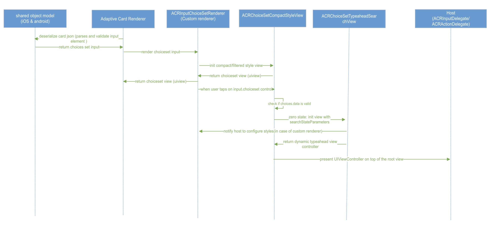
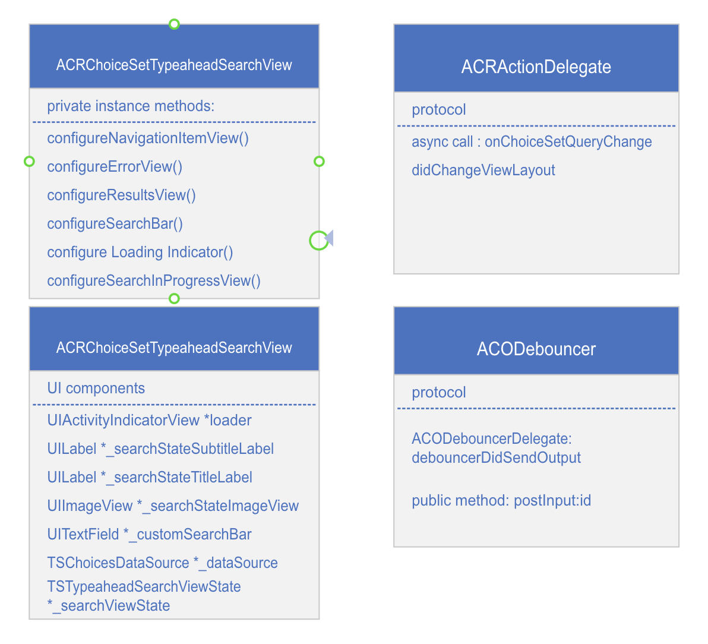
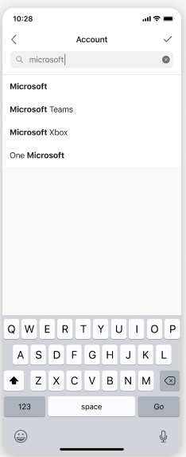

<!-- AUTO-GENERATED: This section is auto-generated from schemas/adaptive-card.json. Do NOT add anything above this or edit anything inside, it MUST be the first thing in the document and will be overwritten. -->

## Dynamic Typeahead search in Adaptive Cards with Input.choiceset

This document covers feature changes to add Dynamic Type Ahead support to Input.ChoiceSet in adaptive cards in iOS SDK. 

Discussions and considerations that lead to this design, including design of shared model design, schema changes are covered in more detail in the [Dynamic Typeahead document.](https://github.com/karthikbaskar/AdaptiveCards/blob/dipja/dynamic-type-ahead-doc/specs/DesignDiscussions/DynamicTypeAhead.md) (This can be skipped if the reader knows about the schema details, shared model design and high level design for the dynamic typeahead feature)

# Table of Contents
1. [Rendering the dynamic type ahead control](#Rendering)
    1. [Rendering of choiceset input control in new screen (Recommended)](#1-recommended-rendering-of-choiceset-input-control-in-new-screen-to-support-dynamic-type-ahead)
		1. [Figma link of dynamic typeahead UX](#figma-link-of-dynamic-typeahead-ux)
		2. [Render the new dynamic typeahead control](#render-the-new-dynamic-typeahead-control)
		3. [Communication with the host](#communication-with-the-host)
			1. [Search Request payload](#1-search-request-payload-json-object)
			2. [Response format for the search request](#2-response-format-for-the-above-search-request)
			3. [Handling errors](#3-handling-errors)
			4. [Loading Indicator](#loading-indicator)
    2. [Extend inline choiceset input control to support dynamic typeahead](#2-extend-inline-choiceset-input-control-to-support-dynamic-typeahead)
2. [Customization Details](#how-host-can-configure-the-styles-of-dynamic-typeahead-search-ui)
	1. [Native controls in iOS vs fluent UI](#native-controls-in-ios-vs-fluent-ui)
	2. [How SDK can provide better customizations](#how-sdk-can-provide-better-customization-to-the-host)
	2. [Customizable Dynamic Typeaehad Search View](#customizable-icons-and-search-state-ui-view)
3. [New Classes and Protocols](#new-protocol-methods-and-classes)
	1. [ACRActionDelegate](#acractiondelegate)
	2. [ACRChoiceSetTypeaheadSearchView](#acrchoicesettypeaheadsearchview)
	3. [Debouncing Logic](#acodebouncer-debouncing-logic)
4. [Host Config](#Host-Config)
5. [Accessibility](#Accessibility)
6. [Test Coverage](#Test-Coverage)
7. [Adaptability](#Adaptability)

### Rendering the new dynamic type ahead control

Rendering input.choiceset to support dynamic typeahead involve components rendering, communication with the host to send search request and receive response and styling of UI configurable via host config. We have considered two options for rendering the choiceset control to support dynamic typeahead:
1. [Recommended] Rendering of choiceset input control in new screen to support dynamic typeahead
2. Extend inline choiceset input control to render dynamic typeahead.

Here are a few pros and cons of rendering of choiceset input control in a new screen to support dynamic typeahead search experience:
Pros:
1. We will have better and richer experience for the host in terms of choice selection, scrollable content and error messages state etc. This will be the preferred design by host like Teams and Outlook.
2. Hosts like MS Teams will not have to override the choiceset component because teams uses full screen experience for the dynamic typeahead search. 

Cons:
1. We can not extend the existing functionality of filtered style view  (inline static typeahead experience).
2. We have to do additional efforts in order to support dynamic typeahead as we can not reuse existing UI components from filtered style view. We will not have consistent experience for both static (inline experience) and dynamic typeahead feature in the SDK.

### 1. [Recommended] Rendering of choiceset input control in new screen to support dynamic type ahead

#### Figma link of dynamic typeahead UX
[DynamicTypeahead Figma](https://www.figma.com/file/xsrZo1AubJwIHmG2NmSK8O/WIP-Typeahead-search-AC-loops?node-id=304%3A56528&t=wnYSrFvdHvonLhGh-0)
Here is the user experience for dynamic typeahead search feature that we are gonna introduce into the SDK. 


#### Render the new dynamic typeahead control
The below sequence diagram shows the flow to render input.choiceset control in full screen view and support dynamic typeahead search.


1. Host will call the method into the `render` method of the AdaptiveCardRenderer and pass the cardActionHandler instance.
2. AdaptiveCardRenderer creates an instance of cardActionHandler and input handler. Also, views of all the components are added to this instance.
3. Now to render `choicesetinput` control, adaptiveCardRenderer will call ACRInputChoiceSetRenderer and pass the input choiceset delegate also. 
4. When user taps on the choiceset input and if choices.data is valid, we  will present a full screen view controller by creating an instance of `ACRChoiceSetTypeaheadSearchView` class.

#### Communication with the host to fetch dynamic choices

We will have to send the search request to the host whenever search text is changing in the choiceset input control so that host can fetch dynamic choices and once the choices is returned by the host, we will update the choices in the UI.


1. On any input change in search bar control in full screen view, a debouncer of type `ACODebouncer` is created and notify the host along with the search request payload with the help of action delegate method asynchronously once the minimum time is elapsed. 
2. SDK will dispatch `onChoiceSetQueryChange` on the background thread. While the host resolves the request for dynamic choices requested by the sdk, we continue to show the loading indicator on the UI.
3. Now we will call `updateUI` method based on the response received from the host.
4. Now user can select a choice from the dynamic choices and once a choice is selected, `dismiss()` method of view controller is called. SDK will update the primary content view to show the selected choice once a choice is selected and will also notify host `didChangeViewLayout` to update any layout related constraint.

We will define `onChoiceSetQueryChange` method with completion block in the existing protocol `ACRActionDelegate` for SDK to Host communication. Host should conforms to this protocol and implement `onChoiceSetQueryChange` in order to support dynamic typeahead.

Parameters of `onChoiceSetQueryChange` method for async communication in ACRActionDelegate protocol

| Parameter | Type | Description |
| :------- | :----- | :------------------------------------------------------------------------------------------
| baseCardElement | BaseCardElement | ChoiceSetInput element on which text change was observed |
| searchRequest | ACODynamicTypeaheadSearchRequest | search request object format to be sent to the host |
| completion | (void (^)(NSArray<Choices *> *choices, NSError *error)) | Completion block with choices[] as response or NSError in case of any failure

#### 1. Search Request payload:
As the user types, the renderer will create a JSON object that includes all the properties from the `Data.Query`, along with what the user has typed, plus any additional options such as the current skip/count and max results to be returned. Here is the request object format to be sent to the host on input change in the choiceset.

```json
{
        "type": "Data.Query",
        "dataset": "graph.microsoft.com/users",
        "value": "microsoft",
        "count": 25,
        "skip": 0
}
```

| Property | Type | Required | Description
| :---------- | :------- | :---------- | :------- |
| type | string | Yes | Specifies that this is a Data.Query object. |
| dataset | string | Yes | The type of data that should be fetched dynamically
| value | string | Yes | Populated for the invoke request to the bot with the input the user provided to the ChoiceSet (The text in the input field of the choiceset)
| count | number | No | Populated for the invoke request to the bot to specify how many elements should be returned (can be ignored by the bot, if they want to send a diff amount)  
| skip | number | No | Populated for the invoke request to the bot to indicate that we want to paginate and skip ahead in the list


#### 2. Response format for the above search request:

Backend responds with an array of choices or might return error in case of any failure. The backend will inspect the `Data.Query` to determine what type of data should be fetched, and what the user has currently typed.

| Parameter | Type | Description |
| :------- | :----- | :------------------------------------------------------------------------------------------
| choices[] | Choices [] | Array of choices for the query text(value) from the remote backend returned by the host
 | error | NSError | Error received from the host while querying the remote backend (login/network error/bad request)

E.g., if the user had typed "Ma" it would return something like (NSArray<Choices *> choicesArray):
```
[
   { "title": "Matt", "value": "1" },
   { "title": "Mark", "value": "2" }
   { "title": "Mack", "value": "3" }
   { "title": "May", "value": "4" }
]
```
if there is an error while querying the bot then it would return something like(NSError Object):
```
Code=204,
reason="Unable to show options right now",
UserInfo= ""
```

#### 3. Handling errors

We have to show error message to the user when bot return non nil error of type `NSError`. In this case, host will need to return localized reason in the NSError object for the error to the SDK so as to configure error message. `updateErrorUI` from `ACRChoiceSetTypeaheadSearchView` will be called and update the `_searchStateTitleLabel` and `_searchStateImageView`.
We will have a way to customize the above error message based on the host's error response.

#### Loading Indicator
We will add an activity indicator in the mainview to indicate that dynamic choices are being fetched from the host. We are using `UIActivityIndicator` component from UIKit to show the loader. We will also add `Loading options` default text using `UILabel` just below the loader and provide host the ability to customize this text as well.

### 2. Extend inline choiceset input control to support dynamic typeahead :

We can extend the functionality of existing static typeahead experience for supporting dynamic typeahead search in input.choiceset. We will refactor the `ACRChoicesetCompactStyleView` class to support dynamic typeahead search. This sequence diagram shows the flow for inline choiceset experience along with the communication in case of dynamic typeahed search.


1. Host will call the method into the render method of the AdaptiveCardRenderer and pass the cardActionHandler instance.
2. AdaptiveCardRenderer creates an instance of cardActionHandler and input handler. Also, views of all the components are added to this instance.
3. Now to render choicesetinput control, adaptiveCardRenderer will call ACRInputChoiceSetRenderer and pass the input choiceset delegate also. This will then call ACRChoiceSetCompactStyleView for compact,filtered and dynamic typeahead control rendering.
4. On any input change in choiceset control, SDK will notify the host with the help of delegate method asynchronously and will also paas the  query string and base action element that has choiceset properties.
5. Now host will make invoke call to the bot/service to fetch response for the sent query. Once host received a response with dynamic choices then host will simply return those choices to the SDK.
6. SDK will update the UI controls once response is received and will also update host to change any layout related constraint.


### Customizations
We will give host the ability to configure the full screen UX based on their requirements such as host can have their own UI for failure scenarios and loading indicator. We will expose few methods in the full screen view to configure the styles of UI and that can be easily accessed from choiceset custom renderer.

#### Native controls in iOS vs fluent UI
We are addding a new class `ACRChoiceSetTypeaheadSearchView` class to build the custom UI for dynamic typeahead with native iOS controls (directly from UIKit). We do not want to introduce dependency on the fluent UI. We decided to customize the UI with native controls in iOS (UITextField for searchbar, UIActivityIndicatorView for loader, UITableView for displaying results) from UIKit.
Pros: 
We can provide better customization and styling to the host. Host can style the component as per their needs.This will help us in avoiding extra overhead on host with respect to the component size. We did research for host (MS Teams) and found out teams is not using fluent UI for search bar component.

#### How SDK can provide better customization to the host?
Here are few examples of what host may want to configure:
- configure the navigation bar in the view controller like title, back button and choices selection button.
- initialize typeahead search view with zero state experience, displaying error, displaying search in progress.
- configure the layout of the list view (eg. if host may want to add separator in the choices list and for that we are using UITableView).
- configure the layout of the container view(stack view) that contains search view, loader and (eg. border/spacingtop/spacing down).
- register class for list layout cell.
- configure loading indicator.

#### Customizable icons and search state UI view
The host is enabled to specify its custom icons image urls/image view and SDK can resolve and load image asynchronously in `ACRChoiceSetTypeaheadSearch`. 
The search icon, cross icon, error icon will be customizable. 
Also, the search UI for the 4 states(considering title, subtitle and icons) which are zero state, searching, no results and error will be customizable. Host will always have an option to customize this default error messages.

SDK will send request back to the custom renderer implemented by the host with all the required params so that host has the flexibility to update the style and layout constraint. Also, SDK will retrieve search state parameters from the host that are needed to create dynamic typeahead view during the time of initialization.




### New Classes and Protocols

#### ACRActionDelegate	
We will define `onChoiceSetQueryChange` method with completion block in the existing protocol `ACRActionDelegate` for SDK to Host communication. Host should conforms to this protocol and implement `onChoiceSetQueryChange` in order to support dynamic typeahead.


#### ACRChoiceSetTypeaheadSearchView
We created a new class `ACRChoiceSetTypeaheadSearchView` which enables the host to create the new dynamic type ahead control and gives the flexibility to customize the styles of UI. 
1. We can extend the same functionality of ACRChoiceSetTypeaheadSearchView for filtered style search as well. We have added TSChoicesDataSource type enum to resolve the data source.
	- static
	- dynamic
2. We have created an enum `TSTypeaheadSearchViewState` with the below mentioned states.
	- zeroState
	
	- searchInProgress
	
	- displayingGenericError  
	We will display "Something went wrong." error message to the user if there are no choices but valid error returned from the host.
	
	- displayingInvalidSearchError
	We will display "No Matches found" error message to the user if there are no choices and no error returned from the host.  
	
	- displayingResults
	
3. We will have to retrieve `TSTypeaheadSearchViewParams` parameters from the host so as to configure all the above mentioned search state UI view.
	- viewState: TSTypeaheadSearchViewState
	- title: NSString
	- subtitle : NSString
	- icon: UIImageView


#### ACODebouncer (Debouncing Logic)
We created a helper class `ACODebouncer` which implements the debounce operation on a stream of data. When user is typing in a choiceset input control, each edit operation is pushed into the debouncer, and the debouncer will only perform the callback when a certain minimum time xms (say 250ms) has been elapsed since last keystroke by the user.

The caller (ACRChoiceSetTypeaehadSearchView) will need to conform to the `ACODebouncerDelegate` protocol. The caller will have to implement `debouncerDidSendOutput` function so as to receive the request from the debouncer after a delay.


- First, we need to create the instance of debouncer and initialize with the delay (configurable via host config).
- postInput:(id)input - post input method will put the request in queue till the delay has been elapsed. 
- sendOutput:(id)output - once the minimum time is elapsed, debouncer will send the request back to the caller.

### Host Config

We allow a new property called 'autoCompleteChoiceSet' in the host config object that will hold all the required configurations for dynamic type ahead supported Input.Choiceset. 

```
autoCompleteChoiceSet: 
{ 
	queryParams: 
	{ 
		count: 15 
		skip: 0 
		debounceTime: 250
	},
} 
```

| Name | Type | Default Value | Description
| :------- | :----- | :----- | :------------------------------------------------------------------------------------------
| queryParams.count | number | 15 | Indicates the maximum number of results that can be fetched for display in the dropdown list of dynamic typeahead supported choiceset.
 | queryParams.skip | number | 0 | Indicates the number of results which must be skipped after which the results will be taken for display in the dropdown list of dynamic typeahead supported choiceset. 
 | queryParams.debounceTime | TimeInterval in ms | 250 ms | minimum delay after which the invoke call to be made

### Accessibility
- Providing an error message when search results are not invalid. 
- Announce loading state message to the user while the search is in progress.
- Announce displayed error message to the user in case of any error.
- All the choices in the list should be accessible via keyboard.

### Test Coverage
Add samples in the SDK sample app (AC Visualizer for iOS) and add UTs for schema changes in the shared library.
TODO: Add more details around test coverage

### Adaptability
We will make sure that it is easy for hosts too adopt this feature in later SDK versions and has to do minimal overriding. Host will be able to achieve the host specific styles with the help of host config file and api's provided by the SDK.
1. We created a separate class ACRChoiceSetTypeaheadSearchView responsible for rendering of the dynamic typeahead supported choiceset which provides greater flexibility for the developers to style this component as per the host. 
2. The host needs to provide the meta data required(error UI details/fonts/styles) to render this component and the only additional effort to make this feature work in the host will be to set up the choiceset custom renderer to use dynamic typeahead UI if choices.data is valid. This will handle the request and sending responses back to the SDK.

<!-- END AUTO-wENERATED -->
