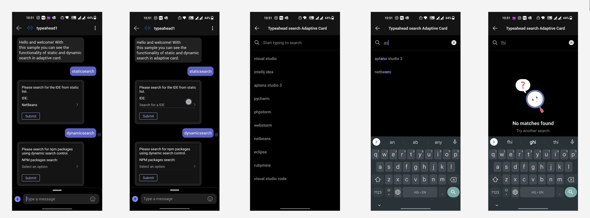

<!-- AUTO-GENERATED: This section is auto-generated from schemas/adaptive-card.json. Do NOT add anything above this or edit anything inside, it MUST be the first thing in the document and will be overwritten. -->

## Dynamic Typeahead search in adaptive cards in iOS client

This document covers overall implementation of dynamic typeahead feature in iOS client. Also, we will cover all the changes needed to support Dynamic Type Ahead search to Input.ChoiceSet in adaptive cards in iOS client.

### Schema Parsing

[Dynamic Typeahead doc (Shared Model Design)](https://github.com/karthikbaskar/AdaptiveCards/blob/dipja/dynamic-type-ahead-doc/specs/DesignDiscussions/DynamicTypeAhead.md)
(This can be skipped if the reader knows about schema details, shared model design and high level design for the dynamic typeahead feature)

### Rendering the UI for dynamic typeahead with input.choiceset

Rendering input.choiceset to support dynamic typeahead involves parsing of `choice.data`, communication with the host to send search request and receive response and styling of UI configurable via host config. We have two options for rendering the choiceset control to support dynamic typeahead:
1. Rendering of choiceset input control in new screen to support dynamic typeahead (Recommended)
2. Extend inline choiceset input control to render dynamic typeahead.

Here are a few pros and cons of rendering of choiceset input control in a new screen to support dynamic typeahead search experience:
Pros:
1. We will have better and richer experience for the host in terms of choice selection, scrollable list and error messages state etc. 
2. Hosts like MS Teams will not have to override the choiceset component because teams uses full screen experience for the dynamic typeahead search. 

Cons:
1. We can not extend the existing functionality of filtered style view  (inline static typeahead experience).
2. We have to do additional efforts in order to support dynamic typeahead as we can not reuse existing UI components from filtered style view. We will not have consistent experience for both static (inline experience) and dynamic typeahead feature in the SDK.

### 1. Rendering of choiceset input control in new screen to support dynamic typeahead search experience (Recommended)

Here is the user experience for dynamic typeahead search feature that we are gonna introduce in the SDK.



The below sequence diagram shows the flow to render input.choiceset control in full screen view and support dynamic typeahead search.


1. Host will call the method into the render method of the AdaptiveCardRenderer and pass the cardActionHandler instance.
2. AdaptiveCardRenderer creates an instance of cardActionHandler and input handler. Also, views of all the components are added to this instance.
3. Now to render choicesetinput control, adaptiveCardRenderer will call ACRInputChoiceSetRenderer and pass the input choiceset delegate also. 
4. When user taps on the choiceset input and if choices.data is valid, we  will present a full screen view controller by creating an instance of ACRChoicesetDynamicTypeaheadView class.
5. On any input change in search bar control in full screen view, we will add debounce logic and notify the host along with the search request payload with the help of action delegate method asynchronously once the minimum time is elapsed. We will dispatch `onChoiceSetQueryChange` on the background thread for handling multiple requests at the same time.

	**Debouncing Logic for sending the request:**
We created a helper class which implements the debounce operation on a stream of data. e.g. When user is typing in a choiceset input control, each edit operation is pushed into the debouncer, and the debouncer will only perform the callback when a certain minimum time xms (say 250ms) has been elapsed since last keystroke by the user. 

	- First we need to initialize the input view in the full with debouncer object
	- postInput:(id)input - post input method will put the request in queue till the delay has been elapsed. 
	- sendOutput:(id)output - once the minimum time is elapsed debouncer will send the request back to the caller.

6. Now host will make invoke call to the bot/service to fetch response for the sent query. Once host received a response with dynamic choices then host will simply return those choices/error back to the SDK.
7. While the host resolves the request for dynamic choices requested by the sdk, we continue to show the loader on the UI. 
	
	**Loading Indicator:** We will add an activity indicator to indicate that dynamic choices are being fetched from the host. We are using UIActivityIndicator component from UIKit to show the loader. We will also add `Loading options` default text just below the loader and provide host the ability to customize this text as well. 
8. Now user can select a choice from the dynamic choices (since multiselect is not supported as a part of initial release) and once a choice is selected we will close the fullscreen view and display the selected choice in the input.choice field in adaptive card's view. SDK will update the primary content view to show the selected choice once a choice is selected and will also notify host (didChangeViewLayout) to update any layout related constraint.

**Interface for communication with the host to fetch dynamic choices:**

We will have to send the query to the host whenever search text is changing in the choiceset input control so that host can fetch dynamic choices and once the choices is returned by the host, we will update the choices in the UI.
1. SDK to host: Sdk will notify the host about the query change in choiceset input control and then host can do the network/service call and return response to the sdk.
 2. Async Host to SDK : Now once host receives the choices from the bot and will need to update the UX based on the dynamic choices received from the host. We will have completion block on the SDK side to handle this scenario.

We will define `onChoiceSetQueryChange` method with completion block in the protocol **ACRActionDelegate** for communication with the host. Host will need to implement the protocol and write definition of the above method in ACRActionDelegate as provided by the SDK.

Parameters of `onChoiceSetQueryChange` method for async communication in ACRActionDelegate protocol

| Parameter | Type | Description |
| :------- | :----- | :------------------------------------------------------------------------------------------
| baseCardElement | BaseCardElement | ChoiceSetInput element on which text change was observed |
| searchRequest | DynamicTypeaheadRequestPayload | search request object format to be sent to the host |
| completion | (void (^)(NSArray<Choices *> *choices, NSError *error)) | Completion block with choices[] as response or NSError in case of any failure

**i. Search Request payload JSON object:**

Here is the request object format to be sent to the host on input change in the choiceset. As the user types, the renderer will create a JSON object that includes all the properties from the `Data.Query`, along with what the user has typed, plus any additional options such as the current skip/count and max results to be returned.

| Property | Type | Required | Description
| :---------- | :------- | :---------- | :------- |
| type | string | Yes | Specifies that this is a Data.Query object. |
| dataset | string | Yes | The type of data that should be fetched dynamically
| value | string | Yes | Populated for the invoke request to the bot with the input the user provided to the ChoiceSet (The text in the input field of the choiceset)
| count | number | No | Populated for the invoke request to the bot to specify how many elements should be returned (can be ignored by the bot, if they want to send a diff amount)  
| skip | number | No | Populated for the invoke request to the bot to indicate that we want to paginate and skip ahead in the list

```json
{
        "type": "Data.Query",
        "dataset": "graph.microsoft.com/users",
        "value": "microsoft",
        "count": 25,
        "skip": 0
}
```

**ii. Response format for the above search request**:

Backend responds with array of choices or should return error in case of any failure.
The backend will inspect the `Data.Query` to determine what type of data should be fetched, and what the user has currently typed.

| Parameter | Type | Description |
| :------- | :----- | :------------------------------------------------------------------------------------------
| choices[] | Choices [] | Array of choices for the query text(value) from the remote backend returned by the host
 | error | NSError | Error received from the host while querying the remote backend (login/network error/bad request)

E.g., if the user had typed "Ma" it would return something like (NSArray<Choices *> choicesArray):
```
[
   { "title": "Matt", "value": "1" },
   { "title": "Mark", "value": "2" }
   { "title": "Mack", "value": "3" }
   { "title": "May", "value": "4" }
]
```
if there is an error while querying the bot then it would return something like(NSError Object):
```
Code=204,
reason="Unable to show options right now",
UserInfo= ""
```

**iii. Handling errors**

We have to show error message to the user when bot return with the error. In this case, host will need to return localized reason for the error to the SDK so as to configure error message.We will use a maximum time limit to fetch dynamic choices in the host config.
1. Default Invalid search error message:  We will display "No Matches found" error message to the user if there are no choices and no error returned from the host. Host will always have an option to customize this default invalid search error message.
2. Default generic error message: We will display "Unable to show options right now" error message to the user if there are no choices and no error returned from the host. Host will always have an option to customize this default generic error message.
3. We will have a way to customize error message based on the host's error response. Host can return localized error message to the SDK of type NSError (with reason) when invoke call completes.

**ACRChoicesetDynamicTypeaheadView UI: Native controls in iOS vs fluent UI**

We are creating the custom UI for dynamic typeahead with native iOS controls directly from UIKit so as to achieve consistent experience for MS Teams and more richer experience. We do not want to introduce dependency on fluent UI. We will use UITextField for search bar, table view, loader components from UIKit library to build full screen UI to support dynamic typeahead etc. We decided to implement the design with custom UI controls (UITextField for searchbar, UITableView to display list of choices, UIActivityIndicatorView for loader) from UIKit.

Pros: 
1. We can provide better customization to the host and host can style the component as per their needs.
2. This will help us in avoiding extra overhead on host with respect to component size (dependency on fluent UI) and host will not have to install individual controls from fluent UI library. We did research for teams and found out teams is not using fluent UI for search bar component and we will not be able to achieve the same UX that we got from design team with fluent UI.

### 2. Extend inline choiceset input control to support dynamic typeahead :

We can extend the functionality of existing static typeahead experience for supporting dynamic typeahead search in input.choiceset. We will refactor the ACRChoicesetCompactstyleView class to support dynamic typeahead search. This sequence diagram shows the flow for inline choiceset experience along with the communication in case of dynamic typeahed search.


1. Host will call the method into the render method of the AdaptiveCardRenderer and pass the cardActionHandler instance.
2. AdaptiveCardRenderer creates an instance of cardActionHandler and input handler. Also, views of all the components are added to this instance.
3. Now to render choicesetinput control, adaptiveCardRenderer will call ACRInputChoiceSetRenderer and pass the input choiceset delegate also. This will then call ACRChoiceSetCompactStyleView for compact,filtered and dynamic typeahead control rendering.
4. On any input change in choiceset control, SDK will notify the host with the help of delegate method asynchronously and will also paas the  query string and base action element that has choiceset properties.
5. Now host will make invoke call to the bot/service to fetch response for the sent query. Once host received a response with dynamic choices then host will simply return those choices to the SDK.
6. SDK will update the UI controls once response is received and will also update host to change any layout related constraint.


### How host can configure the styles of dynamic typeahead search UI?

We will give host the ability to configure the full screen UX based on their requirements such as host can have their own UI for failure scenarios and loading indicator. We will expose few methods in the full screen view to configure the styles of UI and that can be easily accessed from choiceset custom renderer.


Here are few examples of what UI styles can be updated by host:
- configure the navigation bar in the view controller like title, back button and choices selection button.
- initialize full screen view with zero state experience, hosts need to provide generic error message and offline state error message text to the SDK
- Retreive all the information(title,subtitle and images) related to initial state, loading state, generic error state, invalid search state
- configure the layout of the list view (eg. if host may want to add separator in the choices list and for that we are using UITableView).
- configure the layout of the container view(stack view) that contains search view, loader and (eg. border/spacingtop/spacing down).
- register class for list layout cell.
- configure loading indicator to the table view and sdk will send request to the host to show/hide the loader.

How host can configure the styles of UI during initialize of dynamic typeaehad view?
- init method of filtered style view is called from custom choiceset renderer 
- send request for configuring UI back to the host so that host has the flexibility to update the style and layout constraint.


### Host Config
TODO: Sync with other platforms and add more

### Test Coverage
Add samples in the SDK sample app (Visualizer for iOS) and add UTs for schema changes in the shared library.
TODO: Add more details around test coverage

### Adaptability
We will make sure that the host has to do minimal overriding of the components and will be able to achieve the host specific styles and layouts with the help of host config file.

<!-- END AUTO-GENERATED -->
