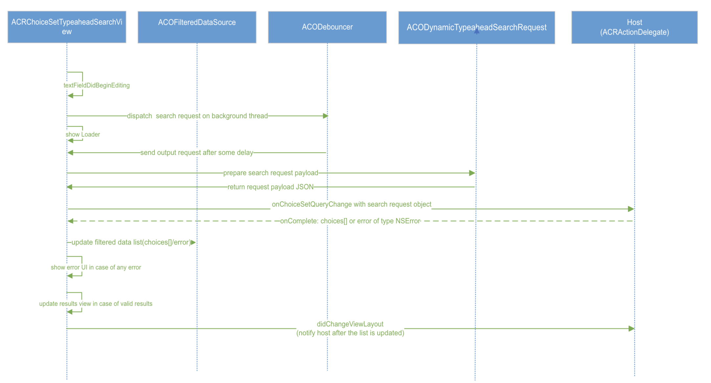

## Dynamic Typeahead search in Adaptive Cards with Input.choiceset

This document covers feature changes to add Dynamic Type Ahead support to Input.ChoiceSet in adaptive cards in iOS SDK.
Discussions and considerations that lead to this design, including design of shared model design, schema changes are covered in more detail in the [Dynamic Typeahead document.](https://github.com/karthikbaskar/AdaptiveCards/blob/dipja/dynamic-type-ahead-doc/specs/DesignDiscussions/DynamicTypeAhead.md)

### Overview
1. Rendering the new dynamic typeahead control
2. SDK to Host communication
3. New Classes and Protocols
3. Customizations

### Rendering Dynamic Type ahead

We have considered two options for rendering the choiceset control to support dynamic typeahead:
1. [Recommended] Rendering of choiceset input control in new screen to support dynamic type ahead
2. Extend inline choiceset input control to render dynamic typeahead.

Here are a few pros and cons of rendering of choiceset input control in a new screen to support dynamic type ahead search experience:
Pros:
1. We will have better and richer experience for the host in terms of choice selection, scrollable content and error messages state etc. This will be the preferred design by host like Teams and Outlook.
2. Hosts like MS Teams will not have to override the choiceset component because teams uses full screen experience for the dynamic typeahead search. 

Cons:
1. We can not extend the existing functionality of filtered style view  (inline static type ahead experience).
2. Additional efforts to support dynamic typeahead as we can not reuse existing filtered style view. We will not have consistent experience for both static (inline experience) and dynamic type ahead feature in the SDK.

### 1. [Recommended] Rendering of choiceset input control in new screen to support dynamic type ahead

#### Dynamic type ahead UX
[DynamicTypeahead Figma](https://www.figma.com/file/xsrZo1AubJwIHmG2NmSK8O/WIP-Typeahead-search-AC-loops?node-id=304%3A56528&t=wnYSrFvdHvonLhGh-0)
Here is the user experience for dynamic typeahead search feature that we are gonna introduce into the SDK. 


#### Render the new dynamic typeahead control
The below sequence diagram shows the flow to render input.choiceset control in full screen view and support dynamic type ahead search.


1. Host will call the `render` method of the AdaptiveCardRenderer to render the Aaptive Card. Additional parameters cardActionHandler, TypeaheadSearchCustomIcons  instances are passed from the SDK to the host.
2. AdaptiveCardRenderer creates an instance of cardActionHandler and input handler. Also, views of all the components are added to this instance.
3. Now to render `choicesetinput` control, adaptiveCardRenderer will call ACRInputChoiceSetRenderer and pass the input choiceset delegate also. 
4. Based on parameters of ChoiceSetInput, if dynamic type ahead needs to be rendered then TypeAheadSearchView is created.
5. When the user taps on the choiceset input and if choices.data is valid, SDK will present a full screen view controller by creating an instance of `ACRChoiceSetTypeaheadSearchView` class and initialize it with search data.
6. The new view controller has a custom search view  where user can type and see dynamic options in a table view list. The UI state and current query is stored inside the TypeAheadSearchView.

New parameters to be sent from the host while rendering AC
cardActionHandlerDelegate - Used to fetch dynamic choices from the host
ACRChoiceSetTypeAheadSearchViewParams - Host provides search states,custom icons (search, cross icons etc.) and error text information though this data class

#### Communication with the host to fetch dynamic choices



1. On any input change in the search text box in the new type ahead screen, delegate `textFieldDidBeginEditing` is being called. 
2. Notify the host along with the search request payload using delegate method once the minimum time is elapsed. The delegate method is being called on a background thread. 
3. SDK will dispatch `onChoiceSetQueryChange` on the background thread. While the host resolves the request for dynamic choices requested by the sdk, we continue to show the loading indicator on the UI.
4. Update current state of the search view which is of type `ACRTypeaheadSearchViewState` and call `updateUI` method along with the search state once the response is received from the host.
5. The user can select a choice from the dynamic choices and once a choice is selected, `dismiss()` method of view controller is called. SDK will update the primary content view to show the selected choice once a choice is selected and will also notify host `didChangeViewLayout` to update any layout related constraint.

### New Classes and Protocols

#### ACRActionDelegate    
We will define `onChoiceSetQueryChange` method with completion block in the existing protocol `ACRActionDelegate` for SDK to Host communication. Host should conforms to this protocol and implement `onChoiceSetQueryChange` in order to support dynamic typeahead.


Parameters of `onChoiceSetQueryChange` method for async communication in ACRActionDelegate protocol:
| Parameter | Type | Description |
| :------- | :----- | :------------------------------------------------------------------------------------------
| baseCardElement | BaseCardElement | ChoiceSetInput element on which text change was observed |
| searchRequest | ACODynamicTypeaheadSearchRequest | search request object format to be sent to the host |
| completion | (void (^)(NSArray<ChoiceInput *> *choices, NSError *error, ACODynamicTypeaheadResponseType *responseType)) | Completion block with choices[] as response or NSError in case of any failure

#### 1. Search request object format to be sent to the host:
As the user types, the caller will create an instance of `ACODynamicTypeaheadSearchRequest` class that includes default value of all the properties as mentioned. Here is the request object format to be sent to the host via `onChoiceSetQueryChange` on input change in the choiceset.

```json
{
        "type": "Data.Query",
        "dataset": "graph.microsoft.com/users",
        "value": "microsoft",
        "count": 25,
        "skip": 0
}
```


#### 2. Response object format to be sent back to SDK:

Backend responds with an array of choices or might return error in case of any failure. `onChoiceSetQueryChange` method is responsible for handling the sending of request and the consumption of the response.

| Parameter | Type | Description |
| :------- | :----- | :------------------------------------------------------------------------------------------
| choices[] | ChoiceInput [] | Array of choices for the query text(value) from the remote backend returned by the host
| error | NSError | Error received from the host while querying the remote backend (login/network error/bad request)
| responseType | ACODynamicTypeaheadResponseType | represents different response type for search request

E.g., if the user had typed "Ma" it would return array of choices of type NSArray<ChoiceInput *> choicesArray:
```
[
   { "title": "Matt", "value": "1" },
   { "title": "Mark", "value": "2" }
   { "title": "Mack", "value": "3" }
   { "title": "May", "value": "4" }
]
```
if there is an error while querying the bot then it would return NSError object:
```
Code=204,
reason="Unable to show options right now",
UserInfo= ""
```
Response type will be an enum of type `ACODynamicTypeaheadResponseType` with these values: error,offline,success

#### ACRChoiceSetTypeaheadSearchView
We created a new class `ACRChoiceSetTypeaheadSearchView` which enables the host to create the new dynamic type ahead control.


`ACRChoicesDataSource` - to resolve the data source.
- static
- dynamic

`ACRTypeaheadSearchViewState` - to maintain the current state
- zeroState
- searchInProgress
- displayingGenericError
- displayingInvalidSearchError 
- displayingResults

`ACRTypeaheadSearchViewParams` - to configure the search UI for different states during initialization
- state: TSTypeaheadSearchViewState
- title: NSString
- subtitle : NSString
- icon: UIImageView


#### ACODebouncer (Debouncing Logic)
We created a helper class `ACODebouncer` which implements the debounce operation and each edit operation is pushed into the debouncer, and the debouncer will only perform the callback when a certain minimum time xms (say 250ms) has been elapsed.

The `ACRChoiceSetTypeaehadSearchView` will need to conform to the `ACODebouncerDelegate` protocol. The caller will have to implement `debouncerDidSendOutput` function so as to receive the request from the debouncer after a delay.


- First, we need to create the instance of debouncer and initialize with the delay (configurable via host config).
- postInput:(id)input - post input method will put the request in queue till the delay has been elapsed. 
- sendOutput:(id)output - once the minimum time is elapsed, debouncer will send the request back to the caller.

#### Customizations
We will give host the ability to configure UX based on their requirements such as host can have their own UI for failure scenarios.


#### Customizable icons and  UI
The host is enabled to specify its custom icons image urls/image view and SDK can resolve and load image asynchronously in `ACRChoiceSetTypeaheadSearch`. 
The search icon, cross icon, error icon will be customizable. 
Also, the search UI for the 4 states(considering title, subtitle and icons) which are zero state, searching, no results and error will be customizable.

#### Native controls in iOS vs fluent UI
We are addding a new class `ACRChoiceSetTypeaheadSearchView` class to build the custom UI for dynamic typeahead. We do not want to introduce dependency on the fluent UI. We decided to customize the UI with native controls in iOS (`UITextField` for searchbar, `UIActivityIndicatorView` for loader, `UITableView` for displaying results) from UIKit.
Pros: 
We can provide better customization and styling to the host.This will help us in avoiding extra overhead on host with respect to the component size. We did research for host (MS Teams) and found out teams is not using fluent UI for search bar component.

### User Experience 
`ACRChoiceSetTypeaheadSearchView` - Will maintain the current search state of the screen (loading, error etc) and will communicate with host to fetch dynamic choices.
Once SDK receives the response from the host, will update the `_searchStateTitleLabel`, `_searchStateImageView` and `_searchStateImageView` with the default or user provided info.

Type ahead search UI states - 

1. ZeroState - Default state when new screen is opened and there are no static choices to be displayed.
2. SearchInProgress - SDK will add an activity indicator (UIActivityIndicator) in the new screen to indicate that dynamic choices are being fetched from the host. During this time we show that loading state.
3. NoResults - When SDK receives an empty list of dynamic choices and no error from the host. 
4. DisplayingError - When SDK receives an error from the host while fetching dynamic choices.
5. DisplayingResults - SDK receives a list of dynamic choices from the host and displays the same in the recycler view list.
6. OfflineState - When SDK receives an error and response type is `offline`.

    

### Host Config

We allow a new property called 'autoCompleteChoiceSet' in the host config object that will hold all the required configurations for dynamic type ahead supported Input.Choiceset. 

```
autoCompleteChoiceSet: 
{ 
    queryParams: 
    { 
        count: 15 
        skip: 0 
        debounceTime: 250
    },
} 
```

| Name | Type | Default Value | Description
| :------- | :----- | :----- | :------------------------------------------------------------------------------------------
| queryParams.count | number | 15 | Indicates the maximum number of results that can be fetched for display in the dropdown list of dynamic typeahead supported choiceset.
 | queryParams.skip | number | 0 | Indicates the number of results which must be skipped after which the results will be taken for display in the dropdown list of dynamic typeahead supported choiceset. 
 | queryParams.debounceTime | TimeInterval in ms | 250 ms | minimum delay after which the invoke call to be made

### Accessibility
- Providing an error message when search results are not invalid. 
Focus should go to all actionable icons/views as well as choices in the table view.
- Announce loading state message to the user while the search is in progress.
- Announce displayed error message to the user in case of any error.

### Test Coverage
Add samples in the SDK sample app (AC Visualizer for iOS) and add UTs for schema changes in the shared library.

### Adaptability
We will make sure that it is easy for hosts to adopt this feature in later SDK versions and has to do minimal overriding. Host will be able to achieve the host specific styles with the help of host config file and api's provided by the SDK.
