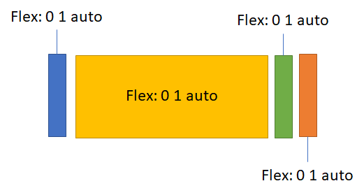
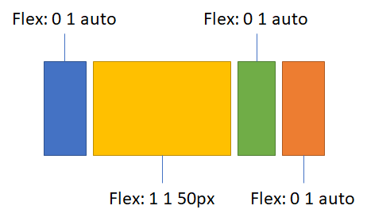

# Consistency spec: Image size vs Column size

## Table of Contents
- [Overview](#overview)
    - [Current Problem](#current-problem)
    - [What's happening behind the scenes?](#whats-happening-behind-the-scenes)
    - [Proposed Solutions](#proposed-solutions)
        - [Honoring Image Size](#honoring-image-size)

## Overview

This spec solves the issue presented by [#4504](https://github.com/microsoft/AdaptiveCards/issues/4504)

### Current problem

As part of the solution to the [Column width behavior](https://github.com/microsoft/AdaptiveCards/pull/4722) it was thought that images could be used as a reference to provide the minimum size needed to render an `auto` width column. This assumption is not correct, as some of our scenario cards don't follow that principle. Take for example the [FlightDetails card](), where we have an image whose `width` is `1000px`; if we were to honor the measurements given by the card author we would get a card where this long image occupies most of the width of the column set as can be seen in the views generated by the iOS and the Android renderers.

| Platform | Rendered card |
| --- | --- |
| JS (Best looking rendering) | | 
| iOS |  |
| Android |  |

### What's happening behind the scenes?

As we have seen, Javascript is generating the better looking card, but how does it do it? As we can see in the columnset, there are other columns that have images on them so why don't they shrink as well? The difference between columns 1, 3, 4 and column 2 is that the second column has `stretch` width, so after changing that width to `auto` we got a similar behaviour to the iOS and Android platforms: 

| Rendered view | Schema
| --- | --- |
|  |  |
| 

```html
<div class="ac-container" style="display: flex; flex-direction: column; justify-content: center; box-sizing: border-box; min-width: 0px; flex: 0 1 auto; padding: 0px; margin: 0px;">
    <div style="display: flex; align-items: flex-start; justify-content: flex-start; box-sizing: border-box; flex: 0 0 auto;">
        
    </div>
</div>
```

As can be seen above, the second column has grown as much as possible but the other columns are being given some small width still, this happens because the column has `flex` defined as `0 1 auto`. As a quick reminder, `flex` is read as `flex: flex-grow flex-shrink flex-basis` which would mean this column would not grow but would be able to shrink with a `shrink proportion` of `1`, while on the other hand `auto` means that [*"the size of the content in flex items is first deducted to determine the free space in each item. flex-grow then distributes the free space among items (based on each item's flex-grow value)"*](https://stackoverflow.com/questions/43520932/make-flex-grow-expand-items-based-on-their-original-size).

Returning the width value to `stretch` we can see that the `flex` value changed to `flex: 1 1 50px`.  

| Rendered view | Schema |
| --- | --- |
|  |  |
| 

```html
<div class="ac-container" style="display: flex; flex-direction: column; justify-content: center; box-sizing: border-box; min-width: 0px; flex: 1 1 50px; padding: 0px; margin: 0px;">
    <div style="display: flex; align-items: flex-start; justify-content: flex-start; box-sizing: border-box; flex: 0 0 auto;">
        
    </div>
</div> 
```

In this case the `flex` property can be read as that it allows the column to grow, to shrink and has an [`initial width` of `50px`](https://www.w3schools.com/cssref/css3_pr_flex-basis.asp).


### Proposed solutions

The Android and iOS renderers can follow a similar pattern to the javascript renderer, the biggest change would be honoring `auto` columns rather than `stretch` columns, this would mean that `stretch` columns should be made to have a more flexible sizing allowing them to grow and shrink before `auto` columns have to. 

#### Honoring Image Size

In this document we have talked about the case of an image with a fixed size, so what happens for images with a semantic value (`small`, `medium`, `large`, etc)? The behaviour should be the same as the proposed one, if the column has been given a smaller width than the image size then the image will have to adapt to the column, this may generate doubts on our users so this should be properly documented as a desired size dependent on the container size it's being rendered in.