# Input Label Position

## Overview
Right now position of the label is always above to the input field. We want to provide more options to card authors to position the label.
Now, labels can also be place inline with the input. It can provide better experience and more flexibity to card authors in different scenarios.

## New Schema Changes in Adaptive Card

Introducing an optional new styling property in AC input fields schema which will allow developers to define `position` of the label with respect to input field. It can be both `inline` and `above`. Default would be existing `above`.

* **Above view:**

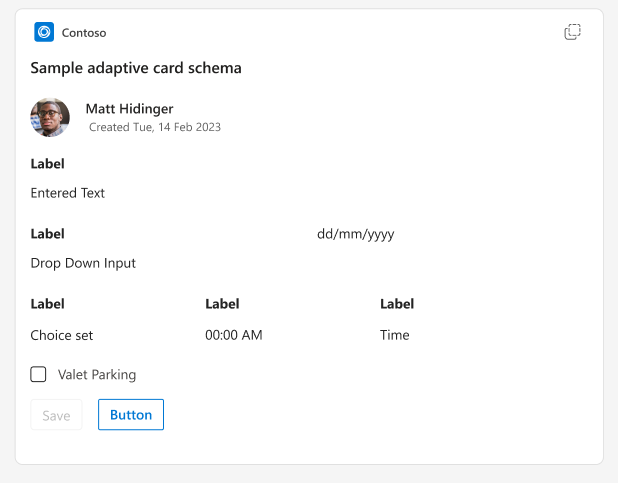

* **Inline view:**

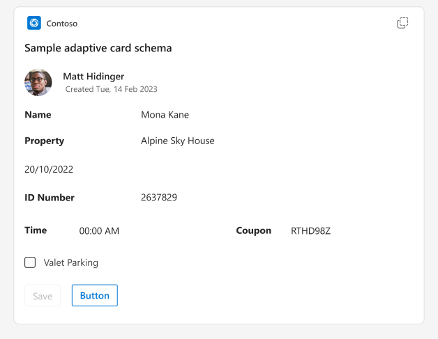

Order of `label` and `value` will always be label first and value second. In RTL, it should follow right to left convention as expected.

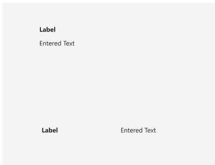

## Proposed Schema Changes:

### labelPosition
Inherited properties of all Input fields will have one more property called `labelPosition` whose type will be `InputLabelPosition`

| Property | Type | Required | Description | Version |
| -------- | ---- | -------- | ----------- | ------- |
| **labelPosition** | `InputLabelPosition?` | No | Determines the position of the label with respect to the input field. Default is "above" when not specified | 1.6 |

#### InputLabelPosition

Position for label in input fields.

* **Type**: `InputLabelPosition`
* **Required**: No
* **Allowed values**:
  * `"inline"` : should place label inline with the input field
  * `"above"` : should place label above the input field.

### labelWidth

| Property | Type | Required | Description | Version |
| -------- | ---- | -------- | ----------- | ------- |
| **labelWidth** | `string` or `number` | No | Determines the width of the label in percent like `40` or a specific pixel width like `"40px"` when label is placed inline with the input . labelWidth would be ignored when the label is displayed above the input. | 1.6 |


### Sample Payload:

```json
     {
          "type": "Input.Text",
          "label": "Name",
          "value": "Sneh",
          "labelPosition" : "above"
      },
      {
          "type": "Input.Time",
          "label": "Time of Arrival",
          "value": "09:30",
          "labelPosition" : "inline",
          "labelWidth" : 30
      },
      {
          "type": "Input.Text",
          "label": "Flight destination",
          "value": "Hyderabad",
          "labelPosition" : "inline",
          "labelWidth" : "40px"
      }
```
## Host configurable properties in card:
Host can configure input's styling property using HostConfig to define width percentage betwen label and input.

In `inline` label position: Default width spacing label:value would be 3:7 of the container of input element when `labelWidth` is not specified by the card author. However, host can configure it for themselves via HostConfig.

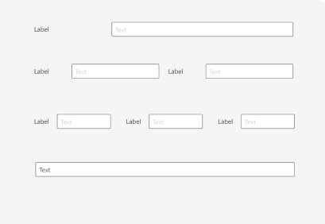

In `above` label position : The width is always 100% of the container of input element.

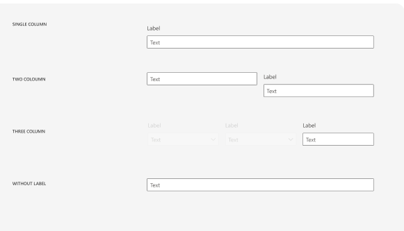


## Example for inline views for different inputs:

Input.Text:

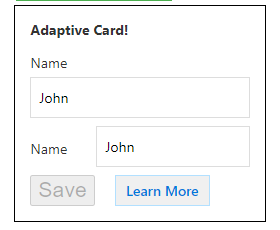

Input.Number:

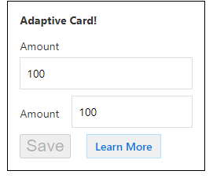

Input.Date:

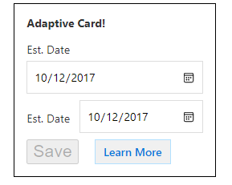

Input.Time:

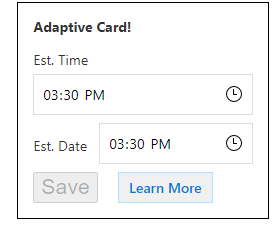

Input.ChoiceSet:

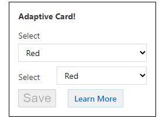

Input.Toggle:

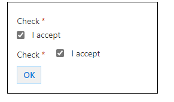


