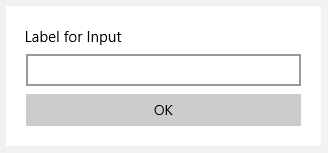
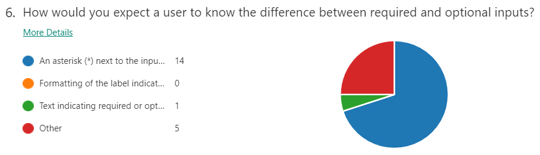
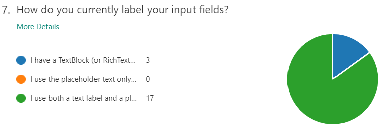
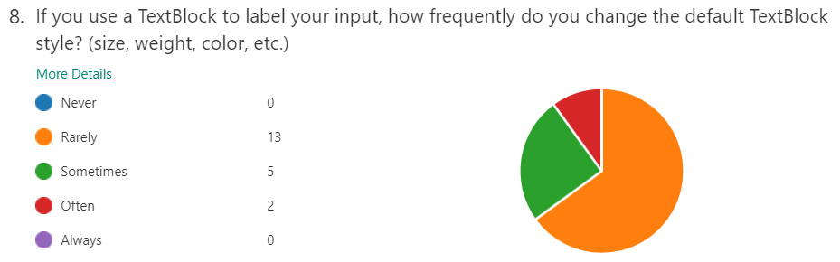
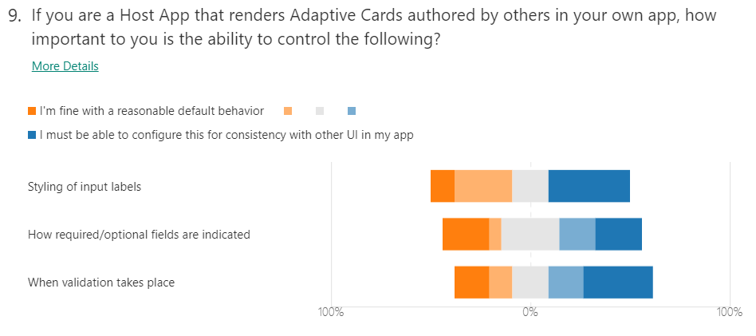

# Input/Label Associations

This document covers design considerations related to issue [#203](https://github.com/microsoft/AdaptiveCards/issues/203).

Consider the following card:
```json
{
	"type": "AdaptiveCard",
	"version": "1.0",
	"body": [
		{
			"type": "TextBlock",
			"text": "Please enter your name:"
		},
		{
			"type": "Input.Text",
			"id": "nameInput",
 			"placeholder": "Last, First"
		}
	],
	"actions": [
		{
			"type": "Action.Submit",
			"title": "OK"
		}
	]
}
```


In that card, the label for the input is “Please enter your name:”, however the card renderer has no way to determine that this is the case. We’ve run into a few cases where this is an issue:
 - Accessibility: The input will be read by screen readers as “Last, First”, rather than “Please enter your name” making it more difficult for screen reader users to use the card. 

 - Validation indicators: As part of input validation, we are allowing card authors to mark inputs as optional or required. One way to indicate that visually would be to put an indicator next to the input’s label. This requires knowing which text is the label.

 - Interaction model: Many forms move focus to the input when the label is clicked/tapped on. We can’t support that behavior without knowing which label goes with which input.

 - Responsiveness: One direction for the future of cards involves re-flowing the layout of a card based on the size of the display. Knowing that a particular label goes with a particular input may help us ensure that semantically related elements stay together on reflow.

## Basic Label Support in Adaptive Cards

The basic addition that we are going to make to the schema is to add a label property to all input types. This approach provides a simple and concise way to label inputs, that hopefully encourages card authors to use it and receive the benefits of improvements to the issues called out above.

``` json
{
	"type": "AdaptiveCard",
	"version": "1.0",
	"body": [
		{
			"type": "Input.Text",
			"id": "nameInput",
			"label": "Please enter your name:",
			"placeholder": "Last, First"
		}
	],
	"actions": [
		{
			"type": "Action.Submit",
			"title": "OK"
		}
	]
}
```

## Formatting
The above approach provides a simple means by which to specify the label, but doesn't immediately provide the ability to format the label. Card authors today who are using TextBlocks or RichTextBlocks as labels have the ability to set any of our formatting properties to control the size, color, font weight, etc. of their text. The schema proposed above does not give them that flexibility. One option to address this would be to allow card authors to specify a TextBlock or a RichTextBlock as a label in addition to supporting a simple string.

There is another concern, however, which must be balanced against the desire to provide card authors with the ability to format their labels. Hosts may have label formatting in their app which they want to apply consistently to cards they are displaying. This applies particularly to how they mark fields as required or optional (per spec at [InputValidation.md](https://github.com/microsoft/AdaptiveCards/blob/master/specs/DesignDiscussions/InputValidation.md)). While by default we will mark required inputs with a `*`, we may want to allow hosts more control. Perhaps some apps wish to show labels for required inputs in bold or italics. If we allows hosts to specify formatting based on what is required, however, and we allow authors to specify formatting via a TextBlock or RichTextBlock, we can easily run into cases where the formatting comes into conflict.

This conflict speaks to a general tension inherent in the design of Adaptive Cards. There's always going to be a trade off between giving the author more power, and letting the host control the experience for their users. We need to determine what balance we want to strike in this case.

In order to gather more data to help us balance the needs of the card authors and hosts, we sent a survey to customers who have expressed an interest in improving out input story. The following options are under consideration, and will be evaluated against survey data to determine which if any will be included in our v1 implementation.

The survey sent included 10 questions including the topics of input validation and input labels, for this spec we will only review the 4 questions that focus on the former topic. The results for this questions were used to leverage on some of the decisions taken on this spec document and can be found in the [Appendix](Appendix).

> ### Default formatting for labels
>
> Reviewing the results from Q8 of the survey, we can see that most voters usually have a good experience with the default rendering of a TextBlock for rendering a label. From this result we can decide that string label rendering should be performed as if we were rendering a default TextBlock.
>
> This would allow authors to emulate writing a simple TextBlock element by simply defining the label as a string, making the string version look like this
>
> ```json
> {
>	"type": "Input.Text",
>	"id": "textInput",
>	"label": "Label for Input"
> }
> ```
>
> While the same rendering experience using a TextBlock would look like this
>
> ```json
> {
>	"type": "Input.Text",
>	"id": "textInput",
>	"label": {
>		"type": "TextBlock",
>		"text": "Label for Input"
>	}
> }
> ```
>
> Both of the afore mentioned cards would produce the same rendered result that would look like  this:
> 
> 
>
> It is important to note that wrapping should always be performed for this type of labels as not doing so would provide a bad user experience. If users can't read the whole label for an input they may not be able to provide a correct answer.
>

### Host Formatting

Based on the results from Q9 of the survey, we will add the option to allow the host to control formatting of the labels, either in general or for required inputs, we need a way for them to specify the desired format. There are two main things we may want to include:

#### Text formatting
 We are introducing the option to specify formatting of input labels for required and optional inputs. We will allow full text formatting (as in the formatting properties of a TextBlock) For example:

 ```json
"inputLabelFormatting": 
{
	"requiredInputs": {
		"weight": "Bolder"
	},
	"optionalInputs": {
		"isSubtle":true
	}
}
```

The full set of properties to be modified using full text formatting will be:

| Property | Default Value |
| --- | --- | --- | --- |
| spacing | "default" | 
| size | "default" | 
| color | "default" |

While it's mentioned that we should allow almost all TextBlock properties to be modified by the label property, some of them must stay out of bounds for hosts as they would provide a bad user experience:
* maxLines and wrap: Labels should be descriptive enough so users can provide the information needed, if the user can't read the whole question the information they will not be able to provide a correct answer
* isVisible: labels should always be visible as long as the associated input is
* height: input elements should control the height for the whole set of label, input and error message 

Allowing the control of this styling via support of native styling on required and optional labels (i.e. CSS, Xaml Styles, etc) may also be required but will be set out of scope for v1 of this feature. This decision speaks to a larger discussion of the direction of host config that is beyond the scope of this document.

#### Required and Optional indicators

 By default, we will mark required inputs with a `*`. We may want, however, to provide the option for the host to configure a suffix to the label for required or optional inputs. This allows the host to add a `*` to required labels, or to add the words "required" or "optional". Consider a host config similar to the below:

  ```json
"inputLabelFormatting": 
{
	"requiredInputs": {
		"suffix":"*",
		"weight": "Bolder",
	},
	"optionalInputs": {
		"suffix":"(optional)",
		"isSubtle":true
	}
}
```
If we want even more detailed control, we could allow the host to specify something like `{labelName} (optional)` or `(optional) {labelName}` in order to allow them to position their indicators as they wish. We could make use of the common expression language being used for templating to support this functionality, but that would require taking a dependency on the common expression language implementation that would not otherwise be required for hosts not using templating.

> One concern with allowing hosts to specify arbitrary label templates or suffixes, is that it opens up a localization issue.  Whatever word they provide should be localized into the language of the card. If we introduce this functionality, we should make sure we have a localization story that covers this scenario. 

> When using these host properties, we would need to only apply them if all inputs on the card have labels so that required fields are marked consistently. We don't want to end up in a situation where some inputs in the card are marked as required in the label and others on the field itself, as this may lead to a confusing user experience.

### Card Author Formatting

We may wish to prioritize Host formatting over card author formatting in order to allow our hosts to impose a specified look and feel to forms displayed in their app. That said, if we don't allow card authors to specify formatting of labels, those authors who wish to do so will simply opt-out of our label approach and revert to using the existing unassociated TextBlocks and RichTextBlocks. This has accessibility and usability impact on our end customers, as they won't have access to the improved experiences made possible when our renderers have semantic knowledge of which text blocks are the labels for a given input.

Given that, we should consider options for card author label formatting. Consider the two following options.

#### Option 1 – Allow TextBlocks and RichTextBlocks as Labels

One option would be to add support for TextBlock and/or RichTextBlock labels to add formatting support:

```json
{
	"type": "Input.Text",
	"id": "nameInput",
	"label": 
	{
		"type": "TextBlock",
		"text": "Please enter your name:",
		"weight": "Bolder",
		"color": "Good"
	},
	"placeholder": "Last, First"
}
```

The problem with this approach, however, is that if we allow the host to specify formatting, there could be a conflict between the formatting provided by the card author and that provided by the host. For example, if the card author makes all their labels bold, the host's indication that required labels should be bold will not provide any additional information, and the end user will not see any indication of which fields are required.


#### Option 2 – LabelFor Property on TextBlocks/RichTextBlocks
Another option would be to allow card authors who wish to format their labels to alternatively use a labelFor property on their TextBlocks instead of using the label property on Inputs. This would opt them out of host formatting, but still allow them to provide the association that would allow us to correctly mark the input for accessibility and interactivity:

``` json
{
	"type": "AdaptiveCard",
	"version": "1.0",
	"body": [
		{
			"type": "TextBlock",
			"text": "Please enter your name:",
			"weight": "Bolder",
			"labelFor": "nameInput"
		},
		{
			"type": "Input.Text",
			"id": "nameInput",
			"placeholder": "Last, First"
		}
	],
	"actions": [
		{
			"type": "Action.Submit",
			"title": "OK"
		}
	]
}
``` 

The downside of this is that it provides a less clean story to our card authors. They would now have two ways to specify a label, and without reading the documentation it would not be clear that one option results in host formatting being applied and the other doesn't. If, for example, a card author wants to emphasize a particular word, and uses a RichTextBlock to highlight that word, they might unknowingly opt themselves out of host formatting. 

##### Non-adjacent labels
Another note about labelFor is that this approach doesn’t require the label to be near the input it labels. In many cases, this may be confusing to users if use incorrectly by card authors. However, we should consider if there are valid scenarios for this use case. Possible scenarios that I could come up with include:


I built this card using a series of column sets. Although it is an acceptable UI, this is probably not the approach we want for card authors to label their inputs on the side. The card authoring is fairly non-intuitive to get a good result. If we want to support labels to the left of the input, we should probably do this as a first-class explicit property (```"labelPosition"``` or ```"allowHorizontalLabels"```). 

This card is another possible example of a use case for non-adjacent labels, where there is additional information between the label and the input:


This scenario could be covered by a RichTextBlock that contains both pieces of text being used as the label (arguably the entire text should be read as the accessibility label for the input); this scenario also opens the doors to cards where there may be elements between the label and the card, just in the prior example card authors may want to have the required hint in the first line rather than having it next to the hint on how to fill in the field:


This scenario is possible but it would break the accessibility story of the form as people using a screen reader would not know the extra piece of information that is not part of the label. This type of behaviors should not be encouraged as it would provoke a big issue with the accessibility story of our product.

## Backwards Compatibility
On earlier versions of renderers the label would be completely dropped, leading to a bad user experience. The card may be completely unusable if without the labels the user cannot deduce what information is meant to be provided in the unlabeled inputs.

Because the label is a property, not a new type, card authors would not be able to use type to trigger fallback to an independent text block and input. To support this, the card author would need to use requires as follows:

```json
{
	"type": "Input.Text",
	"id": "NameId",
	"label": "Please enter your name",
	"requires": {
		"adaptiveCards": "1.3"
	},
	"fallback": {
		"type": "Container",
		"items": [
			{
				"type": "TextBlock",
				"text": "Please enter your name:"
			},
			{
				"type": "Input.Text",
				"id": "NameId"
			}
		]
    }
}
```
We could also possibly add a specific named feature to the requires dictionary to allow card authors to address it directly using something like:
```json
"requires": {
	"inputLabels": "1.0"
}
```
Either of these approaches would allow card authors who know their cards will be hitting platforms targeting both 1.2 and 1.3 to take advantage of the labels for accessibility or interactivity purposes in 1.3 without breaking their experience on 1.2 clients. That this will not help card authors who are targeting 1.0 or 1.1 hosts where fallback is not supported. Card authors who know their hosts support version 1.3 (or any future version) will not need to worry about this concern.

In the case of a host using the `labelFor` property there would be no negative impact on down-level platforms other than not providing the association. Because the TextBlock will still exist, only the association will be dropped when rendered on a platform that doesn't support this feature.

## Placeholders

Based on the answers from Q7, no users answered to using placeholders only for labeling their inputs. We also got in touch with the Accessibility team which recommended us not to use labels as placeholders as that is detrimental for all people. For v1 of this feature we decided to not modify placeholders.

## Label Position

As alluded to above, we should consider how the label position is determined. One of the goals of this feature is to allow us to someday intelligently reflow inputs, so it may be the case that we want to maintain control of label positioning. Today we would always draw the label above the input, but in the future we may put it to the side if our rendering space is wide enough, or push it into placeholders if our space is constrained. For the time being, we can consider label position to be work for the future so it can line with intelligent reflowing so on v1 it's not going to be considered. 

## Other Input Types

This document has primarily focused on `Input.Text` in it's examples, but the label property should be present on all input types. See examples below:

### Date Input

``` json
{
	"type": "Input.Date",
	"id": "dateInput",
	"label": "Please enter the date:"
}
```


### Time Input

``` json
{
	"type": "Input.Time",
	"id": "timeInput",
	"label": "Please enter the time:"
}
```


### Number Input
``` json
{
	"type": "Input.Number",
	"id": "numberInput",
	"label": "How many would you like?"
}
```


### Choice Set

#### Expanded

```json
{
	"type": "Input.ChoiceSet",
	"label": "Please select from the following options:"
	"choices": [
		{
			"title": "Choice 1",
			"value": "Choice 1"
		},
		{
			"title": "Choice 2",
			"value": "Choice 2"
		}
	],
	"style": "expanded"
}
```


#### Compact
```json
{
	"type": "Input.ChoiceSet",
	"label": "Please select from the following options:"
	"choices": [
		{
			"title": "Choice 1",
			"value": "Choice 1"
		},
		{
			"title": "Choice 2",
			"value": "Choice 2"
		}
	],
	"style": "compact"
}
```


### Toggle Inputs

```json
{
	"type": "Input.Toggle",
	"label": "Please accept the privacy policy:",
	"title": "I have reviewed and accept the terms of the privacy policy"
}
```


# Appendix

## Survey results

#### Q6. How would you expect a user to know trhe difference between required and optional inputs?



Most of the voters are fine with using an asterisk next to the inputs or labels. The options under other vary from card authors "thinking an asterisk is a bit crude" or adding the asterisk by themselves.

#### Q7. How do you currently label your input fields?



Most of the voters use a text label and a placeholder for labeling their input text. The remaining voters only use a TextBlock on top of the input to label them. It's important to note that none of the voters only use placeholders for labeling.

#### Q8. If you use a TextBlock to label your input, how frequently do you change the default TextBlock style? (size, weight, color, etc.)



Most of the voters "Rarely" change the default style for TextBlocks that label their inputs. A thing to note here is that no voter commented that they never style the TextBlocks.

#### Q9. If you are a Host App that renders Adaptive Cards authored by others in your own app, how important to you is the ability to control the following?



This is the question where there's not a majority of voters who picked one option. People are very divisive on whether to have a reasonable default behavior and configuring the labels to keep consistency with other UI in their apps.  


 ## Comparisons to other platforms
For guidance, consider how labels and inputs are associated in XAML and HTML:

### XAML
#### Header
 Xaml TextBox has a “header” property, which is drawn above the text box. Clicking on the header puts focus in the TextBox. Narrator reads the header when the TextBox is selected.
Here is an example:

 ``` xml
 <TextBox Header="This is a header"/>
 ```


Or with a formatted header:
``` xml
<TextBox>
	<TextBox.Header>
    	<TextBlock  Text="Header" Foreground="red"></TextBlock>
	</TextBox.Header>
</TextBox>
```


Other control types such as Images can also be used as TextBox labels.

#### AutomationProperties
 Xaml also has an AutomationProperties.LabeledBy attached property for accessibility purposes. This property is used by all elements (not just inputs). If you use it to mark a proceeding text block as the label, it is read the same as a header by narrator, but does not have the click to select behavior of header. 

 ```xml
<TextBlock x:Name="inputLabel">This is a text block label</TextBlock>
<TextBox AutomationProperties.LabeledBy="{Binding ElementName=inputLabel}"/> 
```
 

### HTML
#### Label
HTML has label tag which can be used to label inputs. The input can either be placed inside the label, or referenced with “for”:

``` HTML
  <label>
  Please enter your name:
  <input id="nameInput">
  </label>
```

Or
``` HTML
  <label for="nameInput"> Please enter your name:</label>
  <input id="nameInput">
```
 
This results in the label being associated with the input both for interactivity and accessibility.

#### Aria
 HTML also has aria-label and aria-labelledby. These properties are used for accessibility purposes. As in the Xaml AutomationProperties.LabeledBy property, this labels the input for accessibility purposes, but does not change the interactivity model: clicking on the label does not select the input.

 ## Accessibility Labels
Both Xaml and HTML have accessibility labels which can be used to address accessibility issues related to inputs (AutomationProperties and aria- properties respectively). In both cases, setting these properties addresses accessibility issues, but does not semantically associate the label with the input for interactivity behavior. Additionally, these properties are not input specific, and can be used on other elements as well as inputs. We should consider whether we want generic accessibility labels such as these, but such a feature should apply to all elements and is outside the scope of this document.
