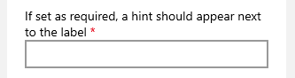

# Table of Contents
1. [Input/Label Associations](#InputLabel-Associations)
	1. [Basic Label Support in Adaptive Cards](#Basic-Label-Support-in-Adaptive-Cards) 
		1. [Rendering](#Rendering)
		2. [Host Formatting](#Host-Formatting)
			1. [Text Formatting](#Text-formatting)
			2. [Required indicators](#Required-indicators) 
		3. [Card Author Formatting](#Card-Author-Formatting)
	3. [Backwards Compatibility](#Backwards-Compatibility)
	6. [Other Input Types](#Other-Input-Types)
		1. [Date Input](#Date-Input)
		2. [Time Input](#Time-Input)
		3. [Number Input](#Number-Input)
		4. [Choice Set](#Choice-Set)
			1. [Expanded](#Expanded)
			2. [Compact](#Compact)
		5. [Toggle Inputs](#Toggle-Inputs)
	7. [Feature Cost Estimation](#Feature-Cost-Estimation)
		1. [Follow ups](#Follow-ups) 
	8. [Requirements Priorities](#Requirements-Priorities)
	9. [Accessibility](#Accessibility)
		1. [1.3.1 Info and Relationships](#131-Info-and-Relationships)
		2. [2.4.6 Headings and Labels](#246-Headings-and-Labels)
		3. [3.3.2 Labels and Instructions](#332-Labels-and-Instructions)
2. [Appendix](#Appendix)
	1. [Survey results](#Survey-results)
		1. [Q6. How would you expect a user to know the difference between required and optional inputs?](#Q6-How-would-you-expect-a-user-to-know-the-difference-between-required-and-optional-inputs)
		2. [Q7. How do you currently label your input fields?](#Q7-How-do-you-currently-label-your-input-fields)
		3. [Q8. If you use a TextBlock to label your input, how frequently do you change the default TextBlock style? (size, weight, color, etc.)](#Q8-If-you-use-a-TextBlock-to-label-your-input-how-frequently-do-you-change-the-default-TextBlock-style-(size-weight-color-etc))
		4. [Q9. If you are a Host App that renders Adaptive Cards authored by others in your own app, how important to you is the ability to control the following?](#Q9-If-you-are-a-Host-App-that-renders-Adaptive-Cards-authored-by-others-in-your-own-app-how-important-to-you-is-the-ability-to-control-the-following)
	2. [Comparisons to other platforms](#Comparisons-to-other-platforms)
		1. [XAML](#XAML)
			1. [Header](#Header)
			2. [AutomationProperties](#AutomationProperties)
		2. [HTML](#HTML)
			1. [Label](#Label)
			2. [Aria](#Aria)
	
	4. [Work for labels to be considered for a future iteration](#Work-for-labels-to-be-considered-for-a-future-iteration)
		1. [Accessibility Labels](#Accessibility-Labels)
		3. [Card Author Formatting Options](#Card-Author-Formatting-Options)
			1. [Option 1 – Allow TextBlocks and RichTextBlocks as Labels](#Option-1-–-Allow-TextBlocks-and-RichTextBlocks-as-Labels)
			2. [Option 2 – LabelFor Property on TextBlocks/RichTextBlocks]([#Option-2-–-LabelFor-Property-on-TextBlocks/RichTextBlocks])
		3. [More powerful host control of required indicators](#More-powerful-host-control-of-required-indicators) 
		4. [Localization](#Localization) 
		5. [Label positioning](#Label-positioning)
			1. [Label Above](#Label-Above)
			2. [Label to the Side](#Label-to-the-Side)
			3. [Label as Placeholder](#Label-as-Placeholder)	
		6. [Custom Rendering](#Custom-Rendering)

# Input/Label Associations

This document covers design considerations related to issue [#203](https://github.com/microsoft/AdaptiveCards/issues/203).

Consider the following card:
```json
{
	"type": "AdaptiveCard",
	"version": "1.0",
	"body": [
		{
			"type": "TextBlock",
			"text": "Please enter your name:"
		},
		{
			"type": "Input.Text",
			"id": "nameInput",
 			"placeholder": "Last, First"
		}
	],
	"actions": [
		{
			"type": "Action.Submit",
			"title": "OK"
		}
	]
}
```


In that card, the label for the input is “Please enter your name:”, however the card renderer has no way to determine that this is the case. We’ve run into a few cases where this is an issue:
 - Accessibility: The input will be read by screen readers as “Last, First”, rather than “Please enter your name” making it more difficult for screen reader users to use the card. 

 - Validation indicators: As part of input validation, we are allowing card authors to mark inputs as optional or required. One way to indicate that visually would be to put an indicator next to the input’s label. This requires knowing which text is the label.

 - Interaction model: Many forms move focus to the input when the label is clicked/tapped on. We can’t support that behavior without knowing which label goes with which input.

 - Responsiveness: One direction for the future of cards involves re-flowing the layout of a card based on the size of the display. Knowing that a particular label goes with a particular input may help us ensure that semantically related elements stay together on reflow.

 ## Basic Label Support in Adaptive Cards

The basic addition that we are going to make to the schema is to add a label string property to all input types. This approach provides a simple and concise way to label inputs, that hopefully encourages card authors to use it and receive the benefits of improvements to the issues called out above.

``` json
{
	"type": "AdaptiveCard",
	"version": "1.0",
	"body": [
		{
			"type": "Input.Text",
			"id": "nameInput",
			"label": "Please enter your name:",
			"placeholder": "Last, First"
		}
	],
	"actions": [
		{
			"type": "Action.Submit",
			"title": "OK"
		}
	]
}
```

### Rendering

The label will be rendered above the input as if the card author had used a TextBlock to label their input. It will have the same behavior as a TextBlock regarding handling empty/white space only text, and be drawn only if there is a non-empty non-whitespace value. 

It is important to note that wrapping will always be performed for this type of labels as not doing so would provide a bad user experience. If users can't read the whole label for an input they may not be able to provide a correct answer.

### Host Formatting

Hosts may have label formatting in their app which they want to apply consistently to cards they are displaying. This applies particularly to how they mark fields as required or optional (per spec at [InputValidation.md](InputValidation.md)). While by default we will mark required inputs with a `*`, we may want to allow hosts more control. Perhaps some apps wish to show labels for required inputs in bold or italics. In order to support these scenarios, there are two main things we will include: 

#### Text formatting
 We are introducing the option for hosts to specify formatting of input labels for required and optional inputs. We will allow full text formatting (as in the formatting properties of a TextBlock) For example:

 ```json
"inputs": 
{
	"label": 
	{
		"inputSpacing": "small",
		"requiredInputs": {
			"weight": "bolder",
			"color": "attention",
			"size": "medium"
		},
		"optionalInputs": {
			"color": "good",
			"isSubtle": true,
			"weight": "lighter"
		}
	}
}
```

The full set of properties to be modified using full text formatting will be:

| Property | Default Value | Extra observations
| --- | --- | --- |
| `color` | `default` | |
| `isSubtle` | `false` | |
| `size` | `default` | | 
| `inputSpacing` | `default` | Will be the same for required and optional inputs |
| `weight` | `default` | |

Allowing the control of this styling via support of native styling on required and optional labels (i.e. CSS, Xaml Styles, etc) may also be useful, but will be set out of scope for v1 of this feature.

#### Required indicators

As mentioned in the [Input Validation spec](InputValidation.md), all input elements will support a new property called ```isRequired```. This property indicates that the input element will only be valid if some data has been inputted into it. To indicate to the user whether an input is required or not we will render a hint next to the labels for required inputs. 



By default, we will mark required inputs with a `*`. We will also, however, provide the option for the host to configure the suffix for required inputs. This allows the host to, for example, use the word "required" instead of a `*`. Consider a host config similar to the below. In this case, the "(required)" suffix would appear instead of the *:

```json
"inputs":
{
	"label": 
	{
		"requiredInputs": {
			"suffix": " (required)",
			"weight": "Bolder
		}
	}
}
```

> Note: If an input is marked as required but does not have the label property set, no visual indicator will be shown indicating that the input is required. Renderers will return a warning in this case that can be surfaced to card authors in the designer and visualizers to warn authors of this behavior.

### Card Author Formatting
This version of input labels does not allow for card authors to provide their own formatting for labels. Survey results show that this is not commonly done, and introducing it would create conflict with the styling provided by the host. For further discussion of ways to possibly add card author formatting in the future, see the Appendix. 

## Backwards Compatibility
On earlier versions of renderers the label will be completely dropped, unfortunately leading to a bad user experience. The card may be completely unusable if without the labels the user cannot deduce what information is meant to be provided in the unlabeled inputs.

Because the label is a property, not a new type, card authors will not be able to use type to trigger fallback to an independent text block and input. To support this, the card author would need to use requires as follows:

```json
{
	"type": "Input.Text",
	"id": "NameId",
	"label": "Please enter your name",
	"requires": {
		"adaptiveCards": "1.3"
	},
	"fallback": {
		"type": "Container",
		"items": [
			{
				"type": "TextBlock",
				"text": "Please enter your name:"
			},
			{
				"type": "Input.Text",
				"id": "NameId"
			}
		]
    }
}
```


## Other Input Types

This document has primarily focused on `Input.Text` in it's examples, but the label property should be present on all input types. See examples below:

### Date Input

``` json
{
	"type": "Input.Date",
	"id": "dateInput",
	"label": "Please enter the date:"
}
```


### Time Input

``` json
{
	"type": "Input.Time",
	"id": "timeInput",
	"label": "Please enter the time:"
}
```


### Number Input
``` json
{
	"type": "Input.Number",
	"id": "numberInput",
	"label": "How many would you like?"
}
```


### Choice Set

#### Expanded

```json
{
	"type": "Input.ChoiceSet",
	"label": "Please select from the following options:"
	"choices": [
		{
			"title": "Choice 1",
			"value": "Choice 1"
		},
		{
			"title": "Choice 2",
			"value": "Choice 2"
		}
	],
	"style": "expanded"
}
```


#### Compact
```json
{
	"type": "Input.ChoiceSet",
	"label": "Please select from the following options:"
	"choices": [
		{
			"title": "Choice 1",
			"value": "Choice 1"
		},
		{
			"title": "Choice 2",
			"value": "Choice 2"
		}
	],
	"style": "compact"
}
```


### Toggle Inputs

```json
{
	"type": "Input.Toggle",
	"label": "Please accept the privacy policy:",
	"title": "I have reviewed and accept the terms of the privacy policy"
}
```


## Feature Cost estimation

This feature focuses on adding a text element to an input element which will have to be implemented in all of our renderers and the designer. It's important to note that this feature covers the accessibility aspect which should be reviewed by people who have expertise in this aspect.

For the development of this feature (P0 & P1 tasks) the following costs have been estimated for all platforms like this:

| Task | Cost (days) | Previous requirements | Includes |
| --- | --- | --- | --- |
| C++ Object Model | 4 | Spec completion | Tests |
| UWP Implementation | 4 | C++ Object Model | Tests and override sample |
| Android Implementation | 4 | C++ Object Model | Tests and override sample | 
| iOS Implementation | 4 | C++ Object Model | Override sample |
| C# Object Model | 4 | Spec completion | Tests |
| .NET Implemenation | 4 | C# Object Model | Override sample |
| HTML Implementation | 4 | C# Object Model | Tests | 
| JavaScript Implementation | 10 | Spec completion | Tests and Changes to designer |
| Bug Bash | 2 |  Spec completion, UWP, Android, iOS, Javascript and .NET implementations | Preparation and Bug Bash |
| Bug Fixing | 5 | Bug Bash | Bug fixing |
| Documentation | 6 | Spec completion, UWP, Android, iOS, Javascript and .NET implementations | Changes to schema explorer and guidance on how to override inputs | 
| Total cost | 51 | | |

Modifications to pipelines or other infrastructure changes are not required as this is a rendering (and accessibility) feature. The estimations were made considering that the developer(s) have experience with the platforms they are developing the feature in as well as their accessibility story.

It's also important to note that using the approach we went with, we must make sure our TextBlock and RichTextBlock rendering methods are open for consumption and are easy to use to any developer who has to override input rendering.

### Follow ups

As mentioned before, this feature tackles a big issue Adaptive Cards has with accessibility, as such, we'll need some guidance from the Accessibility Team at Microsoft to make sure the implementation we made was correct and provides a good experience for people using a screen reader application. I didn't account this in the total cost as this process may take anything from a day to multiple weeks and may fall in the category of bug fixing.

## Requirements Priorities

For v1 of this feature we will only release the requirements marked as P0, while P1 requirements will be left for a v2

| Priority | Task |
| --- | --- |
| P0 | isRequired support (rendering requirement hints) |
| P0 | Label support as a string |
| P0 | Accessibility support for inputs |
| P0 | Host can define formatting for labels in hostconfig |
| P0 | Labels still show up if an host overrides or custom renders an input |
| P0 | Renderers visually indicate what inputs are required (isRequired property) | 
| P1 | Hosts can define the string to be used as "required inputs" hint |
| P1 | Host Apps can define custom rendering for labels (using extensibility APIs) |
| P1 | Samples are provided for overriding input elements |
| P1 | Support for formating labels using other Adaptive cards elements |
| P1 | Support markdown in labels |

## Accessibility

The label property for inputs opens up a way where we can fix or help fix some parts of the accessibility story for forms rendered using Adaptive Cards. The guidelines we used were the [Web Content Accessibility Guidelines (WDGA) 2.0](https://www.w3.org/TR/WCAG20/) where we identified the following guidelines that could help guide our design and could help card authors to provide a better accessible experience using our product:

### 1.3.1 Info and Relationships

[Original guideline](https://www.w3.org/TR/UNDERSTANDING-WCAG20/content-structure-separation-programmatic.html)

Our design supports the use of a "required hint" which will allow cards to be standarized on what word or symbol the host application uses for marking a required input.

### 2.4.6 Headings and Labels

[Original guideline](https://www.w3.org/TR/UNDERSTANDING-WCAG20/navigation-mechanisms-descriptive.html)

This guideline will have to be taken care by card authors but by providing a simple way to specify label for input elements we hope to ease the design of input forms which in turn will make the labels to be more descriptive.

### 3.3.2 Labels and Instructions

[Original guideline](https://www.w3.org/TR/UNDERSTANDING-WCAG20/minimize-error-cues.html)

As part of this feature we'll support the linking of inputs with labels which in turn will allow inputs read the contents of the label they are linked with. Also, the rendering of labels will always be executed next to the input fields so people using screen magnifiers will be presented with minimal issues. 

# Appendix

## Survey results

We sent a survey to customers who expressed interest in input related features. This section presents the results of that survey.

### Q6. How would you expect a user to know the difference between required and optional inputs?


Most of the voters are fine with using an asterisk next to the inputs or labels. The options under other vary from card authors "thinking an asterisk is a bit crude" or adding the asterisk by themselves.

### Q7. How do you currently label your input fields?


Most of the voters use a text label and a placeholder for labeling their input text. The remaining voters only use a TextBlock on top of the input to label them. It's important to note that none of the voters only use placeholders for labeling.

### Q8. If you use a TextBlock to label your input, how frequently do you change the default TextBlock style? (size, weight, color, etc.)


Most of the voters "Rarely" change the default style for TextBlocks that label their inputs. A thing to note here is that no voter commented that they never style the TextBlocks.

### Q9. If you are a Host App that renders Adaptive Cards authored by others in your own app, how important to you is the ability to control the following?


This is the question where there's not a majority of voters who picked one option. People are very divisive on whether to have a reasonable default behavior and configuring the labels to keep consistency with other UI in their apps.  


 ## Comparisons to other platforms
For guidance, consider how labels and inputs are associated in XAML and HTML:

### XAML
#### Header
 Xaml TextBox has a “header” property, which is drawn above the text box. Clicking on the header puts focus in the TextBox. Narrator reads the header when the TextBox is selected.
Here is an example:

 ``` xml
 <TextBox Header="This is a header"/>
 ```


Or with a formatted header:
``` xml
<TextBox>
	<TextBox.Header>
    	<TextBlock  Text="Header" Foreground="red"></TextBlock>
	</TextBox.Header>
</TextBox>
```


Other control types such as Images can also be used as TextBox labels.

#### AutomationProperties
 Xaml also has an AutomationProperties.LabeledBy attached property for accessibility purposes. This property is used by all elements (not just inputs). If you use it to mark a proceeding text block as the label, it is read the same as a header by narrator, but does not have the click to select behavior of header. 

 ```xml
<TextBlock x:Name="inputLabel">This is a text block label</TextBlock>
<TextBox AutomationProperties.LabeledBy="{Binding ElementName=inputLabel}"/> 
```
 

### HTML
#### Label
HTML has label tag which can be used to label inputs. The input can either be placed inside the label, or referenced with “for”:

``` HTML
  <label>
  Please enter your name:
  <input id="nameInput">
  </label>
```

Or
``` HTML
  <label for="nameInput"> Please enter your name:</label>
  <input id="nameInput">
```
 
This results in the label being associated with the input both for interactivity and accessibility.

#### Aria
 HTML also has aria-label and aria-labelledby. These properties are used for accessibility purposes. As in the Xaml AutomationProperties.LabeledBy property, this labels the input for accessibility purposes, but does not change the interactivity model: clicking on the label does not select the input.

### Follow ups

As mentioned before, this feature tackles a big issue Adaptive Cards has with accessibility, as such, we'll need some guidance from the Accessibility Team at Microsoft to make sure the implementation we made was correct and provides a good experience for people using a screen reader application. I didn't account this in the total cost as this process may take anything from a day to multiple weeks and may fall in the category of bug fixing.

## Work for labels to be considered for a future iteration

### Accessibility Labels
Both Xaml and HTML have accessibility labels which can be used to address accessibility issues related to inputs (AutomationProperties and aria- properties respectively). In both cases, setting these properties addresses accessibility issues, but does not semantically associate the label with the input for interactivity behavior. Additionally, these properties are not input specific, and can be used on other elements as well as inputs. We should consider whether we want generic accessibility labels such as these, but such a feature should apply to all elements and is outside the scope of this document.

### Card Author Formatting Options

Card authors today who are using TextBlocks or RichTextBlocks as labels have the ability to set any of our formatting properties to control the size, color, font weight, etc. of their text. The schema proposed above does not give them that flexibility. One option to address this would be to allow card authors to specify a TextBlock or a RichTextBlock as a label in addition to supporting a simple string.

 If we allow authors to specify formatting via a TextBlock or RichTextBlock, and we also allow hosts to specify formatting for required, however, and we can easily run into cases where the formatting comes into conflict.

This conflict speaks to a general tension inherent in the design of Adaptive Cards. There's always going to be a trade off between giving the author more power, and letting the host control the experience for their users. We need to determine what balance we want to strike in this case.

Reviewing the results from Q8 of the survey, we can see that most voters usually have a good experience with the default rendering of a TextBlock for rendering a label. From this result we decide to prioritize host formatting for this release, and re-evaluate introduction card author formatting in a future release.

 That said, if we don't allow card authors to specify formatting of labels, those authors who wish to do so will simply opt-out of our label approach and revert to using the existing unassociated TextBlocks and RichTextBlocks. This has accessibility and usability impact on our end customers, as they won't have access to the improved experiences made possible when our renderers have semantic knowledge of which text blocks are the labels for a given input. Although the survey data indicates that most users will be fine with a plain label, we should revisit this in future releases.

 The following are options for introducing card author formatting.

#### Option 1 – Allow TextBlocks and RichTextBlocks as Labels

One option would be to add support for TextBlock and/or RichTextBlock labels to add formatting support:

```json
{
	"type": "Input.Text",
	"id": "nameInput",
	"label": 
	{
		"type": "TextBlock",
		"text": "Please enter your name:",
		"weight": "Bolder",
		"color": "Good"
	},
	"placeholder": "Last, First"
}
```

The problem with this approach, however, is that if we allow the host to specify formatting, there could be a conflict between the formatting provided by the card author and that provided by the host. For example, if the card author makes all their labels bold, the host's indication that required labels should be bold will not provide any additional information, and the end user will not see any indication of which fields are required.

#### Option 2 – LabelFor Property on TextBlocks/RichTextBlocks
Another option would be to allow card authors who wish to format their labels to alternatively use a labelFor property on their TextBlocks instead of using the label property on Inputs. This would opt them out of host formatting, but still allow them to provide the association that would allow us to correctly mark the input for accessibility and interactivity:

``` json
{
	"type": "AdaptiveCard",
	"version": "1.0",
	"body": [
		{
			"type": "TextBlock",
			"text": "Please enter your name:",
			"weight": "Bolder",
			"labelFor": "nameInput"
		},
		{
			"type": "Input.Text",
			"id": "nameInput",
			"placeholder": "Last, First"
		}
	],
	"actions": [
		{
			"type": "Action.Submit",
			"title": "OK"
		}
	]
}
``` 

The downside of this is that it provides a less clean story to our card authors. They would now have two ways to specify a label, and without reading the documentation it would not be clear that one option results in host formatting being applied and the other doesn't. If, for example, a card author wants to emphasize a particular word, and uses a RichTextBlock to highlight that word, they might unknowingly opt themselves out of host formatting. 

### More powerful host control of required indicators 
For following iterations of this feature, we may want to provide even more detailed control of label formatting, we could allow the host to specify something like `{labelName} (required)` or `(required) {labelName}` in order to allow them to position their indicators as they wish. We could make use of the common expression language being used for templating to support this functionality. That would, however require hosts to take a dependency on the common expression language implementation that would not otherwise be required for hosts not using templating.

### Localization

One concern with allowing hosts to specify arbitrary label suffixes, is that it opens up a localization issue.  Whatever word they provide would ideally be localized into the language of the card. In future versions of this feature we should consider introducing a localization story that covers this scenario.

### Label positioning
One of the goals of this feature is to allow us to someday intelligently reflow inputs, so it may be the case that we want to maintain control of label positioning. Today we would always draw the label above the input, but in the future we may put it to the side if our rendering space is wide enough, or push it into placeholders if our space is constrained.	

That said, it may be desirable let either the card author or the host configure the position of the label. The tradeoff is more layout power to the card author or host, and less flexibility to us to reflow in the future. Because of this, we will not introduce this with v1 of this feature, and consider it only if we get customer feedback or requests to allow positioning of labels.	

##### Label Above	
```json	
{	
	"type": "Input.Text",	
	"id": "nameInput",	
	"label": "Please enter your name:",	
	"labelPosition": "Above",	
	"placeholder": "Last, First"	
}	
```	
	

##### Label to the Side	

```json	
{	
	"type": "Input.Text",	
	"id": "nameInput",	
	"label": "Please enter your name:",	
	"labelPosition": "Side",	
	"placeholder": "Last, First"	
}	
```	
	

> Note on side positioning: With a form full of labels a card author likely would want the inputs to be lined up, which by default would not happen if the labels were different lengths. To properly support side labels we might need a way to group them so that all labels in a group are formatted consistently. Alternatively, we could consider whether we could devise an algorithm for lining up input labels.	
##### Label as Placeholder	

```json	
{	
	"type": "Input.Text",	
	"id": "nameInput",	
	"label": "Please enter your name",	
	"labelPosition": "Placeholder",	
	"placeholder": "Last, First"	
}	
```	


## Custom Rendering
To provide a little more flexibility and an experience that is as similar as possible across all platforms we could allow host apps to render their own labels using each platform's API. This would provide hosts more flexibility on how they render the labels.

As the current APIs we provide for custom rendering visual elements are made for Adaptive Cards elements, they have a simple way to know what renderer they override by using the `type` defined in the json element. For labels we could add the "type" name "`Label`" to avoid any confusions with other elements that have been already defined. 

