# Input/Label Associations

This document covers design considerations related to issue [#203](https://github.com/microsoft/AdaptiveCards/issues/203).

Consider the following card:
```json
{
	"type": "AdaptiveCard",
	"version": "1.0",
	"body": [
		{
			"type": "TextBlock",
			"text": "Please enter your name:"
		},
		{
			"type": "Input.Text",
			"id": "nameInput",
 			"placeholder": "Last, First"
		}
	],
	"actions": [
		{
			"type": "Action.Submit",
			"title": "OK"
		}
	]
}
```

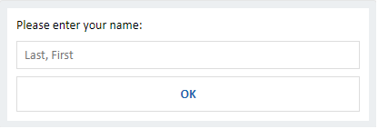

In that card, the label for the input is “Please enter your name:”, however the card renderer has no way to determine that this is the case. We’ve run into a few cases where this is an issue:
 - Accessibility: The input will be read by screen readers as “Last, First”, rather than “Please enter your name” making it more difficult for screen reader users to use the card. 

 - Validation indicators: We have considered allowing card authors to mark inputs as optional or required. One way to indicate that visually would be to put and indicator next to the input’s label. This requires knowing which text is the label.

 - Interaction model. Many forms move focus to the input when the label is clicked/tapped on. We can’t support that behavior without knowing which label goes with which input.

 - Responsiveness: One direction for the future of cards involves re-flowing the layout of a card based on the size of the display. Knowing that a particular label goes with a particular input may help us ensure that semantically related elements stay together on reflow.

 ## Comparisons
For guidance, consider how labels and inputs are associated in XAML and HTML:

### XAML
#### Header
 Xaml TextBox has a “header” property, which is drawn above the text box. Clicking on the header puts focus in the TextBox. Narrator reads the header when the TextBox is selected.
Here is an example:

 ``` xml
 <TextBox Header="This is a header"/>
 ```

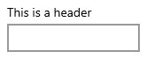


Or with a formatted header:
``` xml
<TextBox>
	<TextBox.Header>
    	<TextBlock  Text="Header" Foreground="red"></TextBlock>
	</TextBox.Header>
</TextBox>
```
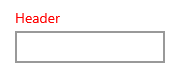

Other control types such as Images can also be used as TextBox labels.

#### AutomationProperties
 Xaml also has an AutomationProperties.LabeledBy attached property for accessibility purposes. This property is used by all elements (not just inputs). If you use it to mark a proceeding text block as the label, it is read the same as a header by narrator, but does not have the click to select behavior of header. 

 ```xml
<TextBlock x:Name="inputLabel">This is a text block label</TextBlock>
<TextBox AutomationProperties.LabeledBy="{Binding ElementName=inputLabel}"/> 
```
 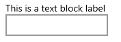

### HTML
#### Label
HTML has label tag which can be used to label inputs. The input can either be placed inside the label, or referenced with “for”:

``` HTML
  <label>
  Please enter your name:
  <input id="nameInput">
  </label>
```

Or
``` HTML
  <label for="nameInput"> Please enter your name:</label>
  <input id="nameInput">
```
 
This results in the label being associated with the input both for interactivity and accessibility.

#### Aria
 HTML also has aria-label and aria-labelledby. These properties are used for accessibility purposes. As in the Xaml AutomationProperties.LabeledBy property, this labels the input for accessibility purposes, but does not change the interactivity model: clicking on the label does not select the input.

## Adaptive Card Schema Options for Semantic Labels
Below are two possible options for schemas associating labels and inputs. I believe option 1 is the better option, although option 2 allows the additional scenario of having a label separate from the input.

### Option 1 – Label property on inputs

One option would be to make the label text a property of the input itself. This is analogous to the XAML header property discussed above.

``` json
{
	"type": "AdaptiveCard",
	"version": "1.0",
	"body": [
		{
			"type": "Input.Text",
			"id": "nameInput",
			"label": "Please enter your name:",
			"placeholder": "Last, First"
		}
	],
	"actions": [
		{
			"type": "Action.Submit",
			"title": "OK"
		}
	]
}
```
This has the benefit of being simple and concise, but doesn’t immediately allow for formatting on the input label. A solution to that would be to add support for TextBlock and/or RichTextBlock labels to add formatting support. This is similar to the approach in Xaml:

```json
{
	"type": "Input.Text",
	"id": "nameInput",
	"label": 
	{
		"type": "TextBlock",
		"text": "Please enter your name:",
		"weight": "Bolder",
		"color": "Good"
	},
	"placeholder": "Last, First"
}
```

We should also consider which item types are valid as labels. Probably just TextBlock and RichTextBlock make sense, but as Xaml supports other types we should consider whether we want to as well.

#### Backwards Compatibility
One down side of this approach is that on earlier versions of renderers the label would be completely dropped, leading to a bad user experience. The card may be completely unusable if without the labels the user cannot deduce what information is meant to be provided in the unlabeled inputs.

Because the label is a property, not a new type, card authors would not be able to use type to trigger fallback to an independent text block and input. To support this, the card author would need to use requires as follows:

```json
{
	"type": "Input.Text",
	"id": "NameId",
	"label": "Please enter your name",
	"requires": {
		"adaptiveCards": "1.3"
	},
	"fallback": {
		"type": "Container",
		"items": [
			{
				"type": "TextBlock",
				"text": "Please enter your name:"
			},
			{
				"type": "Input.Text",
				"id": "NameId"
			}
		]
    }
}
```
We could also possibly add a specific named feature to the requires dictionary to allow card authors to address it directly using something like:
```json
"requires": {
	"inputLabels": "1.0"
}
```
Either of these approaches would allow card authors who know their cards will be hitting platforms targeting both 1.2 and 1.3 to take advantage of the labels for accessibility or interactivity purposes in 1.3 without breaking their experience on 1.2 clients. That said, needing to add fallback to the card defeats the conciseness benefits of this approach, and will not help card authors who are targeting 1.0 or 1.1 hosts. Card authors who know their hosts support version 1.3 (or any future version) will not need to worry about this concern.

### Option 2 – LabelFor Property on TextBlocks/RichTextBlocks
An alternative option would be to have labels as separate text elements, but provide an id that links the inputs to the labels:
``` json
{
	"type": "AdaptiveCard",
	"version": "1.0",
	"body": [
		{
			"type": "TextBlock",
			"text": "Please enter your name:",
			"labelFor": "nameInput"
		},
		{
			"type": "Input.Text",
			"id": "nameInput",
			"placeholder": "Last, First"
		}
	],
	"actions": [
		{
			"type": "Action.Submit",
			"title": "OK"
		}
	]
}
``` 
#### Non-adjacent labels
Like HTML “label for”, this approach doesn’t require the label to be near the input it labels. In most cases, it seems likely that this is not something we want or need to support, and may in fact be confusing to users. However, we should consider if there are valid scenarios for this use case. Possible scenarios that I could come up with include:

##### Labels to the left of the input

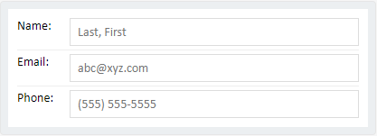

I built this card using a series of column sets. Although it is an acceptable UI, this is probably not the approach we want for card authors to label their inputs on the side. The card authoring is fairly non-intuitive to get a good result. If we want to support labels to the left of the input, we should probably do this as a first-class explicit property (```"labelPosition"``` or ```"allowHorizontalLabels"```). 

##### Additional content between the label and the input
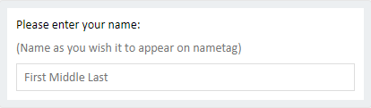

This scenario could be covered by a RichTextBlock that contains both pieces of text being used as the label (arguably the entire text should be read as the accessibility label for the input). Are there scenarios where we would want something else (an image?) between the label and the input?

#### Usability/Adoption
Since the benefits of associating the label and text are somewhat subtle, adoption may be an issue with Option 2. Option 1 has the benefit of being concise and simple for the card author and therefore more likely to be used. If an author wants a simple text label on their input, they can use the label property more easily than generating a separate text box. This would make it more likely that they do so, and therefore get the benefits of accessibility, better interaction model, and possible future responsiveness features even if they themselves don’t consider those issues.

#### Backwards Compatibility
One benefit of this approach is that there is no negative impact on down-level platforms. Because the TextBlock will still exist, only the association will be dropped when rendered on a platform that doesn't support this feature.

### Option 3 – LabeledInput type

A third option would be to introduce a new type that encapsulates both the label and the input.

```json
{
	"type": "LabeledInput",
	"label": "Please enter your name:",
	"input": {
		"type": "Input.Text",
		"id": "NameInput",
		"placeholder": "Last, First"
	}
}
```

This approach is similar to Option 1. As in Option 1, the label could be a string, a TextBlock, or a RichTextBlock. The behavior is also similar in that the label and the input are part of the same object and will therefore be adjacent. It's slightly more verbose than Option 1 as the input becomes a sub-object rather than the input properties being peers of the label.

One benefit of this approach over Option 1 is a slightly more straightforward fallback story (see the "Backwards Compatibility" section below).

#### Backwards Compatibility
If this is sent to a pre 1.3 renderer, the entire element will be dropped (both label and input). Depending on the card, this may make the card non-functional for it's purpose. 

Similarly to option 1, a card author could use fallback to address this if they knew their card was targeting 1.2 and 1.3. The fallback is slightly simpler than option 1 as the `requires` property is not needed to indicate when to fallback. The absence of the LabeledInput type on 1.2 would trigger fallback automatically. As in option 1, because fallback is not supported in 1.0 and 1.1 the LabeledInput would still be dropped on those versions.

```json
{
	"type": "LabeledInput",
	"label": "Please enter your name:",
	"input": {
		"type": "Input.Text",
		"id": "NameInput"
	}
	"fallback": {
		"type": "Container",
		"items": [
			{
				"type": "TextBlock",
				"text": "Please enter your name:"
			},
			{
				"type": "Input.Text",
				"id": "NameId"
			}
		]
	}
}
```
## Placeholders
Our primary input scenario card uses placeholders to label the inputs. With either of the approached above, how do we support scenarios where the desired behavior is for the inputs to be labeled by their placeholder text?

``` json
{
	"type": "AdaptiveCard",
	"version": "1.0",
	"body": [
		{
			"type": "Input.Text",
			"placeholder": "Name",
			"style": "text",
			"id": "SimpleVal"
		},
		{
			"type": "Input.Text",
			"placeholder": "Homepage",
			"style": "Url",
			"id": "UrlVal"
		},
		{
			"type": "Input.Text",
			"placeholder": "Email",
			"style": "Email",
			"id": "EmailVal"
		}
	],
	"actions": [
		{
			"type": "Action.Submit",
			"title": "Submit"
		}
	]
}
```

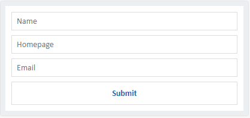

Possible Options:
1. Card author can determine if the label should be put in the placeholder text (`"useLabelAsPlaceholder": true`, `"labelPosition": "Placeholder"`)
    - What do we do if they set a non-label placeholder and set useLabelAsPlaceholder to true? (spec who wins - placeholder probably)
2. Host decides via host-config (`"labelPosition": "Placeholder"`).
    - Same issue as above if an explicit placeholder is set by the card author. On option would be to only respect this if no inputs have placeholders (precedent from button icon placement). 
3. Do nothing (in the schema)
    - Card author can set placeholder instead of label if they want a placeholder to be the label. Undercuts our ability to reason over the card (we don’t know if the placeholder text is being used as the input’s label) but I’m not sure that has any practical negative consequences:
        - Placeholder will serve as accessibility name in the absence of a label
        - Are there responsiveness scenarios where we’d want to pull the label out of the placeholder to expand the card? (I’d guess not?)
        - We don’t have a good place to put the “(optional)” indicator in this scenario. That said, the same will be true of any input that doesn’t use the features spec’d in this document to associate the labels.

4. Use labels as placeholders only as part of a future responsiveness feature. If we're condensing the space of the card, and there are no placeholders, consolidating labels into placeholders would be one way to adapt to limited space. This could be combined with 1, 2, or 3.

As there doesn't seem to be a strong reason to do so, for now, we will not make any changes to allow card authors to indicate that their placeholders are actually labels.

## Label Position
As alluded to above, we should consider how the label position is determined. One of the goals of this feature is to allow us to someday intelligently reflow inputs, so it may be the case that we want to maintain control of label positioning. Today we would always draw the label above the input, but in the future we may put it to the side if our rendering space is wide enough, or push it into placeholders if our space is constrained.

That said, it may be desirable let either the card author or the host configure the position of the label. The tradeoff is more layout power to the card author, and less flexibility to us to reflow in the future. Because of this, we will not introduce this with v1 of this feature, and consider it only if we get customer feedback or requests to allow positioning of labels.

```json
{
	"type": "Input.Text",
	"id": "nameInput",
	"label": "Please enter your name:",
	"labelPosition": "Above",
	"placeholder": "Last, First"
}
```
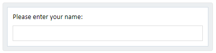

```json
{
	"type": "Input.Text",
	"id": "nameInput",
	"label": "Please enter your name:",
	"labelPosition": "Side",
	"placeholder": "Last, First"
}
```


```json
{
	"type": "Input.Text",
	"id": "nameInput",
	"label": "Please enter your name",
	"labelPosition": "Placeholder",
	"placeholder": "Last, First"
}
```
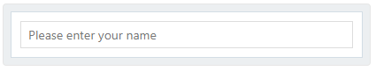

## Other Input Types

This document has primarily focused on `Input.Text` in it's examples, but the label property should be present on all input types. See examples below:

### Date Input

``` json
{
	"type": "Input.Date",
	"id": "dateInput",
	"label": "Please enter the date:"
}
```
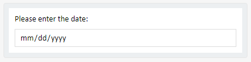

### Time Input

``` json
{
	"type": "Input.Time",
	"id": "timeInput",
	"label": "Please enter the time:"
}
```
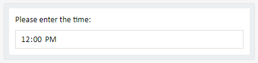

### Number Input
``` json
{
	"type": "Input.Number",
	"id": "numberInput",
	"label": "How many would you like?"
}
```
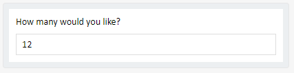

### Choice Set

#### Expanded

```json
{
	"type": "Input.ChoiceSet",
	"label": "Please select from the following options:"
	"choices": [
		{
			"title": "Choice 1",
			"value": "Choice 1"
		},
		{
			"title": "Choice 2",
			"value": "Choice 2"
		}
	],
	"style": "expanded"
}
```
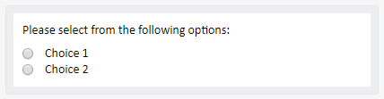

#### Compact
```json
{
	"type": "Input.ChoiceSet",
	"label": "Please select from the following options:"
	"choices": [
		{
			"title": "Choice 1",
			"value": "Choice 1"
		},
		{
			"title": "Choice 2",
			"value": "Choice 2"
		}
	],
	"style": "compact"
}
```
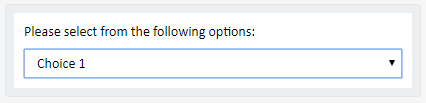

### Toggle Inputs

```json
{
	"type": "Input.Toggle",
	"label": "Please accept the privacy policy:",
	"title": "I have reviewed and accept the terms of the privacy policy"
}
```
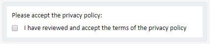

## Accessibility Labels
Both Xaml and HTML have accessibility labels which can be used to address accessibility issues related to inputs (AutomationProperties and aria- properties respectively). In both cases, setting these properties addresses accessibility issues, but does not semantically associate the label with the input for interactivity behavior. Additionally, these properties are not input specific, and can be used on other elements as well as inputs. We should consider whether we want generic accessibility labels such as these, but such a feature should apply to all elements and is outside the scope of this document.
