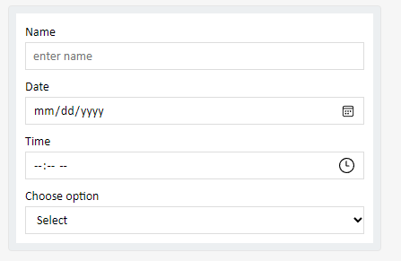

# Input Reveal On Hover

## Overview

Adaptive cards are used by apps to share information as well as to collect input from users to complete user scenarios.
As of now, if we are showing some information in a card and if we also want to collect user’s input, we will have a bunch of Input fields hidden behind a ShowCard button or we will launch some form using button click on the card to collect user's input.
In both cases we might have duplicate readable fields and input fields.

We want to provide better experience to the user where he can read the fields and can also seamlessly update the values at the same place. 

UI of showing data and taking user input will become simplistic. 

 
## Current experience:

As shown in the below picture, An adaptive card displays data for Customer name, Est. Revenue and Est. Close Date. If user wants to update those information, he will have to click on 'Edit' button which will open some form and there he can update values for 'Est. Revenue' etc. and Click on Save to send data back to the bot service.


As of now, Adaptive cards support `Input` fields to collect user input. This is how current user experience of `Input` fields looks like. 

 

## Proposed experience:

We will allow bot developer to enhance the user experience of all `Input` fields in Adaptive card (such as `Input.Text`, `Input.Number`, `Input.Date`, `Input.Time`, `Input.Toggle` and `Input.Choiceset`). These input fields can appear just as readable fields when the user is not taking any action, and when the user clicks or focusses on them, it allows the user to update those fields. The user can then use action buttons like Action.Submit/Action.Execute present on the card to send data back to the bot.

This is the proposed flow for user:-
1. This is an adaptive showing information like "Contact", "Email", "Est. Closing date" etc. with new style where input fields are displayed as **readable fields** in the **default** state i.e. without borders and input adorners (date/time pickers etc)


2. When user hovers anywhere on the card,
	* we will show a lighter color outline to all the input fields and we will also reveal input adorners like date picker in case of Input.Date
	
	This is reveal the inputs as editable fields with borders and input adorners. It will guide the user to go and update the field.
	


3. When user hovers over the input field, we will show a distinct visual cue over the input field to guide user that the field is activated and he can now edit the field.


4. User can go and edit the field.


5. When the user has updated the input field, Action.Submit or Action.Execute button such as "Save" which has `disabledUnlessAssociatedInputsChange` property (https://github.com/microsoft/AdaptiveCards/issues/7103) will get enabled automatically. It will guide user to hit the button to commit the changes made on the card.


6. When the user clicks on the Action.Submit or Action.Execute button, latest input values will be sent to the bot from host and bot can then update the card with latest information which we will show in default state.


## New Capabilites in the card
In order to achieve new experience as mentioned above, we will add these capabilities in the card for developers and host:

## New Schema Changes in Adaptive Card
1. Introduce an optional styling property `inputStyle` in AC input fields schema for developer to choose between existing input fields styling i.e.`default` vs new styling i.e.`revealOnHover`.

* **InputStyle: Default view:**

 

* **InputStyle: RevealOnHover View:**


## Use Case Clarifications:
1. If `value` is `empty` in the input field, we will show label and placeholder text in lighter color like this in the [default] state,


which user can go and update the value.


2. If `label` is `empty`, we will just show `value` field in readable format in the default state which user can go and update the value.


## Developer Recommendation:

1. **Save Button:** Our recommendation is to have a `Save` button (Action.Submit or Action.Execute) with `disabledUnlessAssociatedInputsChange` on the card containing inputs fields with `revealOnHover` style. Save button will send the modified user input values to the bot, and the bot will respond with a card with updated input values.

2. **Cancel Button:** Our recommendation is to have a `Cancel` button (Action.Submit or Action.Execute) on the card containing inputs fields with `revealOnHover` style. If user has made some changes in the input fields but want to revert back to original state, they can click on "Cancel" button. "Cancel" button will send the card with last saved input values.
## Out of Scope:

1. Inline Action in Input.text: We will not support `revealOnHover` style for input text containing inline action. It will be shown as default input style only. Reason being, such sceanrios are reply with a comment or adding a message where user collaboration is not needed.


## Mobile Experience:
In Mobile, input fields with `revealOnHover` input style will behave just as current input fields experience meaning there will not be any effect of `revealOnHover` input style. This is so beacuse there is no hover on mobile and user should immediately see what fields are editable when card appears i.e., input fields will still appear with borders and input adorners (date/time picker etc) when user first sees the card.

## Proposed Schema Changes:

 1. Inherited properties of all Input fields will have one more property called `inputStyle` whose type will be `InputStyle`

| Property | Type | Required | Description | Version |
| -------- | ---- | -------- | ----------- | ------- |
| **inputStyle** | `InputStyle?` | No | style hint for Input fields | 1.6 |


### inputStyle

Style hint for input fields.

* **Type**: `InputStyle`
* **Required**: No
* **Allowed values**:
  * `"revealOnHover"` : Should show input fields as read only view unless user hovers on the card.
  * `"default"` : Should show the existing view for input controls.

Since this property is inherited to all Input fields, it will be supported by all:

* `Input.Text`
* `Input.Number`
* `Input.Date`
* `Input.Time`
* `Input.Toggle`
* `Input.Choiceset`

### Sample Payload:

```json
     {
          "type": "Input.Text",
          "label": "Name",
          "value": "Sneh",
          "inputStyle" : "revealOnHover"
      },
      {
          "type": "Input.Date",
          "label": "Date of Arrival",
          "inputStyle" : "default"
      },
      {
          "type": "Input.Time",
          "label": "Time of Arrival",
          "value": "09:30",
          "inputStyle" : "revealOnHover"
      },
      {
          "type": "Input.Number",
          "label": "Number of Guest",
          "value": 5,
          "inputStyle" : "revealOnHover"
      }	
```
