# Input Validation

Input validation was originally spec'd in issue [#3081](https://github.com/microsoft/AdaptiveCards/issues/3081). This document covers the basics from that spec, and continues the discussion of additional concerns that it raised.

## Schema Additions to Inputs for Validation

``` json
{
    "type": "Input.Text",
    "id": "username",
    "isRequired": true,
    "regex": "^\\w{5,50}$",
    "errorMessage": "Username must be between 5 and 50 characters long."
}
```
The main additions to the schema for input validation are the `"isRequired"`, `"regex"`, and `"errorMessage"` properties on inputs. These properties allow a card author to specify whether or not an input is required, what regular expression defines valid input, and what error message should be shown in case of invalid user input.

Although `regex` would only be supported on `Input.Text`, the `isRequired` and `errorMessage` properties would be supported on all `Input.*` types.

## Schema Additions to Adaptive Card for Validation

In order to allow the card author to visually indicate whether inputs in a card are required or optional, we will add a new property, `showRequiredInputHints`. When this is true, visual indicators will be added to required inputs inputs to signal to the user that they are required. This property will default to true.

```json
{
	"type": "AdaptiveCard",
	"version": "1.3",
	"showRequiredInputHints":true,
	"body": [
		{
			"type": "TextBlock",
			"text": "Please enter your name:"
		},
		{
			"type": "Input.Text",
			"id": "nameInput",
			"isRequired": true
		}
	],
	"$schema": "http://adaptivecards.io/schemas/adaptive-card.json"
}
```

> Note: We may also want to add a `showOptionalInputHints` to allow card authors to instead (or additionally) mark optional inputs visually. Because the most likely design for this would be to use the word "optional," and because that would require an all up localization story we don't yet have, this is out of scope for v1 of this feature.

## Validation Rendering

If showRequiredInputHints is true, Required inputs should be marked with a *. In cases where a label has been specified ([Issue #203](https://github.com/microsoft/AdaptiveCards/issues/203)), the required indicator should be placed next to the input's label.

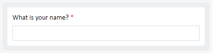

The error text and invalid indication will be rendered in the host's `attention` color.

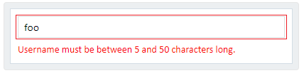

### Host side  styling

As has been proposed, the error message is a string property which is rendered in the `attention` color, card hosts may need more control over how this messages and the visual representation of an error appear. As can be seen in the captures below, there's a wide array on how error messages are represented (the captures were taken from )

| Platform | Sample | 
| --- | --- |
| Microsoft Forms | 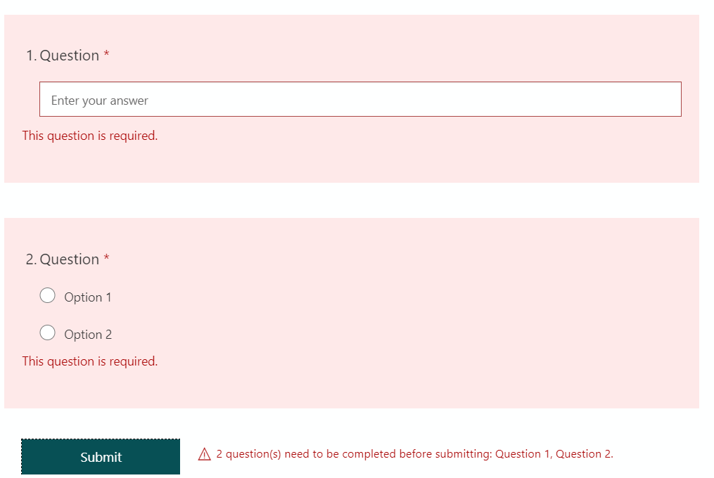 | 
| Outlook | 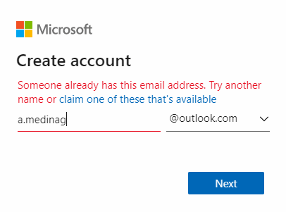 | 
| Facebook |  |
| GMail | 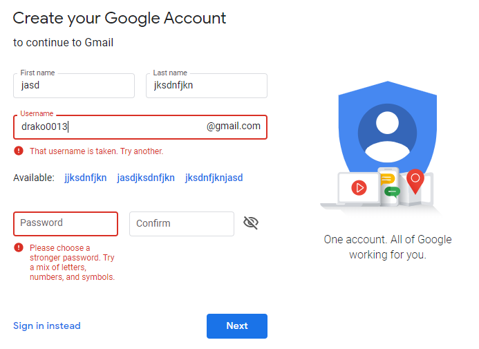 |
| Twitter | 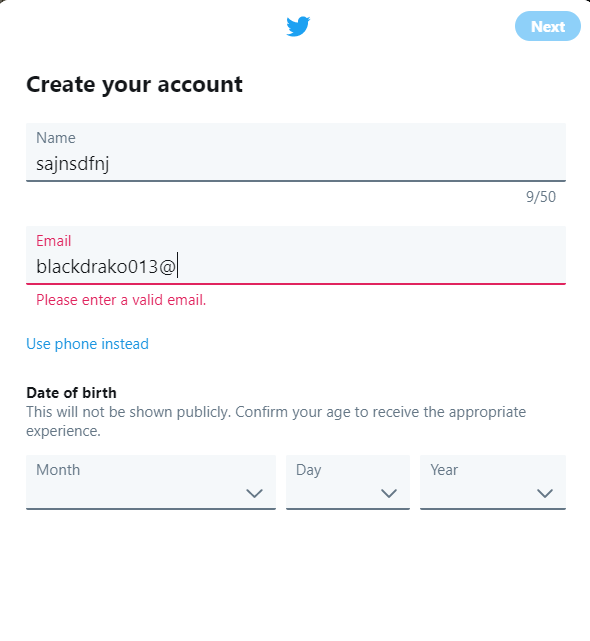 |
| Survey Monkey | 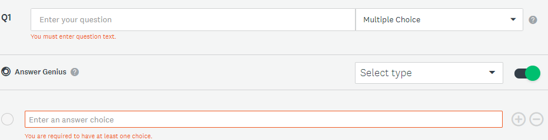 |
| Survey Monkey | 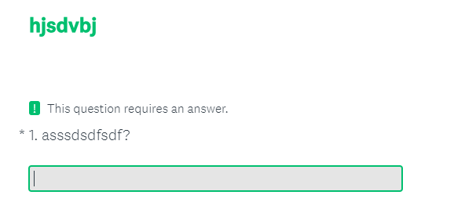 |

The table below details the proposed set of properties that host apps will be able to modify based on the pictures above as well as if they are going to be modified through the host config or the native styling in each platform. 

| Property | HostConfig | Native Styling |
| --- | ---- | --- |
| color (hex value) | X | X |
| textSize | X | X |
| weight | X | X |
| backgroundColor | X | X |
| spacing | X | | 
| borderColor | X | |
| borderWidth | X |  | 
| errorMessagePosition | X (aboveInput, belowInput) | |

Finally, the proposed name for the native style to override for labels would be ```Adaptive.ErrorMessage```.

> Question: The table is just representative, I couldn't find more options to modify in the forms that I investigated. Also, no samples are presented to produce them once we get a clearer picture of the styling options to be allowed

## Input Validation Behavior

### When to Validate

Issue [#3081](https://github.com/microsoft/AdaptiveCards/issues/3081) covers research and best practices behind when to validate. The conclusion reached there is as follows:
 - Validate the input when it loses focus for the first time.
 - Once the field has been marked invalid, validate on each keystroke so the user can see when it becomes valid.

 This is also consistent with the behavior recently adopted by WinUI 3.0 for their input validation feature.

> Conclusion on when to validate 
>
> After the first spec review, the conclussion reached is to give the card host the option to define the moment when the validation occurs giving them three choices:
> - Validate the input when it loses focus for the first time and each keystroke after it
> - Validate the input when it loses focus for the first time and something has been typed in it
> - Validate the input when an action has been clicked
> 
> It is important to note that all types of the previously defined behaviours will also occur when an action is clicked.
>
> The schema change for host config would be adding the property ```validationBehavior``` under ```inputs``` configuration as can be seen below:
>
> ```json
> “inputs”:{
>    // One of
>    “validationBehavior”: “onFocusLost”,
>    “validationBehavior”: “onFocusLostWithInput”,
>    “validationBehavior”: “onSubmit”
> }
> ```  
>
> Question: What should happen for Choice Sets?
>
> ### Validation for ChoiceSet and Toggle Inputs
>
> When we think of validation our first thought may go towards text inputs, but we also support ChoiceSet and Toggle elements. The currently proposed validation behavior should be almost the same as text input based validation but considering that usually interaction with this types of elements is not done using a keyboard.
>
> 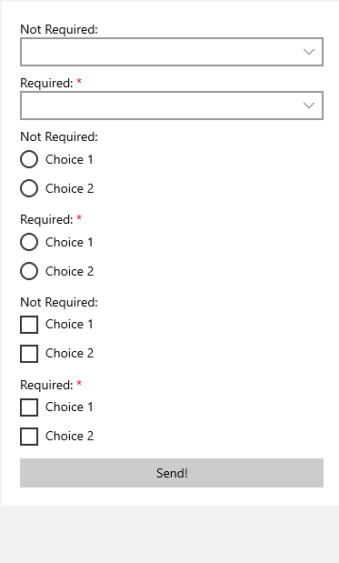
> 

### Which Input Properties to Validate

For this feature we are adding the `isRequired` property to all inputs and the `regex` property to Input.Text. These properties should be validated using the validation methods described in this document.

In addition to these new properties, there are several existing properties that indicate valid values for an input. Currently, these existing properties are enforced on some platforms whose UI controls allow them to be enforced natively in the UI. For example `Input.Date` has `min` and `max` properties. Ideally, this is implemented as a calendar picker in which dates outside the supported range are greyed out. Currently, however, only some platforms support this behavior due to the presence or absence of a native control with that functionality.

With the advent of this input validation feature, those platforms which do not support these properties should use the input validation behavior described in this spec to add support. Enforcing them natively in the UI by preventing the user from picking an invalid value is still preferred, but when that is not feasible, input validation should be used in these cases. Considering this, the full list of properties that should be either enforced or validated are:

|Input|Properties||
|---|---|---
|Input.Text|regex <br> maxLength|New for this feature <br> ExistingProperty
|Input.Number|min, max|Existing Properties
|Input.Date|min, max|Existing Properties
|Input.Time|min, max|Existing Properties
|**All inputs** |isRequired |New for this feature

> Question: Should Input.Number also validate for integer or floating point numbers? No request was made in the survey, should we leave it out of this version spec?

### Which Inputs to Validate
The primary purpose of client side input validation is to validate a users inputs before they submit them. In this case, the card author would want us to validate all inputs before they are submitted:

``` json
{
    "type": "AdaptiveCard",
    "version": "1.3",
    "body": [
        {
            "type": "TextBlock",
            "text": "First Name:"
        },
        {
            "type": "Input.Text",
            "id": "firstName",
            "isRequired": true
        },
        {
            "type": "TextBlock",
            "text": "Last Name:"
        },
        {
            "type": "Input.Text",
            "id": "lastName",
            "isRequired": true
        }
    ],
    "actions": [
        {
            "type": "Action.Submit",
            "title": "Submit"
        }
    ]
}
```


The story becomes more complicated, however, with more complicated cards. Should we validate cards hidden behind collapsed show cards or toggles? Should we validate on action types other than submit? If a hidden element is blocking submit of a form, the user will not be able to see the errors or requirements that are causing their form not to submit. This is not a great user experience. Consider the following options for addressing it:
 
#### Validating all fields
If we validate all fields in the card, that means that there can be scenarios where validation fails on inputs that are not currently on the screen. If a required input is hidden behind a toggle or a show card, the user could be confused as to why they are unable to submit. Additionally, depending on the card design, the card author's intent may not be to validate all fields. In our food order scenario card, for example, clearly only the input fields on the current sub card are relevant to the submit. The card author may want the answer to "How would you like your steak prepared?" to be required for users ordering steak, but not for users ordering chicken.

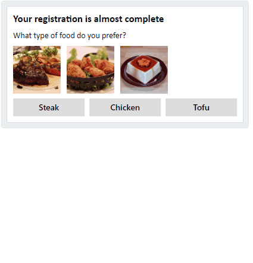

#### Only validate visible fields

One option would be to only validate fields that are currently visible. This introduces a number of concerns. The first is that currently we send all inputs (visible or not) on a submit action. This means that given the current behavior we would be sending potentially non-validated inputs back to the card author. With client side input validation, the code these are ultimately sent to may expect that they've already been validated. Not validating them would break that expectation.

If we decide not to even *send* the hidden (and therefore not-validated) inputs, this would be a breaking change as today we send *all* inputs on submit.

Finally, as the visibility of an input is ultimately determined by the user, we don't want hiding the input to bypass validation. In the below scenario, closing the personalization card should not allow you to use special characters (nor should it imply you no longer want it personalized).

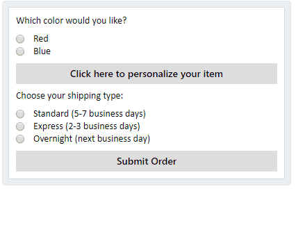

#### Making hidden element visible on submit
In the above card, showing the collapsed show card at submit would allow us to show the user the errors that are blocking submit. While this may work well in some simple ShowCard cases such as the this one, there are a number of pitfalls. A card that makes use of toggle visibility may have non-trivial logic governing what is shown and what is not shown at any time. Consider the following card built using toggle visibility:


If there was a validation error on the first "page", bringing the hidden element back into focus on submit would result in one of the following, depending on whether we brought back the entire hidden element or just the invalid input. In either case, this is not the expected behavior of this card author, and the subsequent behavior if the toggle buttons are pressed again would not be well defined:

Bring back non-visible card element            |  Bring back single input
:-------------------------:|:-------------------------:
  |  

Additionally, per the below discussion, if we disable the submit button when validation fails, we won't event have an appropriate time at which to change the visibility.

> Note on this card: This "Wizard" scenario is implemented here via toggle visibility. We should consider whether we want to support a first class wizard experience where a new element type could list a series of subcards to display in order. Whether or not we ever introduce such a concept, the point remains that toggle logic may be complex, and we shouldn't be arbitrarily toggling things visible outside the scope of what the card author has defined in their toggle buttons.

#### Current Card/Container

Considering the food order card above, one option in show card scenarios may be to validate the current show card, or the show card and any parent cards. This works well for the food order card, but doesn't help us with card scenarios that include toggles. It may also not be the correct behavior for a mid card action set containing a show card. While it would be nice if we could provide an algorithm that deduces which inputs should be validated, it would be tricky to create an algorithm that gracefully handles all cases. Additionally, the more complicated the algorithm, the harder it is for card authors to understand the expected behavior.

> #### Inline actions
>
> A special case for inputs and actions is the one presented in the inlineAction property for Text.Input elements. This property allows a card to render an action next to a Input.Text element, typically to its right, as can be seen below:    
>
> 
>
> The semantics of this property imply that this action is linked to the Input.Text element which would also imply that, by default, an inline action should always validate the Input.Text element it is part of. It is important to add that inline actions should also be allowed to define the list of associated inputs it will validate to provide more freedom.

#### Card Author Control

As the discussion above shows, depending on the card scenario, it may be difficult for us to determine which fields the card author wants to validate. Any of the above approaches may be correct for *some* cards, but none are appropriate for all cards. In order to address this, the best approach is to allow the card author to specify which inputs are associated with a given action. We will implement this via a new `inputs` property on Action types. The inputs listed will be the ones that are validated, and also the ones that are returned on Submit.

The first option available for inputs is "All." This will validate and submit all inputs on the card. This is the current behavior, and would be the default for submit actions.
```json
{
	"type": "Action.Submit",
	"title": "Submit",
	"inputs": "All",
}
```

The second option would be "None". This would be useful for, for example, a "Cancel" button where validation is not required, and would be the default for non-Submit (or Invoke action being discussed for Universal Actions) action types (see further discussion of validation for different action types below).
```json
{
	"type": "Action.Submit",
	"title": "Cancel",
	"inputs": "None",
}
```
For authors that need more granular control of which inputs to validate, we would also allow them to specify a list of inputs, such as the following:
```json
{
	"type": "Action.Submit",
	"title": "Cancel",
	"inputs": ["input1Id", "input2Id"] 
}
```
In order to allow authors to group their inputs, we could also accept container ids. This allows the card author to functionally define a "form" and indicate that the submit button relates to that form:
```json
{
	"type": "Action.Submit",
	"title": "Cancel",
	"inputs": ["input1Id", "input2Id", "formContainerId"] 
}
```

> Questions:
>
> - Do we want to support a "CurrentContainer" or "CurrentContainerAndParent" type option? I think no. Allowing authors to specify containers allows for this behavior, and introducing an option with possibly non-obvious logic in the edge cases may be more confusing than helpful to card authors.
>
> - Do we want a typed "Form" container? The design described above allows card authors to use containers as "forms" by specifying them as the inputs for a submit action. Is it helpful to have an explicit "FormContainer" type to use for this? There doesn't seem to be an explicit use for it today. One scenario may be if we have "Form" type properties in the future that would be useful to put on a typed element.
> - I called the property `"inputs"` rather than something validation specific (`validationInputs`?) because in the submit case it indicates not only the inputs that will be validated, but also those that will be submitted. Are there scenarios in which a submit button would need to validate a different set of inputs than those that it wants to send? I would think **no**, as sending un-validated inputs seems like it could cause problems. 


##### Defaulting to All
As discussed above, validating all fields can lead to issues if pieces of the validated UI are hidden from the user. That said, there are a few reasons **defaulting** to all seems like the right approach:

- In the simplest case, "All" is likely the correct choice. A card which is a simple form with a submit button on the bottom will likely want all validation to pass before submitting

- It is important that the submitted fields are the same as those that are validated. Sending inputs that have validation without enforcing that validation may lead to issues on the server side if the server has assumed that their specified client side validation is dependable. Today, we submit all inputs with each submit, and changing that would be a breaking change for existing cards. Using All as the default allows us to (a) not break the current submit all inputs behavior and (b) not send any un-validated inputs.

- We do validate on focus lost, so a user who has navigated to and away from an input will have seen the validation error, even if they subsequently hid it using a toggle or show card action. This means that in scenarios where the input is not required but has a regex or other validation (such as the personalization example above) the user will already be aware that their field has not validated correctly. The scenario where a **required** input is not shown may be confusing to a user, but one could make the case that it's questionable card design to hide required fields behind toggle or show card actions.

- Allowing the card author to explicitly specify inputs allows them to override this default behavior to configure the validation as appropriate for their scenario.

### Validation and Actions

#### Action Types
Although submit actions are the most obvious case for input validation, we will support validation on all action types. The `inputs` property will indicate which fields are validated.

##### Submit (and Invoke) Actions
Submit actions will default to `"inputs": "All"`. This means that all inputs on the card will be validated and sent with this submission. Card authors can adjust this default behavior by setting the `inputs` property to a different value as described above.

##### Toggle and ShowCard Actions
In many, or even most cases, it likely doesn't make sense to validate on show card or toggle actions if those actions are simply showing more details that don't need to appear on the main card. In some cases, however, either show card or toggle may be used to reveal the next step in a progression through the card experience. The wizard card above is a clear example of this. The card author may want to validate the first "page" before allowing the user to proceed to the second. Event the FoodOrder card can be viewed as an example of using show cards to progress through an interaction. If the upper portion of the card contained addition inputs, the card author may want to validate those fields before proceeding to ask additional questions about the users order. 

Because by default Toggles and ShowCards don't necessarily need to validate inputs, these actions will default to `"inputs": "None"`. We will, however, support the ability to set a different value to enforce validation of some or all of the inputs before allowing the user to take one of these actions.

> Question: Is it confusing to have an `inputs` property on a type that doesn't actually return those inputs (only validates them)? Would we want to add support for returning inputs on other action types? Is this an indication we need a different name?

##### OpenUrl
It seems unlikely that there are many scenarios to validate inputs on OpenUrl, so the default value for `inputs` will be false. For consistency, however, we will allow `inputs` to be set on OpenUrl actions.

#### Disabling Actions

Actions that depend on validation of the inputs should be greyed out until all related inputs have been validated. Because we are validating on focus lost, it would be possible for a user to navigate through a form using tab, resulting in all error messages and validation being shown. Clicking on a non-greyed out submit button at this time would not give any additional feedback, just silently fail to submit. To avoid this, we should grey out the submit button until such time as all inputs pass validation.

## Custom Rendering Error Messages
Comments in [#3081](https://github.com/microsoft/AdaptiveCards/issues/3081) from dclaux:
> showInputValidationErrors: this needs to be introduced as well as a way for a host to custom render these error messages. We've had a very long debate around this.

And andrewleader:
>showInputValidationErrors for renderers (via code) makes sense

> TODO: Follow up on specifying this behavior.

## Future and Out of Scope Features

### OptionalInputHints
Some forms have indicators designating certain fields as "optional". Explicit support for marking optional fields may be a useful addition in the future, but because of the localization requirements is out of scope for this version.

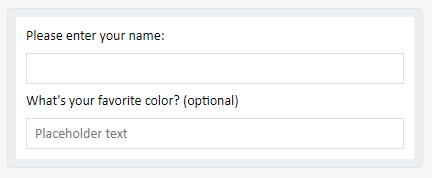

### Success Indicators
Some forms add an indicator to an input once a valid value has been added to give the user feedback that they've entered a valid value. For example, a password field that turns green once the password has reached sufficient complexity. This may be a useful feature for future versions, but is out of scope for v1.

### Cross field validation
There are many scenarios where validation that specifies relationships between fields could be useful. For example requiring a particular field only if another one is filled in, or requiring at least one (or exactly one) of several options is selected. More complicated scenarios, such as a choice in one input changing the available choices in another input, could also be useful.

While this is an area we should investigate in the future, supporting cross field validation is out of scope for v1 of this feature.