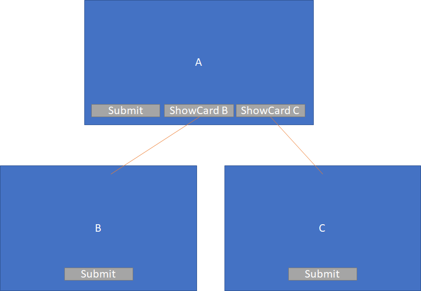
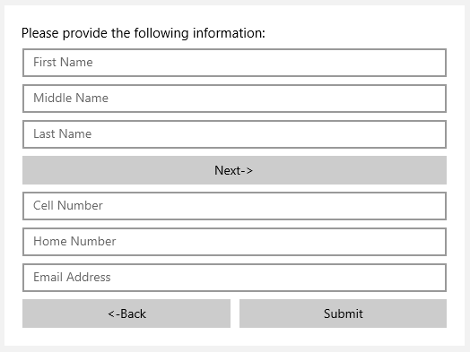
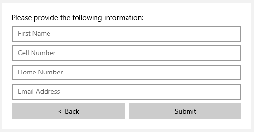
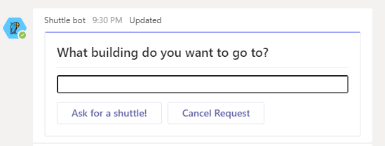

# Table of Contents
1. [Input Validation](#Input-Validation)
    1. [Schema Additions to Inputs for Validation](#Schema-Additions-to-Inputs-for-Validation)
    2. [Validation Rendering](#Validation-Rendering)
        1. [Required and Optional indicators](#Required-and-Optional-indicators)
        2. [Invalid inputs and error messages](#Invalid-inputs-and-error-messages)
        2. [Native Styling](#Native-Styling)
    3. [Input Validation Behavior](#Input-Validation-Behavior)
        1. [When to Validate](#When-to-Validate)
        2. [Which Input Properties to Validate](#Which-Input-Properties-to-Validate)
        3. [Which Inputs to Validate](#Which-Inputs-to-Validate)
    4. [Validation for ChoiceSet and Toggle Inputs](#Validation-for-ChoiceSet-and-Toggle-Inputs)
    5. [Backwards Compatibility](#Backwards-Compatibility)
    6. [Accessibility](#Accessibility)
        1. [No Keyboard Trap](#2.1.2-No-Keyboard-Trap)
        2. [Error Identification](#3.3.1-Error-Identification)
        3. [Error Suggestion](#3.3.3-Error-Suggestion)
        4. [Error Prevention](#3.3.6-Error-Prevention)
    7. [Feature Cost estimation](#Feature-Cost-estimation)
    8. [Requirements Priorities](#Requirements-Priorities)
2. [Annex](#Annex)
    1. [Work for future iterations](#Work-for-future-iterations)
        1. [Validating on focus lost and host configuration](#Validating-on-focus-lost-and-host-configuration)
        2. [Further Native Styling Support](#Further-Native-Styling-Support)
            1. [UWP (XAML)](#UWP-(XAML))
            2. [JavaScript (HTML + CSS)](#JavaScript-(HTML-+-CSS))
        3. [Further discussion of which inputs to validate](#Further-discussion-of-which-inputs-to-validate)
            1. [Only validate visible fields](#Only-validate-visible-fields)
            2. [Making hidden element visible on submit](#Making-hidden-element-visible-on-submit)
            3. [Card Author Control](#Card-Author-Control)
                1. [Action Types](#Action-Types)
                    1. [Toggle and ShowCard Actions](#Toggle-and-ShowCard-Actions)
                    2. [OpenUrl](#OpenUrl)
                2. [Grouping inputs](#Grouping-inputs)
                3. [Hurdles with input-action association](#Hurdles-with-input-action-association)
                    1. [Card author experience](#Card-author-experience) 
                    1. [Validating on focus lost](#Validating-on-focus-lost)
        4. [Success Indicators](#Success-Indicators)
        5. [Cross field validation](#Cross-field-validation)
        6. [Custom Rendering Error Messages](#Custom-Rendering-Error-Messages)
    2. [Examples of invalid inputs](#Examples-of-invalid-inputs)

# Input Validation

This document covers feature changes to add Input Validation support to adaptive cards. Discussions and considerations that lead to this spec, including possible future areas of work, are covered in more detail in the [Annex](#Annex).

## Schema Additions to Inputs for Validation

``` json
{
    "type": "Input.Text",
    "id": "username",
    "isRequired": true,
    "regex": "^\\w{5,50}$",
    "errorMessage": "Username must be between 5 and 50 characters long."
}
```
All `Input.*` types will have the `"isRequired"`, and `"errorMessage"` properties added to them. These properties allow a card author to specify whether or not an input is required, and what error message should be shown in case of invalid user input.

Additionally, a `regex` property will be added to `Input.Text` to allow card authors to specify what regular expression defines valid input,

## Validation Rendering

### Required and Optional indicators
By default, the label of required inputs should be marked with a * suffix. This suffix is configurable in the host config. Further discussion of label formatting can be found in [InputLabels.md](https://github.com/microsoft/AdaptiveCards/blob/master/specs/DesignDiscussions/InputLabels.md), tracked by [Issue #203](https://github.com/microsoft/AdaptiveCards/issues/203).

> Question: Do required/optional indicators appear on inputs without labels?


### Invalid inputs and error messages

When an input is vaidated and an error is found, the error text and invalid indication will be rendered in the host's `attention` color.


Host control of error rendering will be provide via the following HostConfig properties:

| Property | Default value | Description |
| --- | ---- | --- |
| `size` | `default` | Size of the error message text |
| `weight` | `default` | Text weight of the error message text 
| `spacing` | `default` | Spacing between the input and the error message |

```json
"inputs": 
{
    "errorMessage": 
    {
        "spacing": "small",
        "size": "small",
        "weight": "lighter"
    }
}
```

The [Annex](#Examples-of-invalid-inputs) contains examples of a wide array of error messages rendered on different websites. In future versions of the renderer the set of properties to be configurable using host config may increase.

### Native Styling

No changes are being made to native styling support for this feature. The existing native styling support allows styling of input elements, but no new support is being added to handle error or validation scenarios. For discussion of possible future support, see the [Annex](#Further-Native-Styling-Support).

## Input Validation Behavior

### When to Validate

For v1 of this feature, we will validate all inputs only when the user presses any submit button on the card.

>Question: Do we re-validate on each key-stroke once validation has been performed the first time, and if so do we continue to validate after on keystroke once it's been corrected?([#4231](https://github.com/microsoft/AdaptiveCards/issues/4231))

This behavior was decided on after discussion with MVPs. The [Annex](#Validating-on-focus-lost-and-host-configuration) discusses different approaches to when to validate, particularly the benefits of validating when the input loses focus for the first time, and possible future support of host configuration of this behavior.

### Which Input Properties to Validate

For this feature we are adding the `isRequired` property to all inputs and the `regex` property to Input.Text. These properties should be validated using the validation methods described in this document.

In addition to these new properties, there are several existing properties that indicate valid values for an input. Currently, these existing properties are enforced on some platforms whose UI controls allow them to be enforced natively in the UI. For example `Input.Date` has `min` and `max` properties. Ideally, this is implemented as a calendar picker in which dates outside the supported range are greyed out. Currently, however, only some platforms support this behavior due to the presence or absence of a native control with that functionality.

With the advent of this input validation feature, those platforms which do not support these properties should use the input validation behavior described in this spec to add support. Enforcing them natively in the UI by preventing the user from picking an invalid value is still preferred, but when that is not feasible, input validation should be used in these cases. Considering this, the full list of properties that should be either enforced by the control or validated by input validation is below (new properties in **bold**):

| Input | Property | Success condition |
| --- | --- | --- |
| `Input.Text` | **`regex`** | Input complies with provided regex. |
| `Input.Text` | `maxLength` | Input length is less or equal to maxLength. | 
| `Input.Text` | **`isRequired`** | Input has any character in it including spaces or any other character. | 
| `Input.Number` | `min` | Input value is greater or equal to min. |
| `Input.Number` | `max` | Input value is less or equal to max. |
| `Input.Number` | **`isRequired`** | Input has any positive or negative number in it. |
| `Input.Date` | `min` | Input value is greater or equal to min. |
| `Input.Date` | `max` | Input value is less or equal to max. |
| `Input.Date` | **`isRequired`** | A date has been selected and populates the input. |
| `Input.Time` | `min` | Input value is greater or equal to min. |
| `Input.Time` | `max` | Input value is less or equal to max. |
| `Input.Time` | **`isRequired`** | A time has been selected and populates the input. |
| `Input.ChoiceSet` | **`isRequired`** | Any value has been selected. In the case of multiselect, 1 or more values have been selected. | 
| `Input.Toggle` | **`isRequired`** | ValueOn has been selected. |

### Which Inputs to Validate
The primary purpose of client side input validation is to validate a users inputs before they submit them. For example, in the card below the card author would want us to validate all inputs before they are submitted:

``` json
{
    "type": "AdaptiveCard",
    "version": "1.3",
    "body": [
        {
            "type": "TextBlock",
            "text": "First Name:"
        },
        {
            "type": "Input.Text",
            "id": "firstName",
            "isRequired": true
        },
        {
            "type": "TextBlock",
            "text": "Last Name:"
        },
        {
            "type": "Input.Text",
            "id": "lastName",
            "isRequired": true
        }
    ],
    "actions": [
        {
            "type": "Action.Submit",
            "title": "Submit"
        }
    ]
}
```


The story becomes more complicated, however, with more complicated cards. If we validate all fields in the card, that means that there can be scenarios where validation fails on inputs that are not currently on the screen. If a required input is hidden behind a toggle or a show card, the user could be confused as to why they are unable to submit. Additionally, depending on the card design, the card author's intent may not be to validate all fields. In our food order scenario card, for example, clearly only the input fields on the current sub card are relevant to the submit. The card author may want the answer to "How would you like your steak prepared?" to be required for users ordering steak, but not for users ordering chicken.


Considering the food order card above, in show card scenarios we will validate the current show card and any parent cards. 

To explain the input retrieving behavior we landed on consider the following diagram where the main card A has two `ShowCard` actions.



The behaviour is as follows:
* If the `Submit` action on card A is clicked, then only the inputs in card A are retrieved
* If the `Submit` action on card B is clicked, then inputs in card A and card B are retrieved, but not the inputs in card C
* If the `Submit` action on card C is clicked, then inputs in card A and card C are retrieved, but not the inputs in card B

To summarize, all the inputs in the card where the `Submit` action was clicked and all the inputs in all the "parent" cards are retrieved, no inputs in "sibling" cards are retrieved. In the diagram above, card A would be a "parent" of B and C, and card B and C are siblings.

>Question: Do we validate inputs that are hidden behind toggles? If we do, we still run into issues where a non-visible input may be validated. ([#4271](https://github.com/microsoft/AdaptiveCards/issues/4271))

Further discussion of other alternatives considered, including a suggestion for possible future support of card author associations between inputs and actions, is covered in the [Annex](#Further-discussion-of-which-inputs-to-validate).

## Validation for ChoiceSet and Toggle Inputs

Thought most of this document covers text type inputs, we also support ChoiceSet and Toggle elements. The currently proposed validation behavior should be almost the same as text input based validation even though interaction with this types of elements is usually not done using a keyboard.


## Backwards Compatibility
All new properties added for input validation will be ignored when sent to earlier versions of Adaptive Cards. This has the following impact:
 - Required Inputs will not be marked with any indication that they are required
 - Validation properties will not be checked or enforced. Error messages will not be shown.

Additionally, because the exisiting behavior prior to this feature is to return all inputs on the card when the user hits submit, the show card behavior described in the [Which Inputs to Validate](#Which-Inputs-to-Validate) section is a **breaking change**. Previously a submit in any card would have returned all inputs in all show cards. As can be seen in the food order example, this is likely fine in many scenarios, but there could be cards that assume they will be receiving inputs from all sub-cards which will now be broken.

## Accessibility 

The input validation property for inputs opens up a way where we can fix or help fix some parts of the accessibility story for forms rendered using Adaptive Cards. The guidelines we used were the [Web Content Accessibility Guidelines (WDGA) 2.0](https://www.w3.org/TR/WCAG20/) where we identified the following guidelines that could help guide our design and could help card authors to provide a better accessible experience using our product:

### 2.1.2 No Keyboard Trap

[Original guideline](https://www.w3.org/WAI/WCAG21/Understanding/no-keyboard-trap.html)

Our design must be aware of not trapping users in an input or set of input if validation fails. This design focuses the invalid inputs when an action has been clicked, but does not trap the user there if the tab away regardless of whether or not they fix the validation error. 

### 3.3.1 Error Identification

[Original guideline](https://www.w3.org/WAI/WCAG21/Understanding/error-identification.html)

Providing an error message for every input will allow authors to specify error messages as specific as possible for every field. Also, a red border will be drawn around some failing inputs which will make it easier for users to find the failing inputs. 

### 3.3.3 Error Suggestion

[Original guideline](https://www.w3.org/WAI/WCAG21/Understanding/error-suggestion.html)

As explained before, by providing the option of specifying an error message, users will know what may be the issue when filling in a form. Also, when an value is considered invalid, then the error message is also tied to the input so assistive technologies can read it and provide more context to users.  

### 3.3.6 Error Prevention

[Original guideline](https://www.w3.org/WAI/WCAG21/Understanding/error-prevention-all.html)

By providing a input validation check, we allow users that placed an invalid value in a field to stop progressing with the invalid data they filled in. 


## Feature Cost estimation
This feature focuses on adding validation support and error message rendering for inputs. This feature will include the modification of the object model and rendering capabilities.

For the development of this feature the following costs have been estimated for all platforms like this:

| Task | Cost (days) | Previous requirements | Includes |
| --- | --- | --- | --- |
| C++ Object Model | 6 | Spec completion | Tests |
| UWP Implementation | 5 | C++ Object Model | Tests and override sample |
| Android Implementation | 5 | C++ Object Model | Tests and override sample | 
| iOS Implementation | 5 | C++ Object Model | Override sample |
| C# Object Model | 5 | Spec completion | Tests |
| .NET Implemenation | 5 | C# Object Model | Override sample |
| HTML Implementation | 5 | C# Object Model | Tests | 
| JavaScript Implementation | 14 | Spec completion | Changes to designer |
| Bug Bash | 2 |  Spec completion, UWP, Android, iOS, Javascript and .NET implementations | Preparation and Bug Bash |
| Bug Fixing | 5 | Bug Bash | Bug fixing |
| Documentation | 6 | Spec completion, UWP, Android, iOS, Javascript and .NET implementations | Changes to schema explorer and guidance on how to override inputs | 
| Total cost | 63 | | |

Modifications to pipelines or other infrastructure changes are not required as this is a rendering (and accessibility) feature. The estimations were made considering that the developer(s) have experience with the platforms they are developing the feature in as well as their accessibility story.

## Requirements Priorities
The priority of tasks have been mentioned in the open issue [#3081](https://github.com/microsoft/AdaptiveCards/issues/3081) which are:

| Priority | Task |
| --- | --- |
| P0 | Visual indication on the inputs validation state |
| P0 | Author can provide custom error message string for each input |
| P0 | Regex validation support for Input.Text elements | 
| P0 | Ensure that min and max validation are performed |
| P0 | Hosts can define how error messages are formatted through host config |
| P0 | Document scenarios that may not be fully supported on v1 |
| P0 | Accessibility support for inputs |
| P0.5 | Change input gathering (and validation) behaviour to get current card and all parent cards on submit action |
| P1 | Validate only visible inputs | 
| P1 | An user must always know why an action is not working due to a validation error | 
| P2 | Hosts can define when validation is performed |
| P2 | Authors can decide which inputs are going to be validated by an action |
| P2 | Hosts can perform custom rendering of error messages |


# Annex

## Work for future iterations

### Validating on focus lost and host configuration
For the first version of input validation, we will be validating for the first time only on Submit. This section covers a possible expanded design that would allow hosts to validate on focus lost.

Issue [#3081](https://github.com/microsoft/AdaptiveCards/issues/3081) covers research and best practices behind when to validate. The conclusion reached there is as follows:
 - Validate the input when it loses focus for the first time.
 - Once the field has been marked invalid, validate on each keystroke so the user can see when it becomes valid.

 This is also consistent with the behavior recently adopted by WinUI 3.0 for their input validation feature.

 That being said, since our first version will ship with validation on submit, because our hosts may have a variety of existing behaviors in their apps. In order to support consistency within host apps, we could allow the host to configure the validation behavior via host config. 

 Possible values:
 - First Validation on focus lost (default behavior)
 - First Validation on action
 - First Validation on focus lost only if the user has typed something

 For any of the above values, validation will happen for un-validated fields on action, and focus will be placed in the first invalid input.

The schema change for host config will be adding the property `validationBehavior` under `inputs` configuration as can be seen below:

```json
“inputs”: {
   // One of
   "validationBehavior": "onFocusLost",
   "validationBehavior": "onFocusLostWithInput",
   "validationBehavior": "onSubmit"
}
```

As discussed above, only the ```onSubmit``` behavior will be implemented for v1 as after some talks with our MVPs we considered it would be better to provide an incremental experience with this feature.

### Further Native Styling Support

Although for v1 of this feature we are not adding any additional support for native styling, this section includes an approach for improvements here in the future.

When an input fails validation it is visually signalized with a change of the input border color or with other visual cues. As this feature has to do with error message rendering no changes will be made for input rendering. On the other hand, we currently provide native styling for inputs in almost all platforms, this allows host apps to use the platform's capabilities to render the inputs as they want and the platform allows; platforms usually provide ways for signalizing an error in input fields through element states; for clarification we will provide examples on two platforms:

#### UWP (XAML)

For the UWP renderer we can still support the current styles that host apps have defined for their inputs, we would only have to provide the naming convention for the visual states for valid (or neutral) and invalid inputs. The following snippet should provide a template on how hosts could specify this custom rendering by overloading the `InvalidState` on the VisualStateGroup:

``` xml
<VisualStateGroup x:Name="ValidationStates">
    <VisualState x:Name="InvalidState">
        <Storyboard>
            ...
        </Storyboard>
    </VisualState>

    <VisualState x:Name="NeutralState">
        <Storyboard>
            ...
        </Storyboard>
    </VisualState>
</VisualStateGroup>
```

#### JavaScript (HTML + CSS)

In the case of the Javascript renderer we have a simple way of providing a style for an invalid input: the `:invalid` pseudo-class. This pseudo-class is part of css and can be attached to any `input` or `form` element and can be specified like this:

``` css
input:invalid {
  ...
}
```
### Further discussion of which inputs to validate

This section includes further discussion of options for which inputs to validate that we considered as part of the design process. The section on [Card Author Control](#Card-Author-Control) could be considered for a future release.

#### Only validate visible fields

One option would be to only validate fields that are currently visible. This introduces a number of concerns. As the visibility of an input is ultimately determined by the user, we don't want hiding the input to bypass validation. In the below scenario, closing the personalization card should not allow you to use special characters (nor should it imply you no longer want it personalized).


#### Making hidden element visible on submit
In the above card, showing the collapsed show card at submit would allow us to show the user the errors that are blocking submit. While this may work well in some simple ShowCard cases such as the this one, there are a number of pitfalls. A card that makes use of toggle visibility may have non-trivial logic governing what is shown and what is not shown at any time. Consider the following card built using toggle visibility:


If there was a validation error on the first "page", bringing the hidden element back into focus on submit would result in one of the following, depending on whether we brought back the entire hidden element or just the invalid input. In either case, this is not the expected behavior of this card author, and the subsequent behavior if the toggle buttons are pressed again would not be well defined:

Bring back non-visible card element            |  Bring back single input
:-------------------------:|:-------------------------:
  |  

> Note on this card: This "Wizard" scenario is implemented here via toggle visibility. We should consider whether we want to support a first class wizard experience where a new element type could list a series of subcards to display in order. Whether or not we ever introduce such a concept, the point remains that toggle logic may be complex, and we shouldn't be arbitrarily toggling things visible outside the scope of what the card author has defined in their toggle buttons.


#### Card Author Control
As the discussion above shows, depending on the card scenario, it may be difficult for us to determine which fields the card author wants to validate. Any of the above approaches may be correct for *some* cards, but none are appropriate for all cards. In order to address this, one approach is to allow the card author to specify which inputs are associated with a given action. This would be implemented via a new `associatedInputIds` property on actions. The inputs listed will be the ones that are validated, and also the ones that are returned on Submit.

The first option available for inputs is "All." This will validate and submit all inputs on the card. This is the pre input-validation behavior, and would be the default for submit actions.
```json
{
	"type": "Action.Submit",
	"title": "Submit",
	"associatedInputIds": "All",
}
```

The second option would be "None". This would be useful for, for example, a "Cancel" button where validation is not required, and would be the default for non-Submit action types (see further discussion of validation for different action types below).
```json
{
	"type": "Action.Submit",
	"title": "Cancel",
	"associatedInputIds": "None",
}
```
Adding the `None` keyword allows some flexibility on scenarios where an action must be interacted with to continue but no inputs are required to do so, for example, a bot using Adaptive Cards to interact with the user.



For authors that need more granular control of which inputs to validate, we would also allow them to specify a list of inputs, such as the following:
```json
{
	"type": "Action.Submit",
	"title": "Submit",
	"associatedInputIds": ["input1Id", "input2Id"] 
}
```

##### Action Types
Submit actions are the most obvious case for input validation, but the `associatedInputIds` property could also be useful on other action types as described below.

###### Toggle and ShowCard Actions
In many cases, it likely doesn't make sense to validate on show card or toggle actions if those actions are simply showing more details that don't need to appear on the main card. In some cases, however, either show card or toggle may be used to reveal the next step in a progression through the card experience. The wizard card above is a clear example of this. The card author may want to validate the first "page" before allowing the user to proceed to the second. Even the FoodOrder card can be viewed as an example of using show cards to progress through an interaction. If the upper portion of the card contained addition inputs, the card author may want to validate those fields before proceeding to ask additional questions about the users order. 

Because by default Toggles and ShowCards don't necessarily need to validate inputs, these actions would default to `"associatedInputIds": "None"`. We could, however, support the ability to set a different value to enforce validation of some or all of the inputs before allowing the user to take one of these actions.

###### OpenUrl
Today it is unlikely that there are many scenarios to validate inputs on OpenUrl, so the default value for `associatedInputIds` will be `None`. For consistency, however, we would allow `associatedInputIds` to be set on OpenUrl actions as well.

If we in the future allow inputs to be used to construct the Url, any explicitly referenced inputs can be added to those checked by `associatedInputIds`.

##### Grouping inputs

We could allow authors to group their inputs by also accepting container ids. This would allow the card author to functionally define a "form" and indicate that the submit button relates to that form.
```json
{
	"type": "Action.Submit",
	"title": "Submit",
	"associatedInputIds": ["input1Id", "input2Id", "formContainerId"] 
}
```
Container IDs can be ids on a `Container`, `Column`, `ColumnSet` or `Card`. An `id` property will be added to the AdaptiveCard type to support this behavior, which will allow card authors to select, for example, a show card as the associated input container. Card id's are not currently part of the schema and exist today only in JavaScript.

The design described above allows card authors to use containers as "forms" by specifying them as the inputs for a submit action, but does not introduce an explicit `form` type. While semantically typing specific containers as forms seems appealing, we don't have any use cases today where we need that information. One could imagine a scenario in the future where we would want to add properties to forms, but given that the use cases for cards are small pieces of UI, it's unlikely that we'd configure forms at the container level rather than at the card or host level. Additionally, introducing a new type has a backwards compatibility impact, as unknown types will be dropped on earlier versions. Because of these considerations, the benefits of adding a new type are outweighed by the drawbacks. Card authors can use our existing container types to contain their forms.

##### Hurdles with input-action association

###### Card author experience 

A problem that could arise for card authors is that by having them provide the `associatedInputIds` card authors could face hardships as there will be the possibility where a card author misstypes the input id or adds an input but forgets to add it in the ids list.

###### Validating on focus lost

If we introduce both focusLost validation, and `associatedInputIds`, we may introduce scenario that could seem seem odd for users. Namely, inputs that may require some validation but are not part of the associated inputs list will show error messages which will lead to confusion to users. This behavior will only be shown if the `validationBehavior` property is set to `onFocusLost` or `onFocusLostWithInput` while `onSubmit` will work as expected.

 We can avoid this issue by providing a built in mechanism which where, if any action in the card defines a list of inputs which doesn't include all inputs, then we default the validation behavior to that of `onSubmit`.

### Success Indicators
Some forms add an indicator to an input once a valid value has been added to give the user feedback that they've entered a valid value. For example, a password field that turns green once the password has reached sufficient complexity. This may be a useful feature for future versions, but is out of scope for v1.

### Cross field validation
There are many scenarios where validation that specifies relationships between fields could be useful. For example requiring a particular field only if another one is filled in, or requiring at least one (or exactly one) of several options is selected. More complicated scenarios, such as a choice in one input changing the available choices in another input, could also be useful.

While this is an area we should investigate in the future, supporting cross field validation is out of scope for v1 of this feature.

### Custom Rendering Error Messages
Comments in [#3081](https://github.com/microsoft/AdaptiveCards/issues/3081) from dclaux:
> showInputValidationErrors: this needs to be introduced as well as a way for a host to custom render these error messages. We've had a very long debate around this.

And andrewleader:
>showInputValidationErrors for renderers (via code) makes sense

This refers to allowing hosts to add custom rendering via code for showing validation errors. Perhaps they wish to show their errors in the style of tooltips, for example, instead of inline under the image. Currently, we view this as a P2 feature. That said, we may be willing to accept a feature inconsistency here if this is required for JavaScript in v1 of input validation, and add it to other platforms in future versions as the need arises and time allows.


## Examples of invalid inputs

The following is a list of examples on how multiple websites render invalid inputs. These examples were referenced when determining which properties of error displays should be host configurable (See [Invalid inputs and error messages](#Invalid-inputs-and-error-messages)). They can also be considered for any future improvements in this area.

| Platform | Sample | 
| --- | --- |
| Microsoft Forms |  | 
| Outlook |  | 
| Facebook |  |
| GMail |  |
| Twitter |  |
| Survey Monkey |  |
| Survey Monkey |  |
