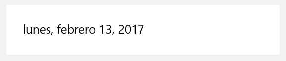
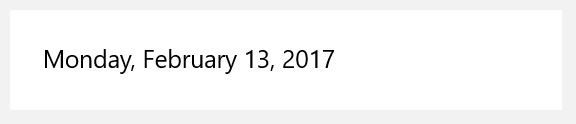

# Localization in Adaptive Cards

Currently Adaptive Cards has minimal localization support. This document covers areas where localization may be necessary. Currently this document does not cover detailed solutions to these scenarios, though those solutions will be added here as work progresses.

## Current Support - Date/Time strings
Currently, there is only one scenario in which we support localization. Our TextBlocks, RichTextBlocks, and FactSets support displaying [Dates and Times](https://docs.microsoft.com/en-us/adaptive-cards/authoring-cards/text-features#datetime-formatting-and-localization). This allows the card author to specify a date in [RFC 3389](https://tools.ietf.org/html/rfc3339) format. We then display the time in the timezone of the host's device, and in the language specified by the card author. For example:

This card:
```json
{
  "type": "AdaptiveCard",
  "lang": "es",
  "version": "1.0",
  "body": [
    {
      "type": "TextBlock",
      "text": "{{DATE(2017-02-14T06:08:00Z, LONG)}}"
    }
  ]
}
```
Displays as follows:


Whereas changing the `lang` tag to:
```json
{
  "lang" : "en"
}
```

results in the following:


## Card Locale vs App Locale
When localizing for Adaptive Cards, we need to be cognizant of which locale we want to localize to. The host app will be operating in a particular locale, and in many cases we may have strings that we can or should localize to that locale. Most platforms likely have various known solutions for localizing our library strings to the locale of the hosting apps.

That said, the card itself may be in a different language, in many scenarios we may want to localize to the language of the card. For example, if a user is using Teams in English, but is communicating with a bot sending cards in Spanish, any strings appearing within the card itself should be presented in Spanish for consistency with the rest of the card. The date/time example above is an example of localizing to the card locale. 

## Renderer Strings

This section covers strings provided natively by our renderers that may require localization. 

Any strings that are present in the Renderers themselves, and that should be localized to the host app language, should be localizable and verified per platform specific localization infrastructure and tooling on each platform. See [ADO 23089952](https://microsoft.visualstudio.com/OS/_workitems/edit/23089952) and the [Localizability Tooling](#Localizability-tooling) section below for more details on steps to validate localizability of these strings in this case.

Specific cases of renderer provided strings:

### Accessibility message for a card with input validation errors
Although today we don't have any strings surfaced from the renderers that appear to end users, we do have a new scenario out of accessibility that could require a localized string. Issue [#4912](https://github.com/microsoft/AdaptiveCards/issues/4912) (Localization tracked by [#4913](https://github.com/microsoft/AdaptiveCards/issues/4913)) tracks adding an all up error message to indicate that there are errors in the card for users who cannot see the errors displayed. If we end up adding custom text here, and if that string is generated by the renderer, localization would be required. This string could be reasonably localized to either host language or the card language.

Per latest discussion, we may not end up having a string here at all. This is because it's possible we can address this issue by properly setting the focus on the failing input and reading it's (card author provided) error string. In that case no additional localization work will be required here.

### Warning and error strings
The renderers return warnings and errors to the host when there are issues with cards being rendered. These errors include a string which describes the problem with the card. Although these strings are developer rather than end user facing, they are surfaced in our designer and visualizers we should still consider localizing them to allow non-English speakers full access to our tools. These strings should be localized to the host app language.

## Host Strings

Localization should be supported for strings provided by the host that are displayed in cards. Because hosts control those strings, for the scenario where the host language changes the host itself can be responsible for updating the host config with the correctly localized string. This does not, however, solve the scenario where the card language via the `lang` tag is set to a different language than the host app. In that case we may be inserting text into a card that does not match the language in the rest of the card. Ideally in this scenario we would allow the host to provide an appropriately localized string to be displayed in the card.

Scenarios in this category:

### Suffix string for required inputs

We allow the host to specify a suffix to be displayed on the label for a required input. While by default this is set to a `*`, the host can change it to a string that may require localization (`"(required)"` for example).

Even if the string is set to *, we may still need to provide (and localize) a descriptive string for accessibility users in order to ensure users know the input is required. Some platforms, such as UWP, provide a built in mechanism to indicate that a particular field is required, but where such a mechanism is not present we should support a localiz string here.

### Action Flyout Button Text

For issue [#4715](https://github.com/microsoft/AdaptiveCards/issues/4715) we plan to introduce a button which contains additionally actions which are not displayed in the action bar. Although by default this button will simply display `"..."`, we will allow the host to configure this button text via HostConfig, and the provided string may require localization (`"More actions..."`, for example )

Similarly to the required inputs suffix case, event when the button text is`"..."`, we likely need to provide a localizable string for accessibility.

## Cards Strings

### Localizing portions of cards
We may find additional scenarios similar to our existing date/time scenario where card data needs to be localized to match the rest of the card text. Today there are no known scenarios in this category.

### RtL Language support
We should ensure RtL languages are supported properly in our card. We should also ensure that the properties such as HorizontalAlignment that make explicit reference to "right" and "left" behave as expected in those scenarios.

### Unicode Support
We should ensure that cards containing unicode are supported and displayed properly on all our renderers.

### Full Card Localization
The overall language of the card is in most cases likely to be something determined outside the scope of the card itself. Perhaps the card author or bot operates in a single language, or perhaps the language of the cards is negotiated between the host and the card author outside of the card schema. In a templated card, the strings themselves may be present in the data, and that data may be localized appropriately at the time it is pulled depending on the contract between the host and the card author. These approaches and scenarios are outside the scope of our product.

We could consider providing a built in localization mechanism for cards, where a single payload could contain enough information to render itself in the language of whatever host it later finds itself in. This could possibly be approached using a templating technique, where the data contains versions of each string for each supported language. Including more than one language in a card would have the tradeoff of increasing payload sizes.

### Components/Templates
Components or full card templates provided by our services could be provided in various languages to allow non-English card consumers and their customers to enjoy the benefits of these services.

## Documentation and Tooling
The following are areas where localizability of documentation and tooling would increase access to our product and tools. For each of these areas, we should ensure that all strings are localizable as described in [ADO 23089952](https://microsoft.visualstudio.com/OS/_workitems/edit/23089952).

- Website
- Docs.Microsoft Content
- Schema explorer - Because this content is generated automatically from the schema file, localization might prove difficult here 
- Designer and Visualizers

## Localizability tooling
For each platform, we need to understand what accessibility tooling and infrastructure is available. While [ADO 23089952](https://microsoft.visualstudio.com/OS/_workitems/edit/23089952) gives a high level list of the steps required to make our strings localizable, we'll need to track down specific details on how each platform handles localizability. Specifically, for each platform, we need to determine what format for defining and accessing resources is supported by localization teams. Additionally, it will also be useful to determine what pseudo-loc tooling/support, if any, is available for each platform in order to validate our localizability.

## Translations
Once our products are updated as described above to be localizable, the actual work of localizing our strings to target languages will need to be done by language experts.


