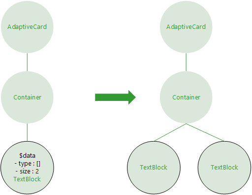
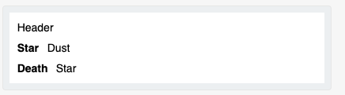
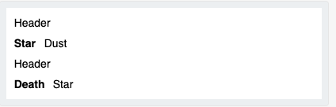

# Overview
## Templating

**Figure 1**

Template allows users to define where data binding occurs.

```json
{
    "type": "TextBlock",
    "text": "${latestPrice} ",
    "size": "ExtraLarge"
}
```

Once binding is defined, adaptive cards will be updated by changing only the data.
```json
{
  "latestPrice": 128.9
}
```

# Parsing
We use ANTLR to generate parser and lexer

## ANTLR
From a grammar, ANTLR generates a parser that can build parse trees and also generates a listener interface (or visitor) that makes it easy to respond to the recognition of phrases of interest.
ANTLR is really two things: a tool that translates your grammar to a parser/lexer in Java (or other target language) and the runtime needed by the generated parsers/lexers. .NET and JS version will handle server side tasks. We will use C++ as target languange and shared across Android, iOS, and UWP as we do currently with our shared json parser.
Once parsers and lexers are generated, the tool is no longer needed, so it won't be part of template SDK. 
## Parsing Strategy
Current grammar is based on standard json grammar with addtional rules to handle adaptive card template language
```json
{
    "$schema": "http://adaptivecards.io/schemas/adaptive-card.json",
    "type": "AdaptiveCard",
    "version": "1.0",
    "body": [
        {
            "type": "TextBlock",
            "text": "Lorem ipsum dolor sit amet",
            "wrap": true
        }
    ]
}
```
The above json will be parsed into a parse tree by the parser.  
ANTLR also provides a walker that takes a visitor as an argument. As the walker walks the tree, visitor's visit methods are called. Visit methods are defined per new grammar by default.
When a visitor method is called, it will be called with a context. The context will be a data structure representing the current visiting node.

```
pair
   : StringDeclOpen STRING CLOSE COLON value    # jsonPair
   | StringDeclOpen TEMPLKEYWRD CLOSE COLON value # templateData
   ;
```

From this grammar snippet, the parser generation tool will create a pairVisit method to a base visitor that we have to implement. By overriding this method, when a walker visits the pair node, it calls the visit method of the node. We can do our own work such as translation in the visit method.


**Figure 2**

**Parse Tree with Templated String**
```json
{
    "$schema": "http://adaptivecards.io/schemas/adaptive-card.json",
    "type": "AdaptiveCard",
    "version": "1.0",
    "body": [
        {
            "type": "TextBlock",
            "text": "${content}",
            "wrap": true
        }
    ]
}
```

Notice that templateString node has been added, likewise other template keywords such as $data, $when, $root, $index can be parsed by the generated parser and lexer  
Parser and lexer can be used on other platforms since they are generated by ANTLR tool and can be targeted to different languages. Visitor and Return Objects are needed to be implemented on other platforms.  
  

**Figure 3**

## Adaptive Expression Language
This was initially intended to provide us functions support. AEL already has many built-in functions such as toLower, toString, equals, add, div, and [etc](https://github.com/microsoft/BotBuilder-Samples/blob/master/experimental/common-expression-language/prebuilt-functions.md)  
But the AEL can do more. It can evaluate our templated string as well.
More upto date information on AEL, please check [Matt's documentation](https://dev.azure.com/microsoft/AdaptiveCards/_git/Explorations?path=%2Fdocs%2FExplorations%2FTemplateLanguage%2FCommonExpressionLanguage.md&_a=preview) and [AEL](https://aka.ms/adaptive-expressions).
Additionally, AEL uses ANTLR, so AEL SDK already includes ANTRL runtime. There will be no additional penaly of using ANTLR by ensuring that we use the same version of the ANTLR runtime


```csharp
private ExpressionEngine _expressionEngine = new ExpressionEngine();
/// some lines of code later
var result = _expressionEngine.Parse(unboundString).TryEvaluate(data);
```

**Signature of TryEvaluate**
```csharp
/// <summary>
/// Evaluate the expression.
/// </summary>
/// <param name="state">
/// Global state to evaluate accessor expressions against.  Can be <see cref="IDictionary{String}{Object}"/>, <see cref="IDictionary"/> otherwise reflection is used to access property and then indexer.
/// </param>
/// <returns>Computed value and an error string.  If the string is non-null, then there was an evaluation error.</returns>
public (object value, string error) TryEvaluate(object state)
```
We just need to ensure our data implement IDictionary interface to be able to use this API for templated string expansion purposes.
For complete API list and the latest update, please visit [AEL](https://aka.ms/adaptive-expressions)

## Data Context
- Data context is a data object adaptive element can use
- Data context supports a memory concept, scope
- Data context has two types, dictionary and array

#### Scope
Data objects can be placed anywhere in AdaptiveCards elements such as Container, TextBlock, and etc in json.
Templating string is bound to the nearest data when AdaptiveCard is viewed as a tree

```json
{
    "type": "AdaptiveCard",
    "$data": {
        "key": "1.2"
    },
    "body": [
        {
            "type": "Container",
            "$data": {
                "key": "2"
            },
            "items": [
                {
                    "type": "TextBlock",
                    "$data": {
                        "key": "3"
                    },
                    "text": "key should be 3, actual:${key}",
                    "size": "Medium",
                    "wrap": true
                },
                {
                    "type": "TextBlock",
                    "text": "key should be 2, actual:${key}",
                    "size": "Medium",
                    "wrap": true
                }
            ],
            "style": "good",
            "bleed": true
        }
    ],
    "$schema": "http://adaptivecards.io/schemas/adaptive-card.json",
    "version": "${key}"
}
```

The above json will be parsed as below image. First TextBlock will have "3", and the next "2"  
  

**Figure 4**

We also have **$root** key word. This is the data context at the root level meaning it will be set at AdaptiveCard level, and applies to all element with all the scoping rule respected as discussed

### Type
Data can be either dictionary type or array type

```json
"$data": 
    { "name": "Matt" },
```

```json
"$data": [
    { "name": "Matt" },
    { "name": "David" },
    { "name": "Thomas" }
],
```
### Parsing Strategy
Since the introduction of a new data context happens only in a pair, and only an obj can include the pair, the Obj is the natural place to handle the data context. 
In VisitObj method, it filters through the method's current context's children which are pairs, and tries to catch a data context node. 
 Current design tentatively uses the first one it sees for the performance reason.  
When a data context node is encountered, it call a base visit method with the node, then the method resolved into VisitTemplateData method.
The method, creates a data context object with a field that indicates Array if set. The data context object parse the value in the pair of the data context node into JArray object if it's array, otherwise into JObject
The newly created data context object is set to current context. In current design, it uses a stack for this purpose. When the method returns to the VisitObj method, data context is set, and translation can continue. Please refer to **Figure 4**

# Translation
## Expansion in Basic Form
This is the most basic form of expansion that involves templated string and dictionary type data context 
#### property 
Data is accessed via '.' 
```json
{
    "type": "AdaptiveCard",
    "body": [
        {
            "type": "TextBlock",
            "text": "Hi ${employee.name}! Here's a bit about your org..."
        }
    ]
}
```

#### array 
Data is accessed via '[]' with index 

```json
{
    "type": "AdaptivCard",
    "body": [
        {
            "type": "TextBlock",
            "text": "3 of your peers are: ${employee.peers[0].name}, ${employee.peers[1].name}, ${employee.peers[2].name}"
        }
    ]
}
```
The distinction in accessors type was important before the use of AEL. It's not important anymore since the job of expansion is delegated to AEL.
## Parsing Strategy
Terminal Nodes or leaf nodes contain the templated string, so the default VisitTerminal method is overridden. When the method sees that given parse context is a TEMPLATELITERAL, it tries to expand using AEL & given data context. Since our data context is JObject or JArray type that implement IDictionary, AEL can expand it. When expansion fails, the method indicate that the literal has been expanded, so when the result is returned, the unaltered literal will be included in the result     
* Including the unaltered literal when the expansion fails allows 2nd pass when data becomes avaialable, should this be default behavior? 

## Expansion with Array Data Context                                                                                                                         
When data context type is an array and there is an adaptive element that uses the data context. Template lagunage specifies that the adaptive element that hosts the data context repeats its subtree of which root node is iteslf.  
  
  
**Figure 5**  
  
   
**Figure 6**  

```json
{
    "type": "AdaptiveCard",
    "version": "1.0",
    "body": [
        {
            "type": "Container",
            "items": [
                {
                    "type": "TextBlock",
                    "text": "Header"
                },
                {
                    "$data": [
                        {
                            "name": "Star",
                            "nickname": "Dust"
                        },
                        {
                            "name": "Death",
                            "nickname": "Star"
                        }
                    ],
                    "type": "FactSet",
                    "facts": [
                        {
                            "title": "${name}",
                            "value": "${nickname}"
                        }
                    ]
                }
            ]
        }
    ],
    "$schema": "http://adaptivecards.io/schemas/adaptive-card.json"
}
```



**Figure 7**  

```json
{
    "type": "AdaptiveCard",
    "version": "1.0",
    "body": [
        {
            "type": "Container",
            "$data": [
                {
                    "name": "Star",
                    "nickname": "Dust"
                },
                {
                    "name": "Death",
                    "nickname": "Star"
                }
            ],
            "items": [
                {
                    "type": "TextBlock",
                    "text": "Header"
                },
                {
                    "type": "FactSet",
                    "facts": [
                        {
                            "title": "${name}",
                            "value": "${nickname}"
                        }
                    ]
                }
            ]
        }
    ],
    "$schema": "http://adaptivecards.io/schemas/adaptive-card.json"
}
```  
  
**Figure 8**  

Notice what's being repeated in **Figure 7** & **Figure 8**. In **Figure 7**, the FactSet is repeated since the data context is set at the FactSet. In **Figure 8**, the Container is repeated as the data context is set at the Container.
Users won't likely to repeat FactSets. Instead, the common scenario is repeating Facts. To accomplish it, data context can be placed within Facts.
```json
{
    "type": "AdaptiveCard",
    "version": "1.0",
    "body": [
        {
            "type": "Container",
            "items": [
                {
                    "type": "TextBlock",
                    "text": "Header"
                },
                {
                    "type": "FactSet",
                    "facts": [
                        {
                            "$data": [
                                {
                                    "name": "Star",
                                    "nickname": "Dust"
                                },
                                {
                                    "name": "Death",
                                    "nickname": "Star"
                                }
                            ],
                            "title": "${name}",
                            "value": "${nickname}"
                        }
                    ]
                }
            ]
        }
    ],
    "$schema": "http://adaptivecards.io/schemas/adaptive-card.json"
}
```

## Parsing Strategy
It is obvious from the examples that simply returning the string or StringBuilder is not sufficient. We need ability to delay the expansion until the walker explores all of a subtree when its current data context is array, and one of its children makes reference to the data context.  

### Result 
- ANTLR allows Visitor to define a custom return object
```csharp
public class JSONTemplateVisitor : JSONParserBaseVisitor<JSONTemplateVisitorResult>
```
- All of the Visitor methods will return this type once declared

- .NET SDK will have JSONTemplateVisitorResult  
- It has a linked list inside
- It supports two operations, join and expand
- join is used to merge results returned from other nodes
 - when joining two results, if the joint (tail and head) are already expanded meaning no templated strings in them, then their linked list nodes are merged to one
 - if they have templated string that needs to be expanded, then they are linked as linked lists without merging the nodes
- In the VisitObj method, once visit to children finishes, we have one merged result object
- if data context object was discovered in the current node, and it's an array type, expansion happens with the merged result object
 - it repeats the following steps n times where n is number of elements in data context
 - it expands the result with data context. 
 - the expanded result is merged
- the result is returned from the method.
- if data context object wasn't discovered in this node, simply return the current result without expanding, so it can be handled by a parent node which will have the data context

## $when
- $when is a pair, key : value. The value part is a predicate. When the predicate evaluates to true, an Adaptive element or a json object will be kept; otherwise, they will be dropped.
```json
{
  "type": "AdaptiveCard",
  "body": [
    {
      "type": "Container",
      "$data": "${LineItems}",
      "items": [
        {
          "type": "TextBlock",
          "$when": "${Milage > 0}",
          "text": " ${Milage}"
        }
      ]
    }
  ]
}
```
- If the above json's data context is non Array type, if ${Milage > 0} evaluates to true, TextBlock in the payload will be kept, otherwise, there will be no TextBlock. 
- If the above json's data context is Array type with n elements, the predicate is evaluated with each element in the array sequentially from the first element, and expanded and will have n TextBlocks.
## Parsing Strategy
- If $when is parsed in a pair context, JSONTemplateVisitorResult is marked as when and pair.
- at the VisitObj method, if a returned result from its child is a pair, the current obj becomes a conditional layer element.
- if evaluation is possible such as data context is not array, $when's predicate is evaluated. If the predicate is true, simply the $when pair is dropped, else JSONTemplateVisitorResult with empty string is returned
- if returned result is $when but not pair, then this result is added into Whens list where all results from $when are stored.
- At expansion with Array data context, JSONTemplateVisitorResult expands itself. If Whens list is not empty, we expand elements in Whens.
- Evaluate predicate of the when result, if true, we expand the when result recursively, and the expanded result is merged. 
- If predicate evaluate to false, we skip the expansion of the element.
- Expands remaining elements in the linked list

