### Android

#### Render Dynamic Type Ahead

1. Host calls the render method in the AdaptiveCardRenderer to render the adaptive card. Additonal paramter choicesResolver is passed from the host to the SDK. This is an implemntation of the IChoicesResolver exposed by the SDK, which is used by the SDK to fetch dynamic choices from host.
2. AdaptiveCardRender creates a instance of RenderedAdaptiveCard.
3. Views are created for all components in the adaptive card and added to RenderedAdaptiveCard. ChoiceSetRender is used to create view for input choice sets.
4. Based on paramters of ChoiceSetInput, if dynamic type ahead needs to be rendered then AutoCompleteView is created.
5. FilteredAdaptor is created and passed ChoiceSetInput instance which contains choices.data, choices[] etc. Also, choicesResolver is passed to the FilteredAdaptor.
6. This instance of filteredAdaptor is then set onto the AutoCompleteView.

New Interfaces and classes  

1. IChoicesResolver
   method - getDynamicChoices()
   params - queryText and choice set input which contains choices.data
   returns - list of dynamic choices
2. ChannelAdaptor
   Sends an asynchronous request to the host on a background thread. Posts the result on to the caller on UIThread.

#### Communication with Host to fetch Dynamic choices

1. When user types in the type ahead control box, an event is triggered onto the auto complete view.
2. AutoCompleteView calls in the filter method in the filtered adaptor.
3. Filtered adaptor creates a request to fetch the dynamic choices from the host and calls the channel adaptor with this request and send choicesResolver as a parameter.
4. Channel adaptor forwards the request to fetch the dynamic choices to the host on a background thread.
5. The host either resolves the dynamic choices itself of through a backend/bot.
6. Host gets a response from the backend/bot which contains list of dynamic choices.
7. The host returns the list of dynamic choices to the channel adaptor.
8. Channel adaptor inturn posts the filtered adaptor on the caller on a UIThread.

#### Debounce Logic

[Recommendation - 250 ms](https://medium.com/android-news/implementing-search-on-type-in-android-with-coroutines-ab117c8f13a4)

#### User Experience

## Option 1

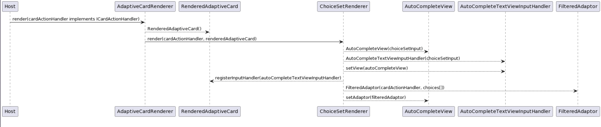

http://www.plantuml.com/plantuml/uml/hP71JiCm44Jl-Oez9XBz0H-gHf5GUmN41N6mx04iENQqtW2VJngbY9fKxg6tPBppPbQxIw9PnjvN-vY4DbjghHx4VQBJR1yGB1YiYEUlsanYQyJ5iDV1UZ2vVl3e4IJHeSjVcsgDHfifPlcnVmVKgbfVecof-uZEu15IBdf7lC9kgWonj6j7YLqyhYPuTlXI_vJQd8o7C8no3UW9ttAqpeQbbYfEt2meOHPhdMsI4GiNOhox9E2pYheGVYdYtddvZOYiCc7rZ6OcfPVNws-N82VWstb0K-qcwzZx7m00

1. Host will implement the ICardActionHandler interface exposed by the SDK. This will be used by the SDK to communicate with the host.
2. Host will call into the render method of the AdaptiveCardRenderer and pass the cardActionHandler instance.
3. AdaptiveCardRenderer creates and instance of RenderedAdaptiveCard. Views of all the components are added to this RenderedAdaptiveCard instance.
4. In case of ChoiceSetInput, the AdaptiveCardRenderer will call the ChoiceSetRenderer and pass the cardActionHanlder and renderedAdaptiveCard instances.
5. In case of type ahead search, the ChoiceSetRender will create an AutoCompleteView and a FilteredAdaptor. It will set the filteredAdaptor onto the autoCompleteView. AutoCompleteView will have instances of renderedAdaptiveCard and cardActionHanlder.
6. ChoiceSetRender will also create a AutoCompleteTextViewInputHandler (implements InputHandler) and set the the AutoCompleteView on it.
7. ChoiceSetRender will then register this AutoCompleteTextViewInputHandler on the RenderedAdaptiveCard. RenderedAdaptiveCard maintains a map of all InputHandlers. The map uses the InputHandlerId as key. (The ChoiceSetInputId is used as AutoCompleteTextViewInputHandlerId)

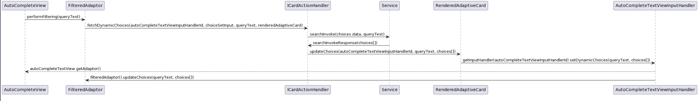

http://www.plantuml.com/plantuml/uml/bPB1ReGW48RlFWL7JLmVm4EpngQfrzscbwO70kDAga1XiDsth-mQmreQkzVnv_j-HlOMgK4tz4dbKDLgq3qWl0hu8hi7yYHw10EyubIZCYNHO5fbXkjSo5FwwS2SN-0RisGLzkURcXfUCHHAFbF9UvWGBI3h7i-I3eBLdH8CR4e3juTvVoErm_bKmtF2BjaZuEL3JXPpJWn8lfZ52DwQ9R_blj8Hp3XnIcA16jOrSbGVa5xXjk0KQO3EaZaUlymjv01MAsaNsDlxNnqEaRubSNgomnqh2LSGE6DqRwqsY2Kv0OQ3VtJ82Wku-fdnLbjsibjLz86In2eKKy_vaQNRuEWxRiE1nnItsu_VOG-Ikw7_0G00

1. On any text change in the AutoCompleteView, FilteredAdaptor will call into the fetchDynamicChoices method in the cardActionHandler. SDk will pass parameters which include autoCompleteTextViewInputHandlerId, queryText, choicesSetInput and renderedAdaptiveCard.
2. The host will make the call to the service/bot to fetch the dynamic choices.
3. Once the bot/service returns a response with dynamic choices, host needs to send the dynamic choices to the sdk.
4. RenderedAdaptiveCard will expose a method updateDynamicChoices which takes in an id, queryText and choices[]. This method will find the input handler using the id from the input handlers map. It will send the queryText and choices[] to the respective input handler using the setDynamicChoices method on the input handler (in this case AutoCompleteTextViewInputHandler).
5. The input handler will send this update to the FilteredAdaptor in the AutoCompleteView.

fetchDynamicChoices method paramters in ICardActionHandler
| Parameter | Type | Description |
| :------- | :----- | :------------------------------------------------------------------------------------------ |
| id | String | This will be the AutoCompleteTextViewInputHanlderId used to identy the respective input handler which sending back response |
| baseCardElement | BaseCardElement | ChoiceSetInput element on which text change was observed |
| queryText | String | Text in the Input.ChoiceSet entered by the user |
| renderedAdaptiveCard | RenderedAdaptiveCard | Instance of the RenderedAdaptiveCard which will be used respond back with dynamic choices |

updateChoices method parameters in RenderedAdaptiveCard
| Parameter | Type | Description |
| :------- | :----- | :------------------------------------------------------------------------------------------ |
| id | String | This will be the AutoCompleteTextViewInputHanlderId used to identy the respective input handler |
| queryText | String | query text recieved from the sdk for fetching dynamic choices |
| choices[] | Choices [] | Dynamic choices for the query text from the service |

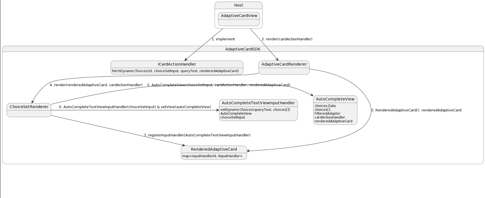
https://www.plantuml.com/plantuml/uml/ZLHBozim4BphLomv51iIGzzWIlY2GudfBIczb1w4lMq4VhZokcqe-U-r5DVH9or9Rie-PcTsDdxgIMeQwagC3qBOjJt1Nm5m-RdObB8ZzGipgSil2dylGFRW1yLPJErkvh3zP96kOBa9RmfIRREJJLcXjd1XsFOnyHI-8nN7xQcHjIgoOwiAx2DLBg6mxmDItdG3BU7dWFhq6V-CJurDYHfBbrii0Cu286IzjzMMWbkos3CebZsNC9hPH0grx3uemt6Ib8_ayzm9hCKyDFilwaeAB2lX63HGcxLrLo7XR90VD5r1C9sMrYTRIV9soTTlVFgZgcZMs6g-gF1jPCjOdtYXQ8mrJUxUVE5iaJ-PgqcXH_9Ep3cdUIFnOs2-q8Uwl7iM0Yx_pDLgpVujNYQW35oD3Jcrx6Mdy2gPbXq5rXXHN9D5uo_wTS8cefYtzCQ0yE1JU3DpvS2Mm2e8S01MQ-RatYP1CFA_9C40_el2Z_Mcybw_I-uMUQnYU66ErFALdW2Fo5txtfi5_r0zeNusyHwbM9p5quWurDK_

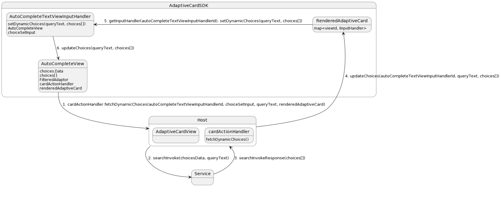
https://www.plantuml.com/plantuml/uml/bLFDRhCm4BpxALOv1Ib1-hx-750L9KfK1VMMLBrKFLYmRL01KtkXZQAyUur1WOBJq1kCPxqpi-kv8YufJsAcFmXXBHJ1WG5KlwD5o3EA2bno6Jv5-3a2hg0BDlH08uk08f6kUHh6A0s_XpBeOnwy8WMxrJxbIHGiTo8AK8qTTgoLRL4M6eA3HcgehMExUj17ZP8DfY5A3DiS8yPs0BhEUk11mhExGdlqmmduVfhbLEkTCTQAAIUn54aM8s4JKmSqNRgW1q5brLrnuhzJdb_in_THJ2VbGbf9_S3jD6b9uOpHH_oYigYTIcFSIh9tjd4yK4YTPVZ8KUvBygH9n1bsMTVeeAgwonR9m6RWlQ5EfxFgrNZmp-sdxDgscb_eh9Ujqti2ZNdhZ1nWKEdGUkgtui5_5nHo6Upyj13lEAvZArUjTMEPOLroikF1rS_Q3QfCf0h7xUWDrTJONy-r2taMSiA_E3ytPbiBxNR076zSU4DgOmE4EExm5RoemMJKVssttNpizxCZcslpUH9_0m00

## Option 2

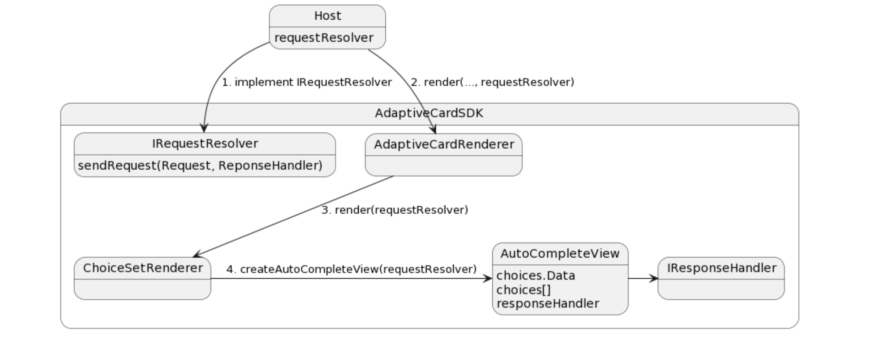

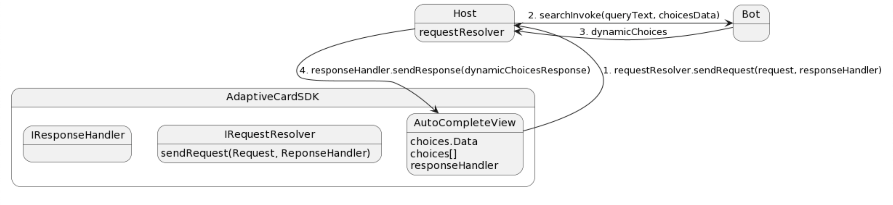

Diagram 1 - https://www.plantuml.com/plantuml/uml/VL4zRy8m4DtlLpmnWKGjzMFAK85WeEeMf2vL1mkVr4Y9JUqB7Ih-Uub90zXHfrpUn_FftYA8zj8sDPq6OMnS4FmGpaC1pryj1oavkFh0dexK2vT6xwKwy4fxirs_HWy1ELcoDUpPHyMH1itgqrKxth9S1BXLJ9Qjk9LhzZKBlrNyFO4EIC7Eb845TZ4-gBKM_R_a_MESzXpspWRUQ6jgzfteQhUNylOoSRSK92332WIsfWUd_NUEagyVcz5V1NVF8mdt2bMtQiDMCdfmdgnZHHHuKF3nPwgKcgSTpmYZlXYOjLRWSKZBWt8zS4h9Z_saiFEiXLCg3ysxEXyfgUjILKB5gZ8z2A0ZBTYQjgb_0G00

Diagram 2 - https://www.plantuml.com/plantuml/uml/VPA_JiCm4CRtFCMfKo9HI_oPCg2MT6Z55X0BOh2IangHsC7d12h4ktD9t58xg9Fjpx-x-tpd5LbfRDVK4MyimbQJXUy8faqA1Zyw99iZwRf74_quxa4pnYTtN9UojLMFcJJbq-Pnp33TBDQTrPbksXejlbJukG1948h0_4nCeTZhga0I6sdbPUJrxVzhWzHgHRYLggpH3D2VjLtklswq5egCpxGK25NfnDYjLv3ZUQqayYfvFbmbNmGEc7TckRmVXv72jGZ78Svj66SZV7Dod2Oduh6bS2E0K9fYlrEzViUOmypX6Ryur7LpwFSGnZYSojyAA0zADbMHJHIS4ZCpR_sT29mukqwB_MH7EU5FjMACl-Gl

SDK interfaces

1. IRequestResolver
   sendRequest(Request request, IResponseHandler responseHandler)
2. IResponseHandler
   sendResponse(Response response)

Request -
| Property | Type | Description |
| :------- | :----- | :------------------------------------------------------------------------------------------ |
| Type | String | A set of well-known string constants that describe the expected shape of the value property. |
| BaseCardElement | BaseCardElement | base card element on which action or change was observed |

| Values                                                              |
| :------------------------------------------------------------------ |
| Type = typeAhead/onAction/onInputTextChange/onMediaPlay/onMediaStop |

TypeAheadRequest extends Request
| Property | Type | Description |
| :------- | :----- | :------------------------------------------------------------------------------------------ |
| Type | "typeAhead" | A set of well-known string constants that describe the expected shape of the value property |
| ChoiceSetInput | ChoiceSetInput | choiceSetInput element on which text change was observed |
| Query | String | Text in the Input.ChoiceSet entered by the user |

Response -
| Property | Type | Description |
| :------- | :----- | :------------------------------------------------------------------------------------------ |
| Type | String | A set of well-known string constants that describe the expected shape of the value property |

SuccessResponse extends Response
| Property | Type | Description |
| :------- | :----- | :------------------------------------------------------------------------------------------ |
| Type | "Success" | A set of well-known string constants that describe the expected shape of the value property |
| Value | Object | An object that is specific to the type of response |

FailureResponse extends Response
| Property | Type | Description |
| :------- | :----- | :------------------------------------------------------------------------------------------ |
| Type | "Error" | A set of well-known string constants that describe the expected shape of the value property |
| Message | String | Custom Error Message |

## Option 3

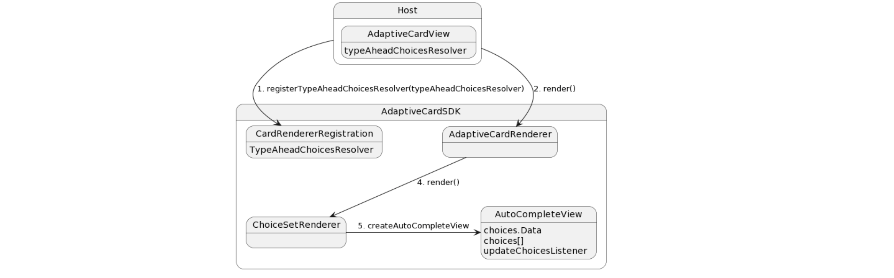

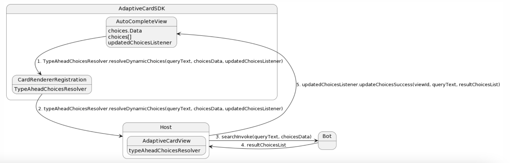

1. AutoCompleteView will have choiceSetInput, a adaptor which contains the choices list and a listener on which the host will post the dynamic choices response.
2. ITypeAheadChoiceResolver is an interface exposed by the SDK.
   interface ITypeAheadChoiceResolver {
   void resolveDynamicChoices(String query, ChoiceSetInput choiceSetInput, ChoicesListener choicesListener);
   }
3. The above interface is implemented by the Host.
4. For any change on the AutoCompleteView (filter() method is invoked by the adaptor filter), after the debounce login/time. We will call the resolveDynamicChoices method on the typeAheadChoiceResolver.
5. We will start showing a loading experience on the Dynamic ChoiceSetInput dropdown.
6. The Host will fetch the dynamic choices and post the response on the choicesListener in the AutoCompleteView. The success response will have choicesList, original query string.
7. If the latest query string in the auto complete view and response query string match, then we update the data set (choices list) of the drop down adaptor.

Diagram 1 - https://www.plantuml.com/plantuml/uml/VL9DIyD04BtdLmmzrKC3Ybvoa9Rq8EWf5I_YOKWUDf1cm-oa8k9_Tvf5ckQZa4FsVUmytixQAuksXogo7mKzEQ_q4n65us9JSAFb4IbByLRYQq7iQGYQd4PWGlhTOBC75-dUbJby1k-g8oJwZSAq2yzk-zmVV88or0K4ak6pz2gifQkx07EasMUvX5xdyX3PDqZKkwMBPPd_DS6-Wvu551IztbfrgJiq5HJdtWRWoJK24yf3l7ZBojSbxn_JTDiKh4Y3wCKgG0snTE5vLwl7AotTnYGT09ahRAapn4r_n5IL2TtPzTrXQU99JMSUTPpGVTyv5X2PRLp5GqovW1L3ohPmRLPR_Jy0

Diagram 2 - https://www.plantuml.com/plantuml/uml/jP8_J_Cm4CRt-nIdJgtKMdfVOCbGjRG35KnjnO8OhFX48v8usET0XVZks4bBemPtOx7iv_uylpjvPbaQTaKE_iA4TzeoVW9Y-npCbQmugsaXZNhCw7s0qkAv28ZO4nFaVKNp7KcrsEai9Ricg_EQ37p1mUrM1xFJkzjZixplWWHfJQKYGsPDBvbb8pdJPGCK2m9YD9RWDiQ7s5c0OxtGHPKJqsa1PsB8xua9fcrViPGiBwSyFVyUTfMIJ4V01mzF9Hc0VYvE9jCBi_uJqN65QI_BVIcBB3r4Xs-Ep7vB7pm-GeOnnX6a4SGttQ25ZvNWVu7yjnY0ZLNZsT_dZOWKYbO-g1kN-jCEQr-qKcFiG7XAbtEdsbj2wpWD_pd1Au6Mf4btgxBMhnIPO0G-6NyMSotwdM56fN95_Wq0

Try using alternatives for ASyncTask in android to fetch choices dynamically since ASyncTask is depreciated.

1. Using a combination of an Executor and a Handler
2. Using a Thread

## Option 4

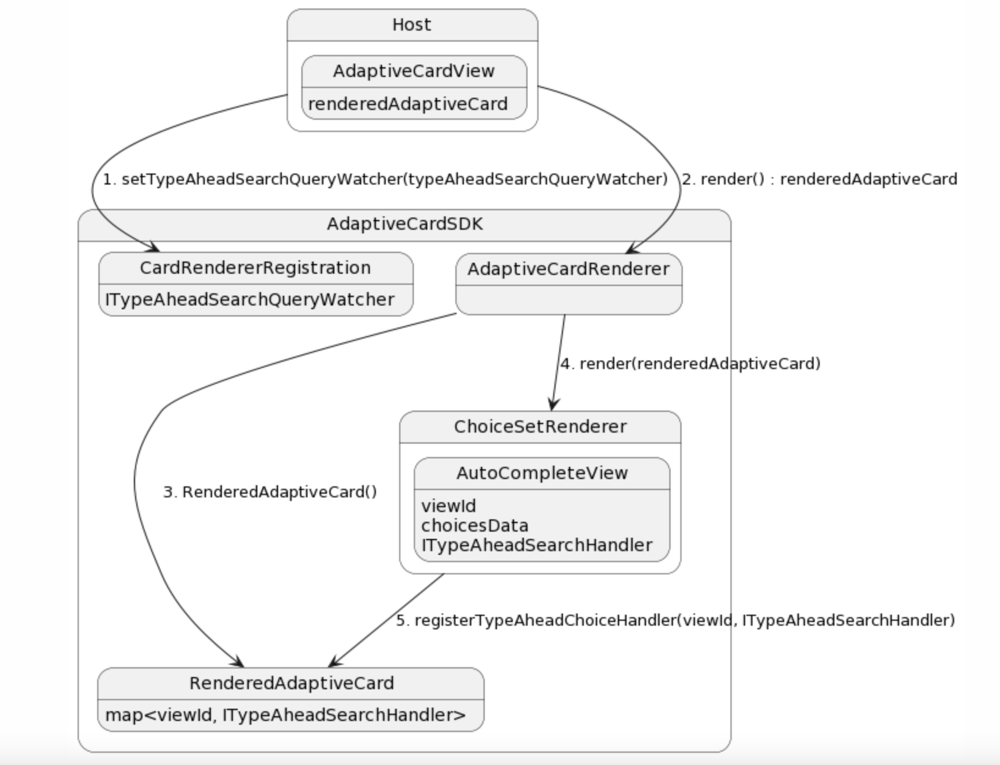

1. The host will set an implemntation of ITypeAheadSearchQueryWatcher on the CardRendererRegisteration. When there is a change in any of the Input.ChoiceSet (Dynamic TypeAhead). This will be used for communication from SDK to the Host.

2. The ChoiceSetRender will register a ITypeAheadSearchHandler on to the RenderedAdaptiveCard with the viewId. RenderedAdaptiveCard will store all such handlers in a map with key as viewId. This will be used for communication from Host to SDK.

Diagram - https://www.plantuml.com/plantuml/uml/XLFBgk905DoVhoZkAe4nC6y8WznBN2Yp6ft7OfX5apvC0dc4xXD51lzzi2CncExSPLTvgaghVBQYZFHrHLQKCBQj5VmZO7W-lMZLINdaJ1dzi-JJ4vJ58qW0Pc0AmurcmthAq8LkJbFqiFawDRr2--7OxFblQSKeATl6cOT80e9SYjttSySl1IjzO6NoublFvlnBILwm8O20MQfHoKMxtEFjFT_BHVCH8C1BfAXLz-LOyccdtypoRLMZApPh6cspeYrpFh3SOy7beabRlRHPMtSL2uzjFO8WO0Qco9s-JJPArF97Vl-PM0Q2E-S0Hq28Ij5tMWbdWrDasFQLn4GObhbQhHTAVfl0iYmq7KcOYoSUtXcaU9V0k4SK8p1lU4-Tfdy4xnCl4SKBKlCjfFWmPlFbYWdp8s2rzhJyCK5kM0a_KZJVn5KXMEKd9tHlyuUhzaP7_aZX7-fp0kFQPZCQkljHyPN_KamNUkP6ztNr7m00

https://www.plantuml.com/plantuml/uml/XP9FQy904CNl-oaUdXAeWhQzX2AA7fIUQafxNhA32UHFs4mKANxtThCsNUf6Rvjvp9jVvisYOQcvBNBnys32fceONmAmdwEbaZLd1rf9hJuoEeuW6_ml2W1NnGYQIaMQbAk8ixXCSgln-jKTQaexswntjCyQrfApgko63ua26DGYRDzFDIrJaYecgPFqhILz-fISfAG5O6UxL8vJXtR-mzjv_gj3ymd6sYj4A6JzSiZek5KFLtmRMQgSz5pqOrTfbIKK4xjOFTD0VuULL-L-9W3xYD3MIZAj9SkOED3Kj3c7mZ5RjbojggBEYQaFtJHFVrsc4IovKqWwmCRu0X1sP_QWnkFvZMoc4pJ4Dm8AU5WBtHc-z2BC9fTJ348CN2MyhSPp8Bl7YLS8mbjMLn56UEhPV5p6pMswH_LitCngIVVhjFsNUmZkt5iepc91fMgB_1i0

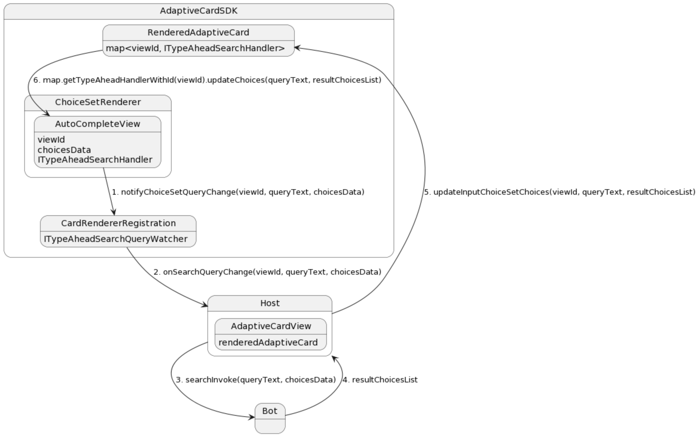

1. On query text change by user, the SDK will call the onSearchQueryChange() method in the ITypeAheadSearchQueryWatcher (registered by the Host) with viewId, queryText and choicesData.
2. The Host will process the query and get the dynamic choices from the bot.
3. Host will call the updateChoices() method in the RenderedAdaptiveCard with viewId, queryText and dynamicChoices.
4. RenderedAdaptiveCard will find the respective ITypeAheadSearchHandler from all the handlers from the map using viewId.
5. ITypeAheadSearchHandler.updateChoices() method will be called with queryText and dynamicChoices which will update the type ahead choices view.

Diagram - https://www.plantuml.com/plantuml/uml/bPHDpzem3CVl-HJMSwBIGwIzIzLKmU10jLq6Q1oc7QB6ezNQf4jTDZJntTVqfNIqOU96_7Vzi_-sM1Ga39LPogeVXB3H1S4V1j0ydvPIv9ISS2MC_9BWhoSG1Tm66G2CWZuOL18Dog72BgmbVT0MT7qFitRhZyCcR6ZR53DRF2O56K69LdKpBf41E3KVmlqvnsMCGkvGc2Z-NA8v7mH5CHe6S6Ll9uQekLE2_MvIy24J-VjJPKiedqVmZL0oHHEmWUybwPNEyXG9UzzlWnOt2leGnJg9iE1hGU9-ojTl0wIZgvhiq1Y0I_AXpAKWN3MacS6YJCcplD4OytbmPrKlE2XDoVTpKsg7P9TLlOGwugppzAUDxV4tFNV3sV4zvZw26clltOUN7BHgsd-aDeFwUrl8iVKtlBKXL7b9_G2TAHE0sgSkuLFLhCUcJyfItUQ_vVRY-16fpsYrGq9nA5kqn__TqdyQSV5W7amSsJiEZrI_CDQu6TZ_1XzUSIXgIAXE-WVEN5keag7Vv6i-BiqMg6IPfNy1

https://www.plantuml.com/plantuml/uml/bL9Bpzem4BpxLwmuWGIMwAE7g48yE12rbm8gPolU9b4JExKtjAZYlzVE8qGbGVfkzkxipEpOQql2K9bdp1q8uQ0jmLy6K5yd6oaAIg-u4qP-J_7t18I5_uiE3a_500mgYGPblyFkh57QQY_qkFTHf_sNlWbVEjPaveXnQia8IhMgp8mrtVXeBu3mV2jmaw2G9nGcIhwLQ6uNGL62naq-j8y3IrIwGmq_DzW881V5vwkB9PJp9_63K393isATx2xHQOGdfDQzZ-FnA2NfdSwB30cxHycqYfSEL1y2gCLwXQZYj7j10dhb4JC0p87kZ3L0M2nMB_9SSb2QqX-tphbFrDs4Yd7QBlxBryxuX-PzDpC6eynUjlgK0RpZe5NjyItS3AfvJpJoD1yvb8KKXA4gIkeMg0zsIC2WBRCMyDMPTIiCadlLDkXFt7y27YDrYJTPNr9AGja8pNXjffL_BNjdhDjkgrrAxpdOAgDGNVLFd8x5ui2zR3_mPtB6rcwZCi_-0G00

IRequest -
| Property | Type | Description |
| :------- | :----- | :------------------------------------------------------------------------------------------ |
| Type | String | A set of well-known string constants that describe the expected shape of the value property |

GetChoicesRequest

IResponse -

| Property | Type   | Description                                                                                 |
| :------- | :----- | :------------------------------------------------------------------------------------------ |
| Type     | String | A set of well-known string constants that describe the expected shape of the value property |
| Value    | Object | An object that is specific to the type of response                                          |

#### Sequence Diagram for Android Flow

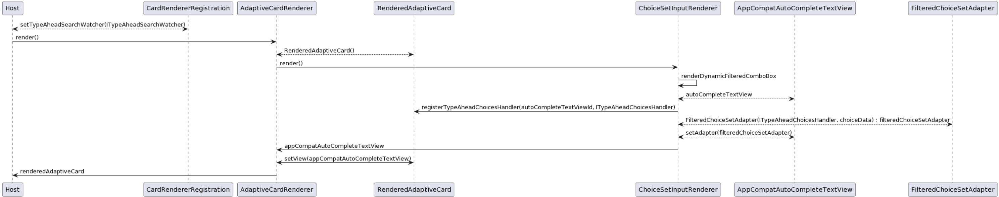

Diagram - https://www.plantuml.com/plantuml/uml/fLFDJiCm3BxdAN9ifUq58eHMDY5wtIOucyRGI6qJEIviRq_RqJ49fnounOxz_TZ99Z8GzssZ2Wk1tGTkWUopmqzzjrxVwp7QOsUHaFRuxY8JiFETqH7vU0vOr0ZsW41L_G9SrKXPAUVptnG3mPox9JAQfbEMA-dwekmxihSLHimEC3BEwA_shi83Sjc5dWK1Si7VhRjp1wsh7bt3evwjRr_zWp-9UBEb8eIXBW0NFVlnr23Z4Kyy3ije4B8flEI0Q5eYqdL75u3u19rja3A9fBGhNIOQSgKMFSq3kDPCSf1CyYPBKQrqDSKxOCYrqMy9WF_CEFx8IC7dASFfvmnBf4ebNdboXn6dncmHLlWxWiQBQn9er6P8zctp1G00

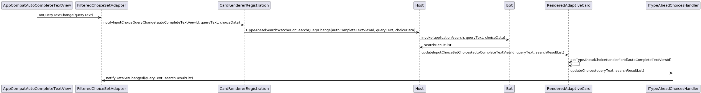

Diagram - https://www.plantuml.com/plantuml/uml/fP9HIyCm58NV-olokC6cxqLajJ9MyCLrwFEbEQx1BedfpNJ_tgRjfenb2Buba7E-SsxkecLox7TDabcRcvqbpZoRS6h0sE2BNnG-nVnUB5N3S91vRLI54fn9iWoN2gEVFTmXFCvhqbjCFextQHAJ1SkSd5n3IpYuDRQgPKUiZ4w5DgpU3eMsdWTXJnZTwKB2Gix4YJeJLIzw9APf4gE412lJSYgApS4Ygq6o1BcgVYMkQhWReuVxF-01440FfkCelJVlc92rZQhw3BTj3uZAEzbFpE7j6grl-AchSJ8Vsyb-j6gFq3WLtafY_9fXYV7G_gN5EMsQNCA8ktaqm1Py6km0Nf6M3TpIk496CaGm7QGuCsj7jsFJOxUh7M8crpTyMCVm9IN67PVNEGjewNVDDm00

### Engineering discussion points

Write thread information.
How can input handler id be manipulated by host?
Instead of listeners, wait for response in background thread.
Have a new interface to expose to host for dynamic choices.
Have naming for interface for fetching data or for inputs. (data adaptor, channel adaptor, data resolver)
