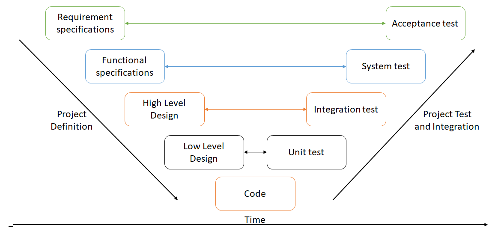

# Testing Automation for AdaptiveCards

## Background

AdaptiveCards had its first released version in 2018, while we have tests in place to test the correct parsing and serialization of the object model, i.e. C++ and .NET object model tests, and even in some cases the correct rendering of the adaptivecards, i.e. UWP TestApp, we haven't provided that much care to testing the interactivity of the cards in an automated way, relying on doing manual inspections; while this is the most straightforward and simple approach it's not a mechanism we can depend on while the project grows in size and usage. 

For example, one of the problems this strategy has arisen are the lack of confidence in finding regressions before one of our client does which in turn affects the confidence they have on our product. Not only that, but the time it takes us to test all cards before we do a release increases as each time we have to test more scenarios trusting that we can evaluate all scenarios and not find any breaking issues close to the release dates.

## Testing

Before we delve further on the main focus of this document, we have to define what testing is and what are the existing types of testing there are. Testing is the process of evaluating the functionality of a software application by checking if the software meets the specified requirements or if there are any defects in the software in order to improve the quality of said software.

Testing can be performed in multiple scopes of the same software and with different approaches in mind, there can be `functional testing` where the software is validated against functional requirements (i.e. unit, integration, smoke/sanity, acceptance, etc.), `non-functional testing` where non-functional aspects are verified (i.e. performance, usability, reliablity, load, scability, stress, etc.) and `maintenance testing`. 

Different software and development models will implement and focus on implementing different types of tests out of the dozens of currently existing types, for example, in the V-Model of software development, which is a model of the system development lifecycle, we can see the inclussion of `Unit`, `Integration`, `System` and `Acceptance` tests, as can be seen in the graphical representation below: 

Each of the aforementioned tests is in charge of testing a different part of the software: 

* `Unit tests`, also known as Component tests, validate that individual units of source code or components of a software perform as designed. Depending on the software to be tested, an unit could be defined as an individual function or procedure or even an entire class. Mock objects, method stubs or other placeholders can be used to completely isolate the unit tested.

* `Integration tests`, once each unit is tested we have to validate that contracts and interactions between them after they have been integrated. This type of integration can be done using different approaches, as Big Bang Integration (almost all units are combined at once), Incremental (two logically related modules are tested, then more modules are summed and tested, repeating until all modules have been addressed), Top-Down integration (top-level units are tested first and lower-level last), Bottom-Up Integration (Counterpart to Top-Down) or Hybrid-Sandwich Integration (merges Top-Down and Bottom-Up approaches).

* `System tests`, validate the complete and fully integrated software product evaluating the end-to-end system specifications. This type of testing includes the use of external peripherals, testing every input in the application and testing the user experience with the application.

* `Acceptance tests`, evaluate the system's compliance with the business requirements. This process can be done as a validation activity in cooperation with the customer. 

But as mentioned earlier, there are dozens of different types of tests, including:  

* `Smoke tests`, also known as confidence testing, sanity testing, build verification test and build acceptance test, are preliminary tests to reveal simple failures severe enough to reject a prospective software release.

* `UI testing` verifies how the tested software handles user actions performed via mouse, keyboard and other input devices as whether the visual elements are displayed correctly and perform their work correctly  

* `Automated testing`, or Test Automation, which is a software testing technique that performs the use of automated software to execute one or more test case suites. It's the counterpart to Manual testing that relies on human verification.

* `Regression testing`, which is designed to confirm tha a recent change has not adversely affected other existing features 

For the remainder of this document, we will focus on the `Automated UI testing` which validates the scope covered by `UI Testing` but adds the use of software to execute the verification tasks without intervention of a human.

## Automating UI Tests
 
UI Test automation is critical to save time on development by automating scenarios that are currently run manually while at the same time avoiding regressions on currently existing scenarios that are not being tested now-a-days, for example, Submit actions to verify the input retrieval and validation scenarios (while the validation is currently tested, there are no mechanisms in place to check that error messages show up or that the correct element is focused), or clicking on interactive controls such as links in a `Textblock`, clicking interacting with the `Media` control or verifying that Container's actions are behave as they should.

As part of the automation tests, rendering should also be tested through the dumping of visual trees (currently UWP has a similar system in place to render multiple cards in 'different hosts' but this process is not run as part of the build pipeline and the verification is done by comparing images rather than trees) and by testing the rendered results of properties, for example, if a `TextBlock` asks for `attention` color then we should verify that the color is respected.

Summarizing the last paragraphs, we should strive to automate the testing of the following components:

* Interactable elements
    * **Actions (OpenUrl, Submit, Showcard, Toggle, Execute)** - i.e. is clicking on submit retrieving all inputs? Are showcards being shown? Are showcards being hidden when clicked a second time? etc
    * **Container actions (Column, ColumnSet, Container, Images)** - Checking the action behaviour is actually happening 
    * **TextBlock** - Verifying links are clickable
    * **Inputs (validation, correct values on submit)** - Are inputs editable? Is only one click necessary to acces the Input.Time control? [#5463](https://github.com/microsoft/AdaptiveCards/issues/5463)
    * **Media controls**

* Rendered properties as API testing
    * **Properties defined in cards & host configs** - i.e. Is the correct good color being rendered in a TextBlock?  

* Visual tree
    * **Visual tree dumps per platform**

## Pros of Automated UI Testing

As previously mentioned, automated UI testing would yield a large number of developer and consumer life improvements, first of all, we can gain coverage from the smallest and most basic rendering scenarios such as rendering a card with a single TextBlock to complex scenarios such as validated inputs inside of a ShowCard; not only that but by automating ui test scenarios we, as developers, can spend less time discovering and reproducing bugs introduced during development as well as avoiding large regressions from being shipped in a public release. 

Due to the introduction of interaction tests, this can also ease the documentation of ambiguous interaction behaviours which would improve the platform parity story as well as helping any individual or organization to better implement their own adaptive cards renderer. 

The best way of determining how successful this effort is will depend on the number of regression bugs filed with each release, as long as the number of regressions does not increase with each release then we will be able to confirm that our test suite is robust enough.
 
## How to reach the Automated UI Testing goal?

> Add info on planned test coverage after x months

Currently AdaptiveCards counts with a large and expanding set of controls, actions and related properties which allow for a broad scope of visual and interactive experiences, reason why introducing Automated UI Testing to AdaptiveCards will not be a small or quick feat, that's why this work will be rolled out in incremental phases with the final goal of maintaining and increasing the quality of each AdaptiveCards release by covering as many test scenarios as possible with each release:

### Epic 1: Get the build system to support automated UI Testing

ETC: 4 weeks 

Enconmpasses: 
* Configure the build system to support UI Tests.
* Update pipelines to run UI tests.
* Implement test app & basic test to validate configuration.
* Configure build and test systems to support running specific tests (inner & outer loop testing).

Results:
Once this work is completed tests will be runnning as part of the build process, this set up will also allow developers to start working on adding new tests. At this point, developers will have a steep ramp up for adding new tests which can deter them from adding tests for complex scenarios. Finally, our test coverage, at this moment, will be really low covering at most 10% of the code paths.

### Epic 2: Lower developers entry point and definition of source of truth

ETC: 2 weeks per platform

Encompasses:
* Implement internal library to lower entry bar for developers.
* Implement Visual Tree Dumping.
* Integrate tooling to compare Visual Trees.
* Refactor tests added before the conclussion of this epic (if any).

Results:
Once completed, this work should ease the process of adding UI tests allowing developers to introduce it as part of their usual workflow even if the test framework or tooling is modified. Adding the dumping of visual trees will set a baseline for the expected rendering results which in turn will automate the detection of rendering changes. 

### Epic 3: Continuous test development

ETC: Continuous process 

Encompasses:
* Implement tests that cover the most common scenarios (i.e. Form filling, value submission)
* Increase test suite per iteration

Results:

With this stage completed, AdaptiveCards should have coverage of the most traversed paths of the usage, this would include the samples we provide to ensure no scenarios have been broken; also, once the plan has reached the "Increase of the test suite" stage, developers should have normalized introducing tests in the following ways:
1. To **test a new feature** that is being introduced
2. To **verify the fix of a bug** when a bug that can be validated with a ui test
3. To **fill in the testing gaps** by adding tests for unvalidated scenarios which in turn can prevent a regression

## How often should tests run?

> - think critically about do we really *need* every test to run every build? some tests are faster and more important than others...so which tests can run on pr and which can run during daily builds?

In an ideal world, as the automation tests are meant to be a regression avoidance device they should be run everytime a Pull request is going to be merged but as we have realised by now, rendering processes tend to take a longer time to run than purely logical processes, including the multiple times each test must be executed as same circumstances can yield different results, that's why that idea becomes impractical. 

At this point we will have to decide whether we want to keep the practicality of a quick build or the reliance of catching regressions before they are merged, as the former has been discarded as the best option we will have to provide mechanisms to execute and differentiate between `Inner loop` tests and `Outer loop` tests. 

The `Inner loop` tests will be in charge of running every time new code is going to be merged into the repository and should be in charge of executing basic and `sanity test` scenarios, this should allow us to catch failures in the simplest scenarios. This set of tests should be able to run in 12 minutes or less so our current pull request validation procedures are not heavily affected. In this test set we should expect a test coverage between 40% and 50%, this coverage will greatly depend on the features excercised by the scenario cards.

Meanwhile, the `Outer loop` tests will be in charge of running as part of daily or nightly builds, this will allow us to run as most scenarios as possible in order to catch regressions as quickly as possible without modifying the current developer workflow. In this test set we should strive for the complete test coverage by covering the testing of all APIs and the complete set of test cards.  

It should also be noted that all contributors should be responsible for adding and executing the added tests before trying to merge their code changes to reduce the possibility of a daily build failing.

> Inner loop tests that are run when code is being added, quick and paralel runs (7 to 12 minutes to run)

# Sources

[1] [Types of Software Testing: 100 Examples of Different Testing Types](https://www.guru99.com/types-of-software-testing.html).

# Appendix

# Native 

## UWP
 
Windows Apps Test Library https://github.com/Microsoft/Microsoft.Windows.Apps.Test

Approach followed by the winui team

Create a test project (not sure which one)

I'm not even sure how are tests coded, maybe the app is run and then the tests hook into it, 
will have to ask around the winui team

CON: It does a bunch of stuff to lift up the test app

https://docs.microsoft.com/en-us/visualstudio/test/use-ui-automation-to-test-your-code?view=vs-2019

From that page they do recommend using Appium

 Note

Coded UI Test for automated UI-driven functional testing is deprecated. 
Visual Studio 2019 is the last version where Coded UI Test will be available. 
We recommend using Selenium for testing web apps and Appium with WinAppDriver for testing desktop and UWP apps. 
Consider Xamarin.UITest for testing iOS and Android apps using the NUnit test framework.

## Android

Espresso https://developer.android.com/training/testing/espresso

To investigate <- can tests run in emulators in the pipelines

"In a well-behaved application, all views that a user can interact with should either contain 
descriptive text or have a content description. See Making apps more accessible for more details. 
If you are not able to narrow down a search using withText() or withContentDescription(), 
consider treating it as an accessibility bug."

https://developer.android.com/training/testing/espresso/basics

https://www.tutorialspoint.com/espresso_testing/espresso_testing_view_matchers.htm

Required for DatePicker and TimePicker interaction
https://developer.android.com/reference/androidx/test/espresso/contrib/package-summary

## iOS 

XCTest + XCUITest

# Cross platform

## Appium https://appium.io/

Open source framework for mobile app automation testing

Testing for android, ios & windows (using winapp, chrome or the ios driver)

Requires AutomationId to find elements

App device capability <- is it constant or will we have to find a way to replace during build?
It can be found the generated AppX\vs.appxrecipe file under RegisteredUserModeAppID node.

CONS:
* Slowish
* Flakiness - Some tests may fail
* 

It would be good to print the visual tree too

The react native team may have mechanisms in place to dump the Android and ios visual trees
for windows https://github.com/asklar/XamlTreeDump 

Tutorial Appium

https://digitalab.org/2017/03/ui-automation-using-appium-winappdriver/#.YJRfKMCSmUk

The tutorial is a little outdated, the DesiredCapabilities are now added in an AppiumOptions object
by calling the method AddAdditionalCapability(string, string)

To be able to start a test app we must publish it, installing it and then setting the app capability 
like this:  

options.AddAdditionalCapability("app", @"b5a70aac-88bc-40b7-af2c-009f4df0bb2e_ghhk6r1bdgbcc!App");

That hex looking string is "Package family name" located in the Package.appxmanifest

TO INVESTIGATE: HOW TO DO THIS WHOLE PROCESS AUTOMATICALLY ON TEST START UP

another important link

https://github.com/microsoft/WinAppDriver/tree/master/Tests/UWPControls

Setting up the tests for Appium Android was way harder than expected, here are some things to remember:
* Tests are executed as test, not as androidTest (instrumented tests)
