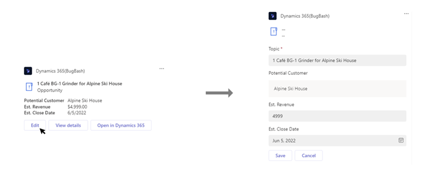
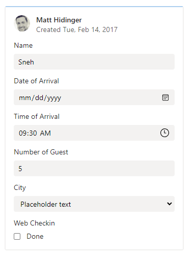

# Inline Editability for Adaptive Cards

# Overview

Adaptive cards are used by apps to share information as well as to collect input from users to complete user scenarios.
As of now, if we are showing some information in a card and we also want to collect user’s input, we will have bunch of Input fields hidden behind a ShowCard button or we will launch some form using button click on the card to collect user's input.
In both cases we might have duplicate readable fields and input fields.

We want to provide better experience to the user where he can read the fields and can also seamlessly update the values at the same place. 

UI of showing data and taking user input will become simplistic. 

 
## Current experience:

As shown in the below picture, An adaptive card displays data for Customer name, Est. Revenue and Est. Clode Date. If an user wants to update those information, he will have to click on 'Edit' button which will open some form and there he can update values for 'Est. Revenue' etc. and Click on Save to send data back to the bot service.




## Proposed experience:
Adaptive cards use `Input` fields to collect user data. This is how current user experience of `Input` fields looks like:

 


We will allow bot developer to enhance the user experience of all `Input` fields in Adaptive card (such as `Input.Text`, `Input.Number`, `Input.Date`, `Input.Time`, `Input.Toggle` and `Input.Choiceset`) in way that, these input fields can appear just as readable fields when user is not taking any action and when user clicks or focusses on them, it allows user to update those fields and then user can use use action buttons like Action.Submit/Action.Execute to send data back to the bot.

This is the flow for user to interact with inline editable fields:-
1. This is an adaptive showing information like "Contact", "Email", "Est. Closing date" etc. with inline Editable style where input fields are displayed as readable fields in the default state.


2. When user hovers on the card, 
	a. we will show outer outline on that card indicating that the card contains one or more inline editable input fields.
	b. we will show a lighter color outline to all the input fields which are inline editable.
	
	This will guide user to the input fields which he can go an update right on the card.


3. when user goes and clicks on any inline editable field, we will show darker outline to input fields indicating that the field is getting edited by the user.


4. when user has updated the value, Action.Submit or Action.Execute button such as "Save" which has  `disabledUnlessAssociatedInputsChange` property (https://github.com/microsoft/AdaptiveCards/issues/7103) will get enabled automatically. It will guide user to hit the button to commit the changes made on the card.


5. When user clicks hits on the Action.Submit or Action.Execute button, latest input values will be sent to the bot from host and bot can then update the card with latest information which we will show in default state.


## New Capabilites in the card:
In order to achive inline editable experience as mentioned above, we will add these capabilities in the card for developers:
* Introduce a new styling property in AC input fields schema for developer to choose between existing input fields vs inline editable input fields.

* Introduce a new styling property in AC input fields schema which will allow developers to define if label and value would be vertically or horizontally aligned. Default would be existing vertical.
(check with Sowrabh on default)
vertical:

horizontal:


* Provide a host configurable styling property to define width percentage of label and value properties for input elements. 
In horizontal view, by default, label:value width is to be 3:7 of the container of input element. however, host can configure it for themselves.


In vertical view, the width is always 100% of the container of input element.


*  If label is missing in the input field then value takes 100% width.

* Consistent font for label and values provided by AC SDK.
Default (for both label and value): 14px; Seogue Regular

* Order of label and value will always be label first value second.


* Label color configurable by host. Colour may be changed from the set of accessible colours in Accessible Messages Design System_WIP


### Other cases:

* If value is empty in the input field. We will show label and placeholder text in lighter color like this in the default state,

which user can go and update the value,


* If label is empty, we will just show value field in readable format in the default state which user can go and update the value.


* Input.Text field containg inline Action: We will not support inline Editable styles for input text containing inline action. It will be shown as default input style only. Reason being, such sceanrios are reply with a comment or adding a message where user collaboration is not needed. 


* Save Button: We will guide bot developer to provide Save button. Save will send the latest input values to the bot and bot can respond with the card with updated input values.

* Cancel Button: We will guide bot developer to provide Cancel button. If user has made some changes in the input fields but want to revert back to original state, they can click on "Cancel" button and bot can send the card with last saved input values in the card.

* Dirty state of the card: When user has some unsaved changes on the card but he moved away from the card but card is still in the viewport. In this case, we will preseve the changes made by the user and we will some indication to user that fields are unsaved or dirty. When card goes out of the viewport, then we wont preserve the unsaved values. (UX input needed on how to show dirty state of the input fields for eg: outline or some icon on the field)

### Further exploration needed:

* In-built Undo or Cancel button on the card: When user has unsaved changes and wants to revert back to original state, we can provide a in-built undo or cancel button on the card which will revert unsaved changes and will display original values. Needs PM/UX inputs to add this feature in addition to inline editability.

## Schema Changes:
 Inherited properties of all Input fields will have one more property called `inputStyle` whose type will be `InputStyle`

| Property | Type | Required | Description | Version |
| -------- | ---- | -------- | ----------- | ------- |
| **inputStyle** | `InputStyle` | No | style hint for Input fields | 1.3 |


### inputStyle

Style hint for input fields.

* **Type**: `InputStyle`
* **Required**: No
* **Allowed values**:
  * `"readWrite"` : Should show as readable field unless user clicks or focusses on it. Label and Value will be horizontally aligned.
  * `"default"` : Default behavior.

Since this property is inherited to all Input fields, it will be supported by all:

* `Input.Text`
* `Input.Number`
* `Input.Date`
* `Input.Time`
* `Input.Toggle`
* `Input.Choiceset`

## Sample Payload:

```json
     {
          "type": "Input.Text",
          "label": "Name",
          "value": "Sneh",
          "inputStyle" : "readWrite"
      },
      {
          "type": "Input.Time",
          "label": "Time of Arrival",
          "value": "09:30",
          "inputStyle" : "readWrite"
      },
      {
          "type": "Input.Number",
          "label": "Number of Guest",
          "value": 5,
          "inputStyle" : "readWrite"
      }	
```

## Open Question:

### 1. When Value is not provided by bot with "readWrite" style
There can be cases where bot chooses for "readWrite" style but it does not provide initial value for the Input Fields as it is not mandatory. How do we handle such cases?

Possible options:

1. we show `label` and `value` in horizotally aligned but value will be in `edit` mode only as the user first sees it. After user updated the field and move the focus away, then we can chow the value as just readable field.

2. we do not support when `value` is not provided and we fallback to `default` style.

### 2. How do we support inLineAction for Input.Text with "readWrite" style

inlineAction is Input.Text specific property which allows a action button placed next to 
value field which user can click to perform action related to that input field. inLineAction supports "Action.Submit", "Action.Execute", "Action.OpenUrl", "Action.ToggleVisibility"


```
{
      "type": "Input.Text",
      "id": "iconInlineActionId",
      "label": "Text input with an inline action",
      "inlineAction": {
        "type": "Action.Submit",
        "iconUrl": "https://adaptivecards.io/content/send.png",
        "tooltip": "Send",
        "isEnabled": true
      }
}
```


How do we align this behavior with "readWrite" style?

Possible options:
1. We show the inline action next to value field (all lable, value and inlineAction in horizontally aligned) but as disabled when user is not focussing/clicking on the Input field and when user performs any action, we show the inlineAction as enabled.

2. We show the inline action next to value field (all lable, value and inlineAction in horizontally aligned) and the action will be enabled always just as current behvaior for inLine Action.

3. We hide the inline action when user is not performing any action and when user clicks, we show the action.