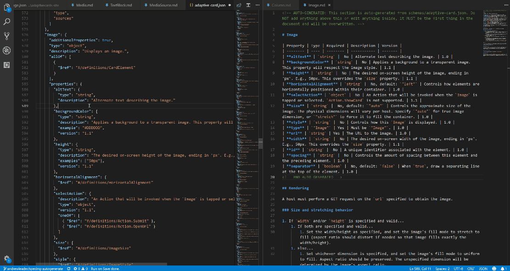

# Specs

## Updating specs

### Setup

For the best experience...

1. Install [Node.js](https://nodejs.org/en/)
1. Use Visual Studio Code
1. Install the [Run on Save extension by pucelle](https://marketplace.visualstudio.com/items?itemName=pucelle.run-on-save)
	1. Make sure you install the right one, there's many under the same name, check the author's name
	1. If it fails to install, update your version of Visual Studio Code

### Updating the property table

The property table in the spec documents is **auto-generated**. Do NOT hand-edit it, as your changes will be lost!

Instead, open `schemas\src` and update the **schema**. If you followed the instructions in [Setup](#setup), after you save your changes to the schema, the specs will be auto-updated in about 10 seconds.

### Re-naming an element

If you're re-naming an element type (not just a property, but an element that has its own spec file), here's the best way to do so (so that your changes are tracked as an update rather than delete and re-create).

1. Rename the file in `specs\elements`
1. Then, update the `schemas\src`

This will ensure that the updates to the schema will be written to the existing spec, rather than creating a new spec file (and leaving an untracked file that doesn't auto-delete).