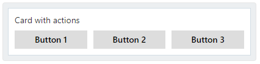
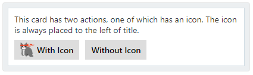
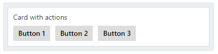
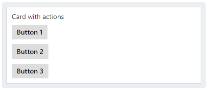
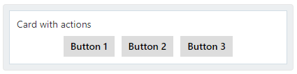
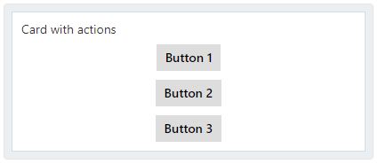
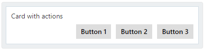
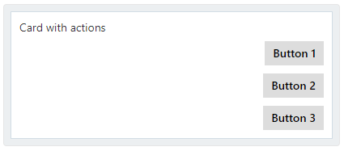
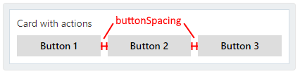
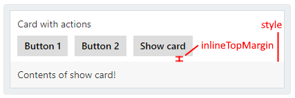

<!-- AUTO-GENERATED: This section is auto-generated from schemas/adaptive-card.json. Do NOT add anything above this or edit anything inside, it MUST be the first thing in the document and will be overwritten. -->

# ActionSet

#### Introduced in version 1.2

| Property | Type | Required | Description | Version |
| -------- | ---- | -------- | ----------- | ------- |
| **type** | `"ActionSet"` | Yes | Must be `"ActionSet"`. | 1.2 |
| **actions** | `Action[]` | Yes | The array of `Action` elements to show. | 1.2 |

**Inherited properties**

| Property | Type | Required | Description | Version |
| -------- | ---- | -------- | ----------- | ------- |
| **fallback** | `Element`, `FallbackOption` | No | Describes what to do when an unknown element is encountered or the requires of this or any children can't be met. | 1.2 |
| **height** | `BlockElementHeight` | No | Specifies the height of the element. | 1.1 |
| **separator** | `boolean` | No | When `true`, draw a separating line at the top of the element. | 1.2 |
| **spacing** | `Spacing` | No | Controls the amount of spacing between this element and the preceding element. | 1.2 |
| **id** | `string` | No | A unique identifier associated with the item. | 1.2 |
| **isVisible** | `boolean` | No, default: `true` | If `false`, this item will be removed from the visual tree. | 1.2 |
| **requires** | `Dictionary<string>` | No | A series of key/value pairs indicating features that the item requires with corresponding minimum version. When a feature is missing or of insufficient version, fallback is triggered. | 1.2 |

## actions

The array of `Action` elements to show.

* **Type**: `Action[]`
* **Required**: Yes
* **Allowed values**:
  * `Action.Execute`
  * `Action.OpenUrl`
  * `Action.ShowCard`
  * `Action.Submit`
  * `Action.ToggleVisibility`

## fallback

Describes what to do when an unknown element is encountered or the requires of this or any children can't be met.

* **Type**: `Element`, `FallbackOption`
* **Required**: No
* **Allowed values**:
  * `ActionSet`
  * `ColumnSet`
  * `Container`
  * `FactSet`
  * `Image`
  * `ImageSet`
  * `Input.ChoiceSet`
  * `Input.Date`
  * `Input.Number`
  * `Input.Text`
  * `Input.Time`
  * `Input.Toggle`
  * `Media`
  * `RichTextBlock`
  * `TextBlock`
  * `"drop"`: Causes this element to be dropped immediately when unknown elements are encountered. The unknown element doesn't bubble up any higher.

## height

Specifies the height of the element.

* **Type**: `BlockElementHeight`
* **Version** : 1.1
* **Required**: No
* **Allowed values**:
  * `"auto"`: The height of the container will be determined by the height of its contents.
  * `"stretch"`: The container will stretch its height to the available remaining height of the parent container.

## spacing

Controls the amount of spacing between this element and the preceding element.

* **Type**: `Spacing`
* **Required**: No
* **Allowed values**:
  * `"default"`
  * `"none"`
  * `"small"`
  * `"medium"`
  * `"large"`
  * `"extraLarge"`
  * `"padding"`
<!-- END AUTO-GENERATED -->

## Rendering

### Icon style of buttons

1. If ALL actions have a valid `iconUrl`...
	1. Respect the `hostConfig.actions.iconPlacement` property.
	1. If `iconPlacement` is `aboveTitle` then the `hostConfig.actions.iconSize` should be used as the **height** of the image, while maintaining aspect ratio. Card Authors should use square images for ideal portability between Hosts.
	1. If `iconPlacement` is `leftOfTitle` then the image **SHOULD BE** as close as possible to the height of the text in the action. If that isn't reasonable then `hostConfig.actions.iconSize` should be used for the height.
1. Else if only SOME have a valid `iconUrl`...
	1. Use `leftOfTitle` to ensure that all buttons are rendered with the same height.
1. Else if NONE have a valid `iconUrl`...
	1. Display as text-only buttons

Renderers must set the per-platform styling name corresponding to the style chosen, so that hosts can style accordingly. For example, if the style ended up being `aboveTitle`, then the platform style should be something like `ActionWithIconAboveTitle`.

#### Text-only buttons

Text-only buttons should be rendered something like below. Prefer to mimick the native button styles on the platform rather than replicating anything seen below. The only requirement is that the text from `Action.Title` must be displayed in the button.

#### Icon above text buttons

Icon above text buttons should be rendered something like below. Prefer to mimick the native button styles on the platform rather than replicating anything seen below. The only requirement is that the text from `Action.Title` must be displayed in the button, and the `Action.iconUrl` must be displayed above the text.

#### Icon left of text buttons

Icon left of text buttons should be rendered something like below. Prefer to mimick the native button styles on the platform rather than replicating anything seen below. The only requirement is that the text from `Action.Title` must be displayed in the button, and the `Action.iconUrl` must be displayed to the left of the text. Notice how not all buttons might have an icon, but with this style, it ensures that the height of all buttons remains consistent.

### Orientation and alignment of buttons

The orientation and alignment is determined by a combination of `hostConfig.actions.actionsOrientation` and `hostConfig.actions.actionAlignment`.

| | Horizontal | Vertical |
|--|--|--|
| **Stretch** |  |  |
| **Left** |  |  |
| **Center** |  |  |
| **Right** |  |  |

### Overflowing of actions...

How to handle actions overflowing is undetermined right now. Renderers could place them in a scroll view, choose to wrap buttons to the next row, etc. Our renderers currently do neither.

### Max actions

Renderers must respect the `hostConfig.actions.maxActions` value. If the actions provided in a single ActionSet exceed that number, the actions exceeding must be dropped, and a warning should be fired.

### Spacing between buttons

The spacing between buttons is specified in `hostConfig.actions.buttonSpacing`. Renderers must render the spacing between buttons as specified.

 

### ShowCard actions

When ShowCard actions are clicked, they must be displayed as follows...

1. If the ShowCard's card doesn't have a `style` set, set the style to the value in `hostConfig.actions.showCard.style`.
1. If `hostConfig.actions.showCard.actionMode` is set to `inline`...
	1. Wherever appropriate, display the card inline. Here's how our renderers do it...
	1. In a separate row beneath the ActionSet, render and show the ShowCard card. Render it as if `bleed` is true on the card, so that the style on the card reaches to the edges.
	1. For the spacing between the ActionSet and the row for the ShowCard card, use the value in `hostConfig.actions.showCard.inlineTopMargin`.
	1. 
	1. If the user clicks on the action for the currently open ShowCard, that should collapse the ShowCard card.
	1. If the user clicks on a different ShowCard action while another ShowCard is displayed, it should switch to that different action's card. 
1. Otherwise, trigger the `ActionInvoked` event. Hosts are responsible for displaying the popup if they changed the mode to popup.
