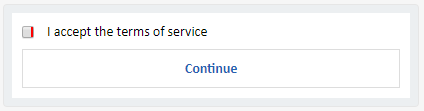
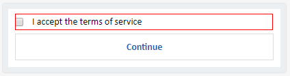
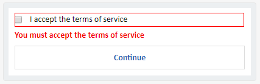

<!-- AUTO-GENERATED: This section is auto-generated from schemas/adaptive-card.json. Do NOT add anything above this or edit anything inside, it MUST be the first thing in the document and will be overwritten. -->

# Input.Toggle

| Property | Type | Required | Description | Version |
| -------- | ---- | -------- | ----------- | ------- |
| **type** | `"Input.Toggle"` | Yes | Must be `"Input.Toggle"`. | 1.0 |
| **title** | `string` | Yes | Title for the toggle | 1.0 |
| **id** | `string` | Yes | Unique identifier for the value. Used to identify collected input when the Submit action is performed. | 1.0 |
| **value** | `string` | No, default: `"false"` | The current selected value. If the item is selected that "valueOn" will be used, otherwise "valueOff" | 1.0 |
| **valueOff** | `string` | No, default: `"false"` | The value when toggle is off | 1.0 |
| **valueOn** | `string` | No, default: `"true"` | The value when toggle is on | 1.0 |
| **wrap** | `boolean` | No | If `true`, allow text to wrap. Otherwise, text is clipped. | 1.2 |

**Inherited properties**

| Property | Type | Required | Description | Version |
| -------- | ---- | -------- | ----------- | ------- |
| **isRequired** | `boolean` | No | Specifies whether the input requires a value. | 1.3 |
| **errorMessage** | `string` | No | Specifies the text that will be displayed if validation failed. This is optional but strongly recommended. If not provided, there will be NO error message displayed (the field will simply be visually highlighted as invalid). | 1.3 |
| **fallback** | `Element`, `FallbackOption` | No | Describes what to do when an unknown element is encountered or the requires of this or any children can't be met. | 1.2 |
| **height** | `BlockElementHeight` | No | Specifies the height of the element. | 1.1 |
| **separator** | `boolean` | No | When `true`, draw a separating line at the top of the element. | 1.0 |
| **spacing** | `Spacing` | No | Controls the amount of spacing between this element and the preceding element. | 1.0 |
| **isVisible** | `boolean` | No, default: `true` | If `false`, this item will be removed from the visual tree. | 1.2 |
| **requires** | `Dictionary<string>` | No | A series of key/value pairs indicating features that the item requires with corresponding minimum version. When a feature is missing or of insufficient version, fallback is triggered. | 1.2 |

## fallback

Describes what to do when an unknown element is encountered or the requires of this or any children can't be met.

* **Type**: `Element`, `FallbackOption`
* **Version** : 1.2
* **Required**: No
* **Allowed values**:
  * `ActionSet`
  * `ColumnSet`
  * `Container`
  * `FactSet`
  * `Image`
  * `ImageSet`
  * `Input.ChoiceSet`
  * `Input.Date`
  * `Input.Number`
  * `Input.Text`
  * `Input.Time`
  * `Input.Toggle`
  * `Media`
  * `RichTextBlock`
  * `TextBlock`
  * `"drop"`: Causes this element to be dropped immediately when unknown elements are encountered. The unknown element doesn't bubble up any higher.

## height

Specifies the height of the element.

* **Type**: `BlockElementHeight`
* **Version** : 1.1
* **Required**: No
* **Allowed values**:
  * `"auto"`: The height of the container will be determined by the height of its contents.
  * `"stretch"`: The container will stretch its height to the available remaining height of the parent container.

## spacing

Controls the amount of spacing between this element and the preceding element.

* **Type**: `Spacing`
* **Required**: No
* **Allowed values**:
  * `"default"`
  * `"none"`
  * `"small"`
  * `"medium"`
  * `"large"`
  * `"extraLarge"`
  * `"padding"`
<!-- END AUTO-GENERATED -->

## Rendering

### Input validation

#### Determining if input is valid...

- If toggle is off
	- If `"isRequired": false`
		- Valid!
	- Else
		- Invalid!
- Else if toggle is on
	- Valid!

#### Visual states

Note that these comps are just examples. Each platform should mimick whatever style the platform has for representing these concepts.

##### Initial state with required cue

##### Invalid state without error message

Note that in this case, highlighting the box is enough since there's a visual difference (there wasn't a box before).

##### Invalid state with error message

