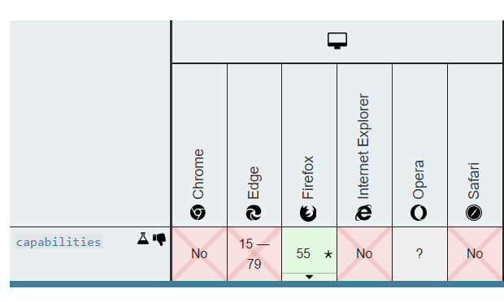

# Adaptive Card Extensions

Learning from the web by embracing experimentation and extensibility in a controlled way.

---

Exploration status: **Draft**. 

No current plan to ship, but actively seeking feedback.

---

## Preface

Building a standard is hard, and as adoption grows, things necessarily slow down. Keeping a handle on fragmentation while still allowing groups to innovate and experiment is critical to prevent stagnation and discourage those groups from "forking" and rolling their own version to meet their needs. 

In the web world, they have come a long way to address fragmentation and bugs between different browser vendors (IE, Edge, FireFox, Opera, Chrome, Safari, and others). It wasn't that long ago that websites had a range of incompatibilities between browers, some serious, some mere annoyances. In one of the webs darker hours, they even went as far as to "sniff" the User Agent string for competing browsers just to make certain websites work. Suffice to say it was a frustrating time for users and developers alike.

Eventually the W3C gained momentum and got the browser vendors to agree that reliable standards are in everyone's best interest. **They also knew that standards and innovation are diametrically opposed**, so the working group prescribed a set of rules and conventions that would allow browsers to innovate and experiment. They also gave web developers APIs to build their sites according to which features/extensions worked in a given browser. This is often referred to as ["progressive enhancement" or "graceful degredation"](https://www.sitepoint.com/progressive-enhancement-graceful-degradation-choice/).

Specifically, this included things like [CSS vendor prefixes](https://developer.mozilla.org/en-US/docs/Glossary/Vendor_Prefix). The web community also innovated tools known as [polyfills](https://developer.mozilla.org/en-US/docs/Glossary/Polyfill#:~:text=A%20polyfill%20is%20a%20piece,do%20not%20natively%20support%20it.) that make it easier for web developers to take advantage of the latest enhancements with a reasonable fallback to down-level browsers.

Finally, the community maintains the [Browser Compatibility Data repository (BCD)](https://developer.mozilla.org/en-US/docs/MDN/Contribute/Structures/Compatibility_tables) which is the central repository for CSS, JavaScript, and HTML features, their current status, and their current support. 

Excerpt of the CSS property [`border-width`](https://github.com/mdn/browser-compat-data/blob/master/css/properties/border-width.json) showing its current status and browser compatibility. 

```json
{
  "css": {
    "properties": {
      "border-width": {
        "__compat": {
          "mdn_url": "https://developer.mozilla.org/docs/Web/CSS/border-width",
          "support": {
            "chrome": {
              "version_added": "1"
            },
            "chrome_android": {
              "version_added": "18"
            },
            "edge": {
              "version_added": "12"
            },
            "firefox": {
              "version_added": "1"
            }
          },
          "status": {
            "experimental": false,
            "standard_track": true,
            "deprecated": false
          }
        }
      }
    }
  }
}
```

And a slightly more complex schema exists to describe JavaScript "builtin" APIs, such as [Array](https://github.com/mdn/browser-compat-data/blob/master/javascript/builtins/Array.json)

Another metaphor from the web: Edge provides [`-ms-high-contast`](https://developer.mozilla.org/en-US/docs/Web/CSS/@media/-ms-high-contrast), which is not currently part of the standard or on a standards track. The MDN makes it very clear on their websites the state of any extension and which extension works in which browsers:

> **Non-standard**
> 
> This feature is non-standard and is not on a standards track. Do not use it on production sites facing the Web: it will not work for every user. There may also be large incompatibilities between implementations and the behavior may change in the future.

### Learning from the web

From the onset of Adaptive Cards we knew we wanted to provide a core set of elements in the schema, and offer [extensibility APIs](https://docs.microsoft.com/en-us/adaptive-cards/sdk/rendering-cards/javascript/extensibility) for Hosts to register new elements, or custom render existing ones. We even followed the W3C's lead by providing guidance on naming these custom elements and properties. 

Some of the more well-known extensions that followed this guidance were [created by Cortana](https://stciuxdocs.asgfalcon.io/documents/Content/Segments/CortanaUX/Adaptive.html) (*internal Microsoft link*).

**In short, standards are important, but standards move slowly as a rule. And a standard that doesn't meet changing business needs is a standard not long for this world. Let's embrace "controlled" innovation and experiments in a holistic way.**

What follows is a starting point to grok this problem.

## Principles and Objectives

1. **Facilitate non-stanadard experimentation** and vendor-specific innovation. Embrace "extensions" as a necessary part of building a standard.
2. **Create clarity around Schema Extensions**: what Hosts/platforms they work in; whether they are on a standards-track or not. Provide plenty of guidance on how to properly utilize extensions.
3. **Make it easy to submit extensions for standards consideration.** 
   1. (E.g., Contoso can create a Charting extension that works on JavaScript and Android. By proposing their extension as a standard they have a consistent and normalized way of describing the schema, and a self-contained implementation/reference renderers that can be easily reviewed and ported to other platforms.)
   
## Benefits

1. **Improved discoverability and awareness throughout the Adaptive Cards ecosystem**. Since extensions are just a feature of Adaptive Cards, our existing website, docs and SDKs can be enhanced to promote them.
2. **Centralized documentation and tooling for officially extending the schema.**. https://adaptivecards.io will be updated to list extensions, show compatibilty charts, and the Designer will automatically reflect which extenions are supported in which Hosts.
3. **Follows well-known extensibility patterns**. [ASP.NET has "Middleware"](https://docs.microsoft.com/en-us/aspnet/core/fundamentals/middleware/?view=aspnetcore-3.1). VS Code has ["Extensions"](https://code.visualstudio.com/api/references/extension-manifest)
4. **Gives a name to what people are already doing.** Instead of saying "use our extensbility APIs and read these docs" we can say "write an extension with a ". Also gives us a way to describe the existing packages for [adaptivecards-fabric](https://www.npmjs.com/package/adaptivecards-fabric) and [AdaptiveCards.Rendering.Wpf.Xceed](https://www.nuget.org/packages/AdaptiveCards.Rendering.Wpf.Xceed/).
5. **Fasciliates rapid protoyping and experimentation.** A standard and comprehensive lifecycle API makes it possible to extend the renderers in powerful ways without having to fork them.
6. **Makes it easy to build and ship samples.** Because extensions are self-contained and follow strict rules that each renderer must support, it becomes a lot easier to build and package sample code.

## Requirements

> Project board tracking this work is here: https://github.com/microsoft/AdaptiveCards/projects/25

1. Extensions are backed by a **an extension manifest** which describes its name, supported platforms, how it changes the schema, etc (details below)
1.  Hosts describe what extensions they support in a centralized repo of Host Configs
1. Extension manifests and Host Configs are used to generate new pages on adaptivecards.io that list available extensions and which extensions work in which hosts. A more advanced version of this: 
1. Extensions should be in a set of wel-defined states, such as "standard" or "experiment" or "osbolete" (which could indicate a workaround)
1. Designer support. If a Host supports an extension, the Designer should reflect that (where possible)
1. Card-authors can explicitly require extensions using the `requires` and `fallback` mechanism

### Extension manifests

Imagine this file sitting at the root of a extension's GitHub repo. The code for the extensions will exist on each supported platform, and be packaged and deployed using the existing platform tools. 

This manifest describes 
- which platforms are supported
- links to those packages
- how the schema is extended
- how Hosts configure it
- any other extension dependencies?

```json
{
    "id": "adaptivecards-autocomplete",
    "version": "0.1",
    "elementPrefix": "",
    "propertyPrefix": "autocomplete",
    "supports": {
        "javascript": "https://npmjs.com/package/adaptivecards-autocomplete"
    },
    "contributes": {
        "elements": {
            "Input.ChoiceSet": {
                "properties": {
                    "autocomplete": {
                        "type": "object",
                        "properties": {
                            "data": {
                                "type": "uri"
                            }
                        }
                    }
                }
            }
        }
    },
    "hostConfig": {
        "properties": {
            "registries": {
                "type": "array",
                "description": "The list of registries to lookup templates",
                "items": {
                    "type": "uri"
                }
            }
        }
    }
}
```

### Card Usage

Using an extension in a card payload is clearly denoted by a special prefix character. We can also provide a means of linking to the extension documentation in the payload, making it self-contained and self-describing as it potentially moves between Hosts.

```json
{
    "type": "Input.ChoiceSet",
    "label": "Select user",
    "-autocomplete": {
        "extension": "https://adaptivecards.io/extensions/autocomplete",
        "data": "https://api.example.com/users",
        "fallback": {
            ...
        }
    }
}
```

### Host Config

Hosts will declare what extensions they support in Host Config and how they should be configured.

**Teams Host Config**

```json
{
    "extensions": {
        "adaptivecards-autocomplete": {

        },
        "adaptivecards-links": {
            "version": "^0.1",
            "registries": [
                "https://registry.adaptivecards.io"
            ]
        }
    }
}
```

The extension will get passed the `HostConfig` object and configure itself as expected. This reduces, but may not always eliminate, the per-platform specific code that a host needs to write per extension.

```csharp
{
    var renderer = new AdaptiveCardRenderer();
    renderer.HostConfig = ...;
    renderer.Extensions.Add(new AutoCompleteExtension());
    var card = renderer.Render(<CARD>);
}
```

### Tests and verification

We can and should enforce that extensions are authored and packaged with test payloads. We can then build out a means of validating them in CI, especially on different platforms.

## Extension ideas

The website would be updated to list extensions, and which platforms they work on. 

Our Hosts/Partners page would also list which extensions work for a given Host.

* `adaptivecards-links`
* `adaptivecards-fluentui`
* `adaptivecards-fluid`
* `adaptivecards-xceed`
* `adaptivecards-from-jsonschema`: Card-From-JSON-Schema support
* `adaptivecards-auth-msa`: Resource resolvers with authentication. E.g., automatically append auth headers for `Image` endpoints on Graph, SharePoint, etc
* `adaptivecards-autocomplete`: Could extend choice set to fetch remote data 
* `adaptivecards-graphing`: Graph extensions can be natively supported on speicifc client but service-lvel fallback could work on other platforms
* `adaptivecards-youtube` - built in fallback to an image with a selectAction
* `adaptivecards-semanticelements` - explore a POC from a while back where elements can be `Data.X` which will lookup the template for that data type from the template service and automatically expand it
* `adaptivecards-colorpicker` - with fallback to `Input.ChoiceSet`
* `adaptivecards-fluenticons` including icon properties for ChoiceSet choices, Actions, etc
   
  
## Further thoughts

1. Eventually this effort can be expanded to include a full "middle-ware" pipeline and set of APIs, allowing things like Universal Actions, Live Data Binding, or custom padding support by authoring extensions.
2. On-demand acquisition of extensions. Lots to figure out here, potentially boostrapping on Fluid Loaders, etc. Card Authors can declare which extensions they need and they get dynamically loaded
3. Versioning could get really complicated.
4. Should the standard set of elements, actions, inputs, also be repackaged into a set of extensions, like a "metapackage"


# Revisions

**2020-07-25**: first draft, called "Plugins"
**2020-08-10**: renamed "Adaptive Card Extensions" and reducing scope to schema extensions (e.g., custom elements and custome properties)