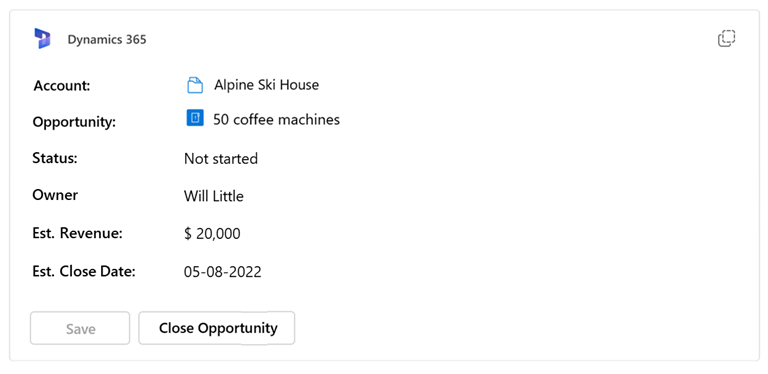
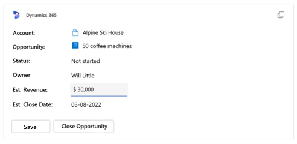
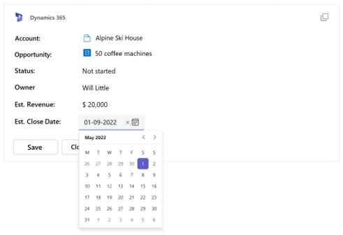
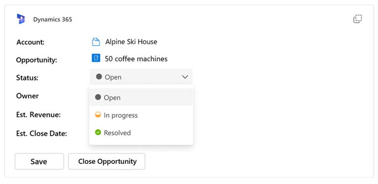

# Inline Editability for Adaptive Cards

# Overview

Adaptive cards are used by apps to share information as well as to collect input from users to complete user scenarios.
As of now, if we are showing some information in a card and we also want to collect user’s input, we will have bunch of Input fields hidden behind a ShowCard button or we will launch some form using button click on the card to collect user's input.
In both cases we might have duplicate readable fields and input fields.

We want to provide better experience to the user where he can read the fields and can also update the values at the same place. 

UI of showing data and taking user input will become simplistic. 

 
## Current experience:

As shown in the below picture, An adaptive card displays data for Customer name, Est. Revenue and Est. Clode Date. If an user wants to update those information, he will have to click on 'Edit' button which will open some form and there he can update values for 'Est. Revenue' etc. and Click on Save to send data back to the bot service.


## Proposed experience:
Adaptive cards use `Input` fields to collect user data. This is how current user experience of `Input` fields looks like:

 


We will allow bot developer to enhance the user experience of all `Input` fields in Adaptive card (such as `Input.Text`, `Input.Number`, `Input.Date`, `Input.Time`, `Input.Toggle` and `Input.Choiceset`) in way that, these input fields can appear just as readable fields when user is not taking any action and when user clicks or focusses on them, it allows user to update those fields and then user can use use action buttons like Action.Submit/Action.Execute to send data back to the bot.


This is an adaptive showing information like "Status", "Owner", "Est. Revenue" and "Est. Close Date"


When user want to update lets say "Est. Revenue", he can click on the value and card will allow user to update the value. and after updating he can click on "Save" button to send data back to the bot.



To achieve this, `Input` fields will have `readWrite` as their inputStyle property, which will modify the user experience as follows: (In the above picture "Est. Revenue" is of type `Input.Text`)

* `label` and `value` property of Input field will be aligned in horizontal sections so that it looks like key-value pair of readable information.
* when user is not taking any action, Input field will look just like readable fields diplaying 'label' and 'value' without any edit field properties like border or background highlight on the 'value' section.
* when user clicks or focusses on the 'value' section, card will allow user to edit the 'value' section and it will show edit field properties like like border or background highlight on the 'value' section.

Similar user experience for `Input.Date` with 'readWrite' inputStyle property.



and `Input.Choiceset` with 'readWrite' inputStyle property.



Other 'Input' fields like `Input.Number`,  `Input.Time` and `Input.Toggle` will also follow the  similar pattern for 'readWrite' inputStyle property.

TBD: Update pictures with 'readWrite' user experience for all Input fields.

## Schema Changes:

 Inherited properties of all Input fields will have one more property called `inputStyle` whose type will be `InputStyle`

| Property | Type | Required | Description | Version |
| -------- | ---- | -------- | ----------- | ------- |
| **inputStyle** | `InputStyle` | No | style hint for Input fields | 1.3 |


### inputStyle

Style hint for input fields.

* **Type**: `InputStyle`
* **Required**: No
* **Allowed values**:
  * `"readWrite"` : Should show as readable field unless user clicks or focusses on it. Label and Value will be horizontally alinged.
  * `"default"` : Default behavior.

Since this property is inherited to all Input fields, it will be supported by all:

* `Input.Text`
* `Input.Number`
* `Input.Date`
* `Input.Time`
* `Input.Toggle`
* `Input.Choiceset`

## Sample Payload:

```json
     {
          "type": "Input.Text",
          "label": "Name",
          "value": "Sneh",
          "inputStyle" : "readWrite"
      },
      {
          "type": "Input.Time",
          "label": "Time of Arrival",
          "value": "09:30",
          "inputStyle" : "readWrite"
      },
      {
          "type": "Input.Number",
          "label": "Number of Guest",
          "value": 5,
          "inputStyle" : "readWrite"
      }	
```
